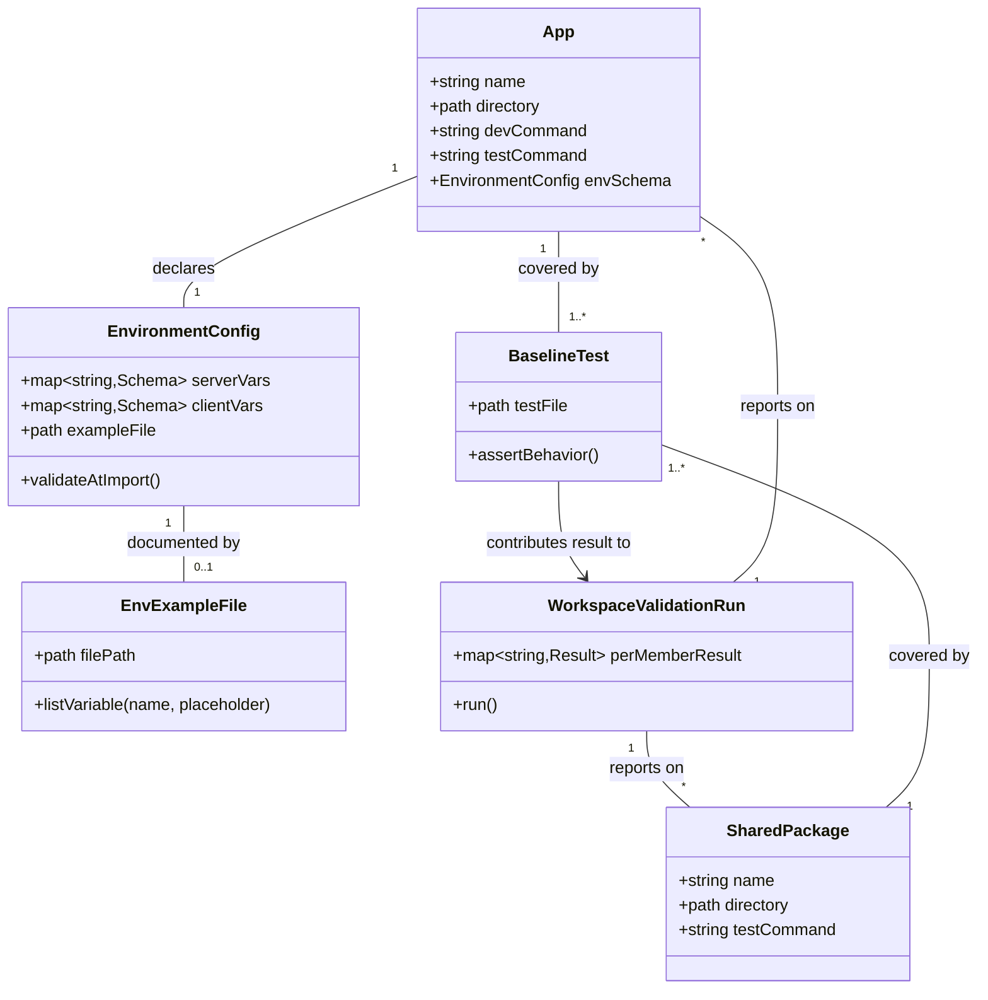

# Close Project Codebase Bootstrap Gaps (env parity + test coverage)

**Status: Implemented.** All Operations below are complete; `pnpm run ready`
passes with 5/5 workspace members exercised by `vp run -r test`. Two issues
discovered during implementation are noted where relevant and tracked separately
(Notion T012, T013) rather than folded into this canvas's scope.

## Requirements

Close the two concrete gaps the codebase-bootstrap analysis surfaced so the
monorepo's workspace-wide guarantees are actually true, not just documented:
give every app the same env-onboarding experience (a committed `.env.example`,
not a README table one has and the other doesn't), and make `vp run -r test`
meaningfully exercise every workspace member instead of silently skipping four
of five because they define no `test` script.

## Entities

## Approach

1. **Env-onboarding parity**:
   - Generate `apps/manager-dashboard/.env.example` directly from the variable
     table already published in that app's own README (`BETTER_AUTH_SECRET`,
     `BETTER_AUTH_URL`, optional `VITE_APP_TITLE`, `SERVER_URL`) — do not invent
     new variables or restructure `env.ts`.
   - Update the manager-dashboard README's Setup section to
     `cp .env.example .env.local` the same way `consumer-application`'s README
     already does, replacing the current "there is no committed example file
     yet" note.
   - This is a documentation/parity fix, not a design change — `env.ts` itself
     is untouched.

2. **Test-coverage floor across the workspace**:
   - Add a `"test": "vp test"` script to the four `package.json` files that
     currently lack one (`apps/consumer-application`, `apps/manager-dashboard`,
     `packages/ui`, `packages/vite-config`), mirroring `packages/query`'s
     existing script exactly.
   - Add exactly one real (non-trivial) test per member, targeting the piece of
     that member's code most central to this spec's requirements: for the two
     apps, the `env.ts` fail-fast contract (FR-006); for `vite-config`, that
     `tanstackAppPlugins()` actually composes plugins; for `ui`, that the shared
     stylesheet entry point exists and contains the expected Tailwind import.
   - Do not attempt to add broad application-logic coverage (routes, PowerSync
     sync logic, Better Auth flows) — that is explicitly out of scope per the
     bootstrap analysis and belongs to future feature-specific specs.

3. **Verification, not assumption, of per-member attribution**:
   - After adding the scripts/tests, run `vp run -r test` once and confirm the
     output attributes results per workspace member (per the open question
     already flagged in `contracts/workspace-commands.md` — "verify during
     implementation, do not assume"). This is a validation step, not a code
     change; if attribution turns out to be unclear in `vp`'s output, that
     becomes a new, separately-scoped finding rather than something silently
     patched here.
   - **Implementation result**: attribution confirmed clean — `vp run -r test`
     lists all 5 members individually. Running the full `pnpm run ready`
     pipeline once, however, surfaced an unrelated pipeline issue: `vp build`
     regenerates `apps/*/src/routeTree.gen.ts` in a format `vp check` then
     re-flags, so `check → test → build` is not idempotent (a second `check`
     after `build` fails again on files nothing meaningfully changed in). This
     is exactly the kind of "new, separately-scoped finding" this step
     anticipated — logged here, tracked as Notion task T013, and explicitly not
     fixed under this canvas's Safeguards.

## Structure

### Inheritance Relationships

Not applicable in the traditional OOP sense — this is a monorepo configuration
change, not a class hierarchy. The relevant "inheritance" is convention
inheritance: each new `test` script and test file follows the exact pattern
already established by `packages/query` (its `"test": "vp test"` script and its
`create-query-client.test.ts` file are the template every other member's
addition copies).

### Dependencies

1. `apps/consumer-application` test depends on its own `src/env.ts` (imported
   with mocked `process.env`/`import.meta.env` values, not real secrets).
2. `apps/manager-dashboard` test depends on its own `src/env.ts` (same mocking
   approach).
3. `packages/vite-config` test depends on its own `src/index.ts` export
   (`tanstackAppPlugins`).
4. `packages/ui` test depends on `src/styles.css` existing on disk (Node `fs`
   read, not a runtime import, since it's a CSS asset).
5. `apps/manager-dashboard/.env.example` depends on (must stay in sync with)
   `apps/manager-dashboard/src/env.ts`'s schema — this is a documentation
   artifact, not a code dependency, but the sync obligation is a real constraint
   (see Safeguards).
6. Root `vp run -r test` depends on every member's `package.json` now defining a
   `test` script — this is what currently causes the silent-skip risk.

### Layered Architecture

1. **Workspace root layer**: `pnpm-workspace.yaml`, root `package.json`
   (`vp run ready` orchestration) — unchanged by this work, only its downstream
   behavior (per-member attribution) is verified.
2. **App layer**: `apps/consumer-application`, `apps/manager-dashboard` — each
   gains a `test` script, one new test file, and (manager-dashboard only) a new
   `.env.example` + README update.
3. **Shared package layer**: `packages/ui`, `packages/vite-config` — each gains
   a `test` script and one new test file; `packages/query` is the reference
   pattern and is untouched.
4. **Validation layer**: `vp run -r test` (and by extension `vp run ready`) — no
   code change here, but its effective coverage changes from 1/5 to 5/5
   workspace members as a result of the layers above.

## Operations

### Create Config File - `apps/manager-dashboard/.env.example` — ✅ Done

1. Responsibility: Give `manager-dashboard` the same committed, copyable
   env-onboarding artifact `consumer-application` already has, matching FR-007.
2. Content: blank `KEY=` per variable, no defaults, no inline comments —
   `BETTER_AUTH_SECRET=`, `BETTER_AUTH_URL=`, `VITE_APP_TITLE=`, `SERVER_URL=`.
   **Revised from the original spec** (which proposed a default
   `BETTER_AUTH_URL=http://localhost:4000` and per-line comments): simplified
   post-implementation to a bare `KEY=` list for every variable, deferring all
   guidance to the README's Environment table rather than duplicating it inline.
   Documented here so the prompt matches the file as committed, not the earlier
   draft.
3. Constraints: variable names and requiredness MUST exactly match
   `apps/manager-dashboard/src/env.ts`'s schema — no extra, no missing, no
   renamed variables.

### Update Docs - `apps/manager-dashboard/README.md` — ✅ Done

1. Responsibility: Replace the current "there is no committed example file yet"
   Setup instructions with a `cp` step, matching the pattern already used in
   `apps/consumer-application/README.md`.
2. Logic:
   - Replace the manual `vp dlx @better-auth/cli secret` + inline env-block
     instructions in "Setup" with:
     `cp apps/manager-dashboard/.env.example apps/manager-dashboard/.env.local`,
     followed by a short note that `BETTER_AUTH_SECRET` still needs a real
     generated value (keep the `vp dlx @better-auth/cli secret` tip, just move
     it under the `.env.local` step instead of replacing the example-file flow).
   - Leave the existing "Environment" variable table as-is — it remains accurate
     documentation, just no longer the _only_ onboarding path.

### Add Config - `test` script in 4 `package.json` files — ✅ Done

1. Responsibility: Make `vp run -r test` actually attempt tests for
   `consumer-application`, `manager-dashboard`, `packages/ui`,
   `packages/vite-config`.
2. Change: add `"test": "vp test"` to the `"scripts"` object in each of:
   - `apps/consumer-application/package.json`
   - `apps/manager-dashboard/package.json`
   - `packages/ui/package.json` (this package currently has no `"scripts"` key
     at all — add one)
   - `packages/vite-config/package.json` (add alongside the existing
     `"check": "vp check"`)
3. Constraints: exact string `"vp test"`, matching `packages/query`'s existing
   script verbatim — no custom flags.

### Create Test - `apps/consumer-application/src/env.test.ts` — ✅ Done

1. Responsibility: Prove the fail-fast contract (FR-006) for the app most
   exercised by this spec's User Story 4.
2. Methods:
   - `it("parses successfully when all required variables are valid")`:
     - Logic: stub `process.env`/`import.meta.env` with valid values for
       `OPENAI_API_KEY`, `GEMINI_API_KEY`, `VITE_POWERSYNC_URL`,
       `VITE_POWERSYNC_TOKEN`; dynamically import `./env`; assert it resolves
       and the parsed `env` object exposes the expected keys.
   - `it("throws with the specific variable name when a required variable is missing")`:
     - Logic: stub **every** variable including the target one — the target var
       is stubbed to `""` (not omitted), since `env.ts` has
       `emptyStringAsUndefined: true` and the local machine may already have a
       real value for that variable in its ambient environment (a real
       `.env`/`.env.local` or shell var); omitting the stub call does NOT
       guarantee "missing" and risks leaking a real secret into test
       output/assertions. Dynamically import `./env`; assert the import rejects.
       `@t3-oss/env-core`'s default `onValidationError` throws a **generic**
       `Error("Invalid environment variables")` — the variable name is NOT in
       the thrown message, only in a
       `console.error("❌ Invalid environment variables:", issues)` call with an
       `issues` array containing `{ path: [varName], ... }`. So: assert the
       promise rejects (generic message), AND spy on `console.error`
       (`vi.spyOn(console, "error").mockImplementation(() => {})`) to assert it
       was called with an `issues` array containing an entry whose `path`
       includes `"OPENAI_API_KEY"`.
   - Use `vi.resetModules()` between cases since `@t3-oss/env-core` validates at
     import time (module-level side effect), and mock `process.env` /
     `import.meta.env` via Vitest's `vi.stubEnv` rather than mutating global
     state directly.
3. Constraints: no real API keys, no network calls — all values are test
   fixtures. Every variable referenced by the schema MUST be explicitly stubbed
   in every test case (never rely on a variable being absent from the ambient
   environment).

### Create Test - `apps/manager-dashboard/src/env.test.ts` — ✅ Done

1. Responsibility: Same fail-fast contract, for the app whose gap (missing
   `.env.example`) this feature is directly closing.
2. Methods:
   - `it("parses successfully when all required variables are valid")`: stub
     `BETTER_AUTH_SECRET` (32+ chars) and `BETTER_AUTH_URL`; assert successful
     import.
   - `it("throws when BETTER_AUTH_SECRET is missing")`: stub
     `BETTER_AUTH_SECRET` to `""` (empty string, not omitted — same
     ambient-environment reasoning as the consumer-application test) and
     `BETTER_AUTH_URL` to a valid value; assert the import rejects with the
     generic `"Invalid environment variables"` message, and spy on
     `console.error` to assert the logged `issues` array contains a `path`
     including `"BETTER_AUTH_SECRET"`.
   - `it("throws when BETTER_AUTH_SECRET is shorter than 32 characters")`:
     supply a short string; assert import rejects the same way (generic
     message + `console.error` issues path assertion) — covers the
     `v.minLength(32)` rule specifically.
3. Constraints: same mocking approach, module-reset discipline, and
   explicit-stub-to-empty-string discipline as the consumer-application test.

### Create Test - `packages/vite-config/src/index.test.ts` — ✅ Done

1. Responsibility: Prove `tanstackAppPlugins(...)` actually composes a
   non-empty, order-sensible plugin list, since both apps' `vite.config.ts`
   depend on this function silently succeeding.
2. Methods:
   - `it("returns an array of Vite plugins including the caller-supplied plugin")`:
     - Logic: call `tanstackAppPlugins(someMarkerPlugin)` with a minimal fake
       plugin object (`{ name: "test-marker" }`); assert the return value is an
       array; assert it contains an entry whose `name` is `"test-marker"`
       (proving the caller's plugin, e.g. `consumer-application`'s
       `powersync-vite-plugin.ts`, is actually included, not dropped).
3. Constraints: do not assert on the exact internal plugin set
   (Start/React-Compiler/Tailwind internals) beyond presence of the
   caller-supplied plugin — keep the test resilient to internal reordering, per
   the conservative-entity-design principle of not over-specifying
   implementation detail.

### Create Test - `packages/ui/src/styles.test.ts` — ✅ Done

1. Responsibility: Prove the package's sole export (`./src/styles.css`) exists
   and contains the expected Tailwind entry point, since nothing else in this
   package is executable TypeScript.
2. Methods:
   - `it("exposes a non-empty stylesheet that imports Tailwind")`:
     - Logic: read `src/styles.css` from disk with Node's `fs.readFileSync`;
       assert the content is non-empty; assert it contains
       `@import "tailwindcss"` (or the actual import statement present in the
       file — read the file first to confirm exact syntax before asserting).
3. Constraints: this is a file-content assertion, not a CSS-parsing test — keep
   it simple and fast; do not add a CSS parser dependency for this.

### Verify - Per-member attribution in `vp run -r test` output — ✅ Done

1. Responsibility: Confirm the open question flagged in
   `contracts/workspace-commands.md` — that `vp`'s recursive test output
   actually identifies which member ran/passed/failed.
2. Logic: after all scripts/tests above are added, run `vp run -r test` once
   from the repo root; inspect the output; confirm each of the 5 members
   (`consumer-application`, `manager-dashboard`, `ui`, `vite-config`, `query`)
   appears individually with a pass/fail result, not just an aggregate summary.
3. Outcome: if attribution is unclear, do not silently work around it in this
   feature — report it as a new, separately-scoped finding (this feature's
   Safeguards explicitly bound it out of scope to fix `vp`'s own output format).

## Norms

1. **Test script convention**: every workspace member that has tests defines
   `"test": "vp test"` in its `package.json` `scripts` — no bespoke test runners
   or flags per package.
2. **Test file naming**: `*.test.ts` colocated next to the file under test
   (matches `packages/query/src/create-query-client.test.ts`'s existing
   pattern).
3. **Env mocking in tests**: never read or depend on real `.env`/`.env.local`
   files or real secrets in a test; use Vitest's `vi.stubEnv` / manual
   `process.env` assignment scoped to the test with cleanup in `afterEach`, and
   `vi.resetModules()` before each dynamic import of an `env.ts` module
   (required because `@t3-oss/env-core` validates at import time, so module
   caching would otherwise mask failures). **Every variable in the schema MUST
   be explicitly stubbed in every test case, including the one under test for a
   "missing" scenario — stub it to `""`, never omit the stub call.** Omitting a
   stub does not guarantee the variable is absent; the developer's real ambient
   environment (a loaded `.env`/`.env.local`, a shell-exported var) may already
   provide a real value, which would then leak into test assertions/output
   instead of exercising the missing-variable path. `@t3-oss/env-core`'s default
   `onValidationError` throws a **generic**
   `Error("Invalid environment variables")` and logs the actual failing variable
   path via `console.error`, not the thrown message — tests asserting "fails
   naming the variable" MUST spy on `console.error` and inspect the logged
   `issues[].path`, not `error.message`.
4. **Env file sync discipline**: any variable added to, removed from, or renamed
   in an app's `env.ts` schema MUST be reflected in that app's `.env.example` in
   the same change — no drift between the two.
5. **Dependency versions**: any new devDependency needed for testing (there
   should be none beyond what `vite-plus`/Vitest already provides via `vp test`)
   MUST be added through the pnpm `catalog:` entry in `pnpm-workspace.yaml`,
   never a literal version in a package's own `package.json`.
6. **No relative cross-package imports**: tests, like application code, MUST
   import shared packages via `@windwise/<name>` (`workspace:*`), never via
   relative paths crossing the `apps/` ↔ `packages/` boundary.
7. **Documentation parity**: whenever one app documents a setup step a certain
   way (e.g., `.env.example` + `cp` instruction), the other app's README should
   follow the same shape unless there's a stated reason not to.

## Safeguards

1. **Functional Constraints**: Every one of the 5 workspace members MUST have a
   `test` script and at least one test file after this change;
   `apps/manager-dashboard` MUST have a `.env.example` whose variable set
   exactly matches its `env.ts` schema.
2. **Performance Constraints**: New tests MUST run fast enough to remain part of
   `vp run ready`'s normal pre-PR loop — no test may make a real network call
   (no real PowerSync connection, no real Better Auth HTTP call); all external
   calls are mocked or avoided entirely by construction (e.g., testing `env.ts`
   parsing directly rather than app startup).
3. **Security Constraints**: `.env.example` MUST contain only placeholder
   values, never a real secret, token, or working credential; test fixtures for
   `BETTER_AUTH_SECRET`/API keys MUST be obviously-fake strings (e.g., repeated
   characters), not values that resemble real provider key formats.
   **Implementation note**: an earlier draft violated this constraint's spirit
   indirectly — by omitting a variable from `vi.stubEnv` instead of explicitly
   clearing it, a real ambient secret leaked into failing-test output once
   during development. No `.env.example` or committed fixture was ever wrong;
   the risk was in test _construction_, not test _data_. Fixed by the
   explicit-stub-to-empty-string rule now in Norms §3. The specific key that
   leaked needs manual rotation by the developer (tracked as Notion task T012)
   since that's outside what a code change can remediate.
4. **Integration Constraints**: No change in this feature may alter the runtime
   behavior of `env.ts`, `tanstackAppPlugins`, or any app's
   routing/PowerSync/Better-Auth integration — this is additive (scripts, tests,
   one doc file, one doc edit) only; if a test reveals an actual bug in existing
   code, stop and report it rather than silently fixing unrelated logic under
   this feature's scope.
5. **Business Rule Constraints**: The `.env.example` variable list is derived
   strictly from `apps/manager-dashboard/src/env.ts` (source of truth), not from
   the README table, in case the two ever silently diverge — cross-check both
   before finalizing the file.
6. **Scope Constraints (explicitly out of bounds for this feature)**: Do NOT add
   a database adapter to Better Auth (statelessness is a separately-flagged,
   deferred risk). Do NOT build integration tests for PowerSync or Better Auth
   flows. Do NOT introduce a shared `@windwise/env` package. Do NOT modify
   `pnpm-workspace.yaml`'s `tools/*` glob or investigate it beyond the
   verification step already scoped above.
7. **Technical Constraints**: All new test files MUST type-check and lint
   cleanly under the workspace's existing root `vite.config.ts` `lint`/`fmt`
   configuration (Oxlint, `vite-plus/prefer-vite-plus-imports` rule) — run
   `vp check` on touched files before considering a task complete.
8. **Data Constraints**: `.env.example` values follow the existing convention in
   `consumer-application/.env.example` (blank `KEY=` for secrets the developer
   must supply, a real default only for genuinely non-secret values like
   `BETTER_AUTH_URL=http://localhost:4000`).
9. **API/Command Constraints**: No new root-level or per-app scripts beyond the
   four `"test": "vp test"` additions; `vp run ready`'s existing definition
   (`vp check && vp run -r test && vp run -r build`) is not modified.
