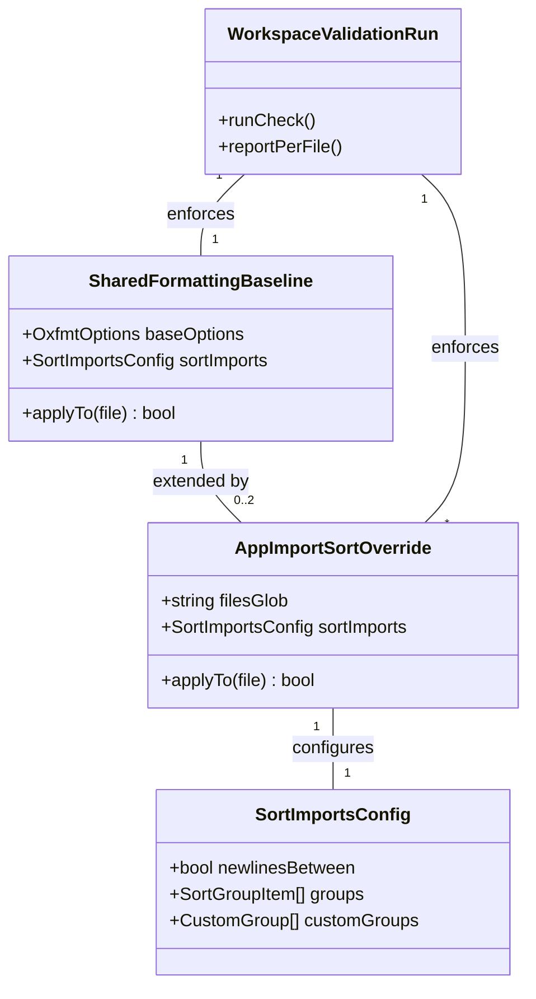

# OXC Shared Formatting Baseline with Per-App Import Sort

**Status: Implemented (revised mechanism).** The Approach below was corrected
mid-implementation after two rounds of empirical verification falsified the
original assumptions. See the "Implementation result" notes inline — this file
reflects what actually ships, not the first draft.

## Requirements

Give the workspace one shared Oxlint/Oxfmt baseline that already governs every
app and package, and let `apps/consumer-application` and
`apps/manager-dashboard` each apply their own import-ordering rule on top of it
— without introducing a second validation command, without separate physical
config files per app, and without either app's rule leaking into the other or
into shared packages.

## Entities

## Approach

1. **Baseline lives in the root `.oxfmtrc.json`, wired into `vite.config.ts`'s
   `fmt` block**:
   - `vite.config.ts` imports `./.oxfmtrc.json` and assigns it to `fmt`, so the
     JSON file is the single physical file a developer edits, while still
     flowing through Vite+'s documented `fmt` block mechanism rather than being
     a second, competing config source.
   - The baseline's `sortImports` block
     (`groups: ["builtin","external","windwise","app",[...relative],"unknown"]`,
     `customGroups` matching `@windwise/**` → `windwise` and `#/**` → `app`)
     governs any file not covered by an app-specific override — this satisfies
     FR-001/FR-004 directly.

2. **Per-app divergence is expressed as `overrides` entries inside the same
   `.oxfmtrc.json`, not separate physical files per app**:
   - Two glob-scoped entries (`apps/consumer-application/**`,
     `apps/manager-dashboard/**`) were added to the existing `overrides` array,
     each setting only `options.sortImports` — nothing else — so every other
     baseline setting (quote style, print width, etc.) continues to apply to
     both apps unchanged.
   - **Implementation result — this corrects the original request's implied
     mechanism a second time.** Two mechanisms were tried and rejected before
     this one:
     1. An Oxlint `sort-imports` lint rule via `lint.overrides` (the first draft
        of this canvas) — rejected because that rule sorts by _imported member
        name and declaration kind_, not by _module-source grouping_ (external
        vs. relative), and turned out not to be auto-fixable by
        `vp check --fix`/`--fix-suggestions`/`--fix-dangerously` under any flag
        — verified by direct testing, not assumed.
     2. Separate physical `apps/*/.oxfmtrc.json` files (matching the literal
        original request, "each app will have their specific files") — rejected
        because `vp check`/`vp fmt` only reads the **root-level**
        `.oxfmtrc.json`; nested per-directory config files are silently ignored
        by Vite+'s wrapper even though the raw `oxfmt` binary supports cascading
        config discovery. Verified empirically: writing a file with raw
        `oxfmt --write` respecting the nested config, then immediately running
        `vp fmt --write` on the same file, reverted it back to the root config's
        behavior.
   - The `overrides`-inside-root-file mechanism is the only one of the three
     that is (a) real per-app divergence, (b) auto-fixable via `vp check --fix`,
     and (c) actually honored by the single `vp check`/`vp run ready` validation
     command.

3. **Oxfmt's `sortImports` is the correct tool, not Oxlint's `sort-imports`
   rule**:
   - Oxfmt (the formatter) has a native `sortImports` option modeled on
     `eslint-plugin-perfectionist/sort-imports`, confirmed via direct inspection
     of the installed `oxfmt` package's `configuration_schema.json`. It supports
     real module-source grouping (`builtin`, `external`, `internal`,
     `parent`/`sibling`/`index`, plus `customGroups` matched by
     `elementNamePattern`) — exactly the "external vs. internal vs. relative"
     grouping the original request implied and that Oxlint's rule could not
     provide. Because it's a _formatter_ option, it is applied by
     `vp fmt`/`vp check --fix` like any other formatting rule — fully automatic,
     no manual reordering needed (unlike the rejected Oxlint approach).

## Structure

### Inheritance Relationships

Not applicable — this is declarative JSON configuration, not a class hierarchy.
The relevant structural relationship is override precedence within
`.oxfmtrc.json`: base top-level options apply to every file; `overrides` array
entries apply cumulatively on top, in array order, each entry setting only the
option keys it declares (confirmed via Oxfmt's own schema: "When a file matches
multiple overrides, the later override takes precedence").

### Dependencies

1. `vite.config.ts`'s `fmt` block depends on `./.oxfmtrc.json` via a JSON import
   (`import oxfmtConfig from './.oxfmtrc.json' with { type: 'json' }`) — this is
   the one physical file that is both the shared baseline and the home for both
   apps' overrides.
2. `vp check`/`vp fmt` depend on nothing new structurally — they already read
   the `fmt` block from `vite.config.ts`; routing that block's content through
   an imported JSON file instead of an inline object is transparent to them.
3. The `staged` pre-commit hook (`staged: { "*": "vp check --fix" }`)
   automatically picks up the new `sortImports` overrides for any staged file —
   no hook change needed.
4. **Rejected dependency, verified not to exist**: `vp fmt`'s nested-config
   discovery. Per-app `.oxfmtrc.json` files placed inside `apps/*/` are never
   read by `vp` — this was empirically disproven, not assumed to be absent.

### Layered Architecture

1. **Workspace root layer**: `.oxfmtrc.json` (imported by `vite.config.ts`'s
   `fmt` block) — base options plus a 4-entry `overrides` array (quote style,
   markdown width, and the two new per-app `sortImports` entries).
2. **App layer**: `apps/consumer-application/**`, `apps/manager-dashboard/**` —
   matched by the new overrides; existing files were reformatted once via
   `vp check --fix` to bring them into compliance.
3. **Shared package / root-file layer**: `packages/**`, root-level files —
   matched only by the base config; verified untouched by either app override
   (spot-checked with a probe file).
4. **Validation layer**: `vp check` / `vp run ready` — no change to invocation;
   confirmed to pass end-to-end (`pnpm run ready` exits 0) with the new
   overrides active.

## Operations

### Update Config - `.oxfmtrc.json` `overrides` array — ✅ Done (revised mechanism)

1. Responsibility: Express both apps' import-sort divergence as `sortImports`
   overrides in the existing root `.oxfmtrc.json`, per FR-002/FR-003, without
   touching base options (FR-001/FR-004).
2. Change: appended two entries to the existing `overrides` array:
   - `{ files: ["apps/consumer-application/**"], options: { sortImports: { groups: ["builtin","external","windwise","app",["parent","sibling","index","style","side_effect_style"],"unknown"], newlinesBetween: true, customGroups: [...same as baseline] } } }`
     — identical to the baseline's grouping (external and windwise kept as
     separate tiers, with a blank line between every tier).
   - `{ files: ["apps/manager-dashboard/**"], options: { sortImports: { groups: ["builtin",["external","windwise"],"app",["parent","sibling","index","style","side_effect_style"],"unknown"], newlinesBetween: true, customGroups: [...same as baseline] } } }`
     — diverges by merging `external` and `windwise` into a single combined tier
     (no blank line between generic npm packages and `@windwise/*` workspace
     packages), reflecting a deliberately different stylistic choice for that
     app.
3. Constraints: each override sets only `options.sortImports` — no
   `singleQuote`, `printWidth`, or other key — so every other baseline setting
   continues applying unchanged to both apps' files.

### Verify - Confirm shared packages and root files are unaffected — ✅ Done

1. Responsibility: Prove FR-004.
2. Logic: wrote a probe file to `packages/query/src/__probe.ts` with
   out-of-order builtin/external/relative imports, ran `vp fmt --write`,
   confirmed it was grouped per the **base** config (blank line between
   builtin/external/relative, no app-specific merging), then deleted the probe
   file.
3. Outcome: confirmed — no app override leaked into a shared package.

### Verify - Confirm per-app divergence and independence (SC-003) — ✅ Done

1. Responsibility: Prove the two apps' rules are genuinely independent.
2. Logic: ran `vp fmt --write` against one `__root.tsx` file per app; diffed the
   resulting import blocks.
3. Outcome: confirmed — `consumer-application`'s file kept `external` and
   `windwise` as separate blank-line-delimited groups; `manager-dashboard`'s
   file merged them into one group with no blank line. No cross-app effect
   observed.

### Verify - One-time reformat pass on existing files — ✅ Done

1. Responsibility: Since the workspace previously had no enforced import order,
   confirm the scope of the first `vp check --fix` pass.
2. Logic: ran `vp check --fix` once across the whole workspace after the config
   change.
3. Outcome: the diff was broader than originally scoped — it included a
   repo-wide quote-style change (double → single quotes) that predates this
   feature's specific `sortImports` work, since it came from the pre-existing
   root `.oxfmtrc.json`'s `singleQuote: true` override being picked up for the
   first time. This is a pre-existing baseline setting, not something this
   feature introduced — noted here for traceability, not flagged as a new risk.

### Verify - Existing workspace validation still single-pass (User Story 3) — ✅ Done

1. Responsibility: Confirm FR-005.
2. Logic: ran `pnpm run ready` (`vp check && vp run -r test && vp run -r build`)
   once, full workspace.
3. Outcome: exit code 0. No new command was introduced; `sortImports`
   findings/fixes flow through the existing `vp check`/`vp fmt` pipeline exactly
   like any other formatting rule.

## Norms

1. **One physical config file for formatting**: `.oxfmtrc.json` at the workspace
   root, imported into `vite.config.ts`'s `fmt` block — no per-app
   `.oxfmtrc.json` files (they are silently ignored by `vp`, confirmed
   empirically). Per-app divergence lives in that single file's `overrides`
   array.
2. **Override entries are additive, never wholesale replacements**: an override
   for an app sets only the option key(s) it intends to diverge on (here,
   `sortImports`) — it must never redeclare unrelated base options even to
   repeat the same value.
3. **`sortImports` is an Oxfmt (formatter) option, not an Oxlint (linter)
   rule**: any future adjustment to import-ordering behavior must work within
   Oxfmt's `sortImports` schema (`groups`, `customGroups`, `newlinesBetween`,
   etc.) — do not reach for Oxlint's `sort-imports` rule; it exists but sorts by
   a different, less useful axis (member name/declaration kind) and is not
   auto-fixable in this Oxlint version.
4. **Verify auto-fix behavior before relying on it**: this feature's first two
   approaches (Oxlint rule, nested files) each looked plausible from
   documentation/schema alone but failed under actual execution —
   auto-fixability and config-discovery behavior were both wrong assumptions
   until tested directly. Treat "should work per the docs" as a hypothesis, not
   a fact, for anything touching `vp`'s config-resolution behavior.
5. **Glob scoping uses workspace-relative paths from the root config**:
   `apps/consumer-application/**`, `apps/manager-dashboard/**` — matching the
   pattern already used for `lint.overrides` in
   `001-project-codebase-bootstrap`'s successor work and Vite+'s own
   monorepo-overrides documentation.

## Safeguards

1. **Functional Constraints**: Both apps MUST have an active,
   independently-configured `sortImports` override in the root `.oxfmtrc.json`'s
   `overrides` array after this change; `packages/**` and root-level files MUST
   be governed by the base `sortImports` config only.
2. **Performance Constraints**: No new tooling introduced — `sortImports` is a
   built-in Oxfmt option already bundled; no measurable added cost to
   `vp check`/`vp run ready` beyond normal config-parsing overhead.
3. **Security Constraints**: Not applicable — configuration-only change, no
   runtime/network/secret surface.
4. **Integration Constraints**: The `staged` pre-commit hook and
   `vp run ready`'s three-step definition
   (`vp check && vp run -r test && vp run -r build`) were NOT modified —
   verified the new overrides are picked up automatically by both without any
   change to their own configuration.
5. **Business Rule Constraints**: An override for one app MUST NOT set any
   option key other than `sortImports` unless a future, separately-scoped
   requirement explicitly asks for more divergence.
6. **Scope Constraints (explicitly out of bounds for this feature)**: Do NOT
   introduce `eslint-plugin-import` or any non-Oxc tool. Do NOT reintroduce the
   Oxlint `sort-imports` rule (rejected mechanism, kept out of
   `lint.rules`/`lint.overrides` entirely — verified absent). Do NOT create
   per-app physical `.oxfmtrc.json` files (rejected mechanism, verified
   non-functional through `vp`). Do NOT modify the `staged` hook or
   `vp run ready`'s definition.
7. **Technical Constraints**: The `overrides` array entries MUST validate
   against the installed `oxfmt` version's `configuration_schema.json` —
   verified directly during implementation (`vp check --fix` parsed and applied
   the config without schema errors), not assumed from documentation alone.
8. **Data Constraints**: Not applicable.
9. **API/Command Constraints**: No new `vp`/root `package.json` commands.
   `vp check`, `vp check --fix`, `vp fmt`, and `vp run ready` remain the only
   entry points; confirmed their output/behavior is unchanged in shape
   (formatting fixes apply silently via `--fix`, same as any other Oxfmt rule).
