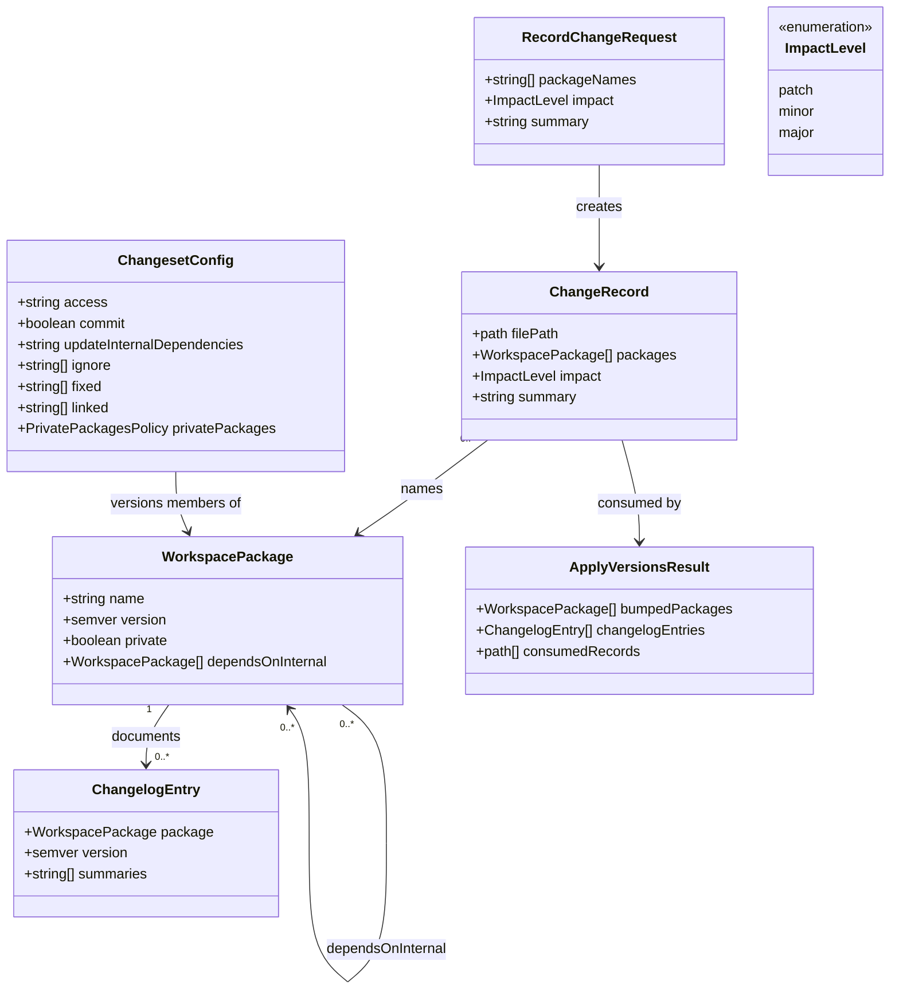

# Close Changesets Contributor-Documentation Gaps

## Requirements

Give contributors a complete, package-scoped versioning workflow they can follow
without asking a teammate: record pending SemVer intent per app or shared
package, apply those records at release time to independent versions and
changelogs, and never publish private workspace packages. Keep the existing
Changesets wiring; close the documentation and convention gaps the analysis
found so impact level, new-package baselines, and ignored packages are
unambiguous.

## Entities

## Approach

1. **Keep existing tooling; do not rebuild**:
   - `@changesets/cli` (catalog `^2.31.0`, resolved `2.31.1`) already records
     and applies versions. Root scripts `changeset` and `changeset:version` are
     already invoked via `vp run`.
   - `.changeset/config.json` already encodes FR-002/FR-004/FR-005: `fixed: []`,
     `linked: []`, `updateInternalDependencies: "patch"`,
     `access: "restricted"`, `privatePackages.version: true`,
     `privatePackages.tag: false`, `commit: false`, `prettier: false`.
   - Every workspace member already has `"version": "0.1.0"` and
     `"private": true`. Do not invent a second versioning tool, CI bot, or
     `changeset publish` path.

2. **Close analysis gaps in contributor docs only**:
   - US3.2 is partial: AGENTS.md and `.changeset/README.md` name
     patch/minor/major but give no Windwise examples.
   - New packages added after this feature still need a manual
     `"version": "0.1.0"` at creation; Changesets will not invent it.
   - Conflicting pending records for one package: highest impact wins (major >
     minor > patch). Document that; do not add custom resolution code.
   - Never-versioned packages use `.changeset/config.json` `ignore`. Document
     the mechanism; leave `ignore: []` unless a package is explicitly excluded
     by a later spec.

3. **Release vs record**:
   - Contributors run `vp run changeset` in the same PR as the code change.
   - Maintainers run `vp run changeset:version` as a separate release-prep
     commit. Do not auto-commit. Do not bump in pre-commit.
   - Conventional Commits remain git history; they do not drive SemVer.
   - Keep `.changeset/workspace-baseline.md` (empty frontmatter) so this work
     item itself does not produce a version bump. Do not apply versions as part
     of this prompt unless validating with a throwaway record that is discarded.

## Structure

### Inheritance Relationships

1. `@changesets/cli` defines the record/apply CLI (`changeset`,
   `changeset version`, `changeset status`).
2. Root `package.json` scripts wrap those commands for `vp run`.
3. Workspace members (`apps/*`, `packages/*`) are independently versioned
   packages; the root `windwise` package.json version is a workspace snapshot
   and is not a pnpm workspace member.
4. No custom exception types. CLI failures (missing packages, nothing to apply)
   stay Changesets' own stderr.

### Dependencies

1. Contributor / maintainer calls `vp run changeset` or
   `vp run changeset:version`.
2. `vp` runs the root `package.json` script, which calls `@changesets/cli`.
3. The CLI reads `.changeset/config.json` and `.changeset/*.md`, then writes
   member `package.json` `version` fields and `CHANGELOG.md`.
4. Internal `workspace:*` edges (apps → `@windwise/ui`, `@windwise/query`,
   `@windwise/vite-config`) are updated per
   `updateInternalDependencies: "patch"`.
5. AGENTS.md and `.changeset/README.md` depend on the same policy as
   `config.json`; they must not contradict it.

### Layered Architecture

1. Invocation layer: `vp run changeset` / `vp run changeset:version`.
2. Policy layer: `.changeset/config.json` (access, ignore, internal bumps, no
   auto-commit).
3. Intent layer: pending `.changeset/*.md` Change Records.
4. State layer: each member `package.json` `version` and `CHANGELOG.md`.
5. Guidance layer: AGENTS.md “Package versions (Changesets)” and
   `.changeset/README.md`.

## Operations

### Verify Config — `.changeset/config.json`

1. Responsibility: Confirm policy matches spec FR-002, FR-004, FR-005. Change
   the file only if it has drifted.
2. Attributes:
   - `access`: `"restricted"`
   - `commit`: `false`
   - `fixed`: `[]`
   - `linked`: `[]`
   - `ignore`: `[]`
   - `updateInternalDependencies`: `"patch"`
   - `prettier`: `false` (this repo uses Oxfmt, not Prettier)
   - `privatePackages.version`: `true`
   - `privatePackages.tag`: `false`
   - `baseBranch`: `"main"`
   - `changelog`: `"@changesets/cli/changelog"`
3. Methods:
   - `assertUnchangedIfCompliant()`: void
     - Logic:
       - Read `.changeset/config.json`.
       - If all fields above match, leave the file untouched.
       - If any field drifted, restore the values above. Do not add CI
         enforcement, `changeset publish`, or `tag: true`.
4. Constraints: Do not set `access` to `public`. Do not populate `fixed` or
   `linked`.

### Verify Manifests — workspace members at `0.1.0`

1. Responsibility: Every independently versioned member has a baseline version
   and stays private.
2. Attributes:
   - Members: `@windwise/consumer-application`, `@windwise/manager-dashboard`,
     `@windwise/query`, `@windwise/ui`, `@windwise/vite-config`
   - Root `windwise`: `"version": "0.1.0"` for workspace identity only
3. Methods:
   - `assertBaselineVersions()`: void
     - Logic:
       - Each member `package.json` MUST have `"version": "0.1.0"` and
         `"private": true` unless a prior `changeset:version` run already
         advanced a version (then do not reset).
       - Do not add `"version"` to hypothetical future packages in this prompt;
         document the convention instead.
4. Constraints: Do not backfill historical versions. Do not set `1.0.0`.

### Verify Scripts — root `package.json`

1. Responsibility: Keep record/apply invocable through `vp`.
2. Methods:
   - `assertScripts()`: void
     - Logic:
       - `"changeset"` MUST be `"changeset"`.
       - `"changeset:version"` MUST be `"changeset version"`.
       - `@changesets/cli` MUST remain a root `devDependency` with `"catalog:"`.
       - `pnpm-workspace.yaml` catalog MUST pin `"@changesets/cli": ^2.31.0` (or
         the already-resolved compatible range). Do not pin the CLI inside apps
         or shared packages.

### Update Documentation — `AGENTS.md` Package versions section

1. Responsibility: Close US3.2 and the undocumented conventions from analysis.md
   (new-package baseline, highest-impact wins, `ignore`).
2. Methods:
   - `extendPackageVersionsSection()`: void
     - Logic:
       - Keep the existing identity table (work item / git branch / package
         version) and the two `vp run` commands.
       - Add Windwise-specific impact examples:
         - `patch`: fix CSS reset in `@windwise/ui` that does not add API; fix
           env validation crash in `@windwise/consumer-application`.
         - `minor`: add Button/Input primitives to `@windwise/ui`; add a new
           helper export to `@windwise/query`.
         - `major`: remove or rename a public export from `@windwise/ui` or
           `@windwise/query` (still on `0.y.z`; document that major is reserved
           for incompatible API change, and that jumping to `1.0.0` is a product
           decision, not the default for every breaking change during initial
           development — follow SemVer `0.y.z` by bumping minor for subsequent
           development releases unless the changeset explicitly records
           `major`).
       - State: multiple pending records for the same package → highest impact
         wins (`major` > `minor` > `patch`).
       - State: a new workspace member MUST ship `"version": "0.1.0"` and
         `"private": true` in its `package.json` at creation; Changesets does
         not invent the field.
       - State: to exclude a package from versioning, add its name to
         `.changeset/config.json` `ignore` and document why in the PR; currently
         `ignore` is empty.
       - State: skip changesets for docs, specs, formatting, cspell, and
         agent-workflow files.
       - State: do not run `changeset publish`; do not bump in pre-commit.
3. Constraints: Do not duplicate the entire spec into AGENTS.md. Do not invent
   CI gates.

### Update Documentation — `.changeset/README.md`

1. Responsibility: Same guidance as AGENTS.md, shorter, next to the tool.
2. Methods:
   - `addImpactExamples()`: void
     - Logic:
       - Keep “do not run `changeset publish`”.
       - Add the same three Windwise examples (patch/minor/major) in compact
         form.
       - Mention highest-impact-wins, new-package `0.1.0`, and `ignore`.
       - Keep the pointer to AGENTS.md.

### Preserve Empty Baseline Record — `.changeset/workspace-baseline.md`

1. Responsibility: This work item must not itself bump packages off `0.1.0`.
2. Methods:
   - `keepEmptyChangeset()`: void
     - Logic:
       - Keep YAML frontmatter with no package keys (`---` / `---`).
       - Do not convert it into a `minor`/`patch` record for `@windwise/ui` or
         any other member.
       - If `vp run changeset -- status` reports no packages to bump, that is
         the expected outcome while only the empty record exists.

### Validate — dry run, no release apply

1. Responsibility: Confirm US1/US2 behavior without committing a real bump.
2. Methods:
   - `statusDryRun()`: void
     - Logic:
       - Run `vp run changeset -- status` (or `pnpm exec changeset status`).
       - With only the empty baseline file, expect no patch/minor/major bumps.
       - Optional local check (do not commit): add a temporary
         `.changeset/tmp-ui-patch.md` naming only `"@windwise/ui": patch`, run
         `changeset status`, confirm dependents `@windwise/consumer-application`
         and `@windwise/manager-dashboard` queue at least `patch`, and
         `@windwise/query` / `@windwise/vite-config` do not unless they depend
         on ui. Delete the temporary file before finishing.
       - Do not run `vp run changeset:version` against a real intended release
         in this prompt.
3. Constraints: `vp check` must still pass. Do not format unrelated generated
   files (`routeTree.gen.ts`) as part of this work.

## Norms

1. Annotation Standards: Change Records use Markdown with YAML frontmatter
   mapping package name → `patch` | `minor` | `major`, then a prose summary.
2. Dependency Injection: `@changesets/cli` is a root catalog `devDependency`
   only. Apps keep `workspace:*` for `@windwise/*`.
3. Exception Handling:
   - No custom error types.
   - Misattributed package names are caught in PR review, not by new validation
     code.
   - CLI stderr from Changesets is the user-facing error channel.
4. Data Validation: `version` fields MUST remain valid SemVer. `private` MUST
   remain `true` on every member.
5. Logging: None beyond Changesets CLI output.
6. Documentation Standards: Contributor guidance lives in AGENTS.md (full) and
   `.changeset/README.md` (short). Root README only lists the two `vp run`
   commands. Specs stay under `docs/specs/003-changesets-versioning/`.

## Safeguards

1. Functional Constraints: Independent versions; unrelated packages stay
   untouched. Empty pending set → no version or changelog mutation.
2. Performance Constraints: CLI-only; `@changesets/cli` MUST NOT appear in app
   production bundles.
3. Security Constraints: Never `changeset publish`. `access: "restricted"` plus
   `"private": true`. No registry tokens in this feature.
4. Integration Constraints: Invoke through `vp run`, not ad-hoc `npx`. Do not
   add a pre-commit hook that bumps versions. Do not add a merge-to-main CI
   apply bot (explicitly out of spec scope).
5. Business Rule Constraints: Highest pending impact wins. Internal dependents
   get at least a `patch` when a dependency they use is bumped. Baseline for
   existing members is `0.1.0`.
6. Exception Handling Constraints: Do not wrap Changesets in a custom
   GlobalExceptionHandler. Do not hide CLI failures.
7. Technical Constraints: No Lerna, bumpp-on-commit, or semantic-release
   inference from Conventional Commits. `commit: false`. `prettier: false`.
8. Data Constraints: Change Records MUST name at least one existing workspace
   package. Do not invent package names.
9. API Constraints: This feature exposes no HTTP API. The only contracts are the
   two root scripts and `.changeset/config.json` policy fields.
