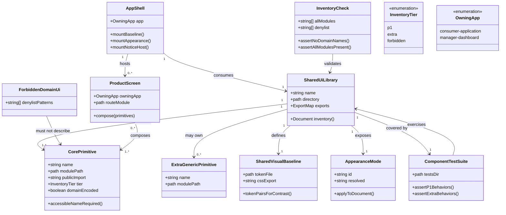

# Close Shared UI Core Foundation Gaps

**Status: Implemented (with known external gate debt).** Operations below match
the code as of sync. `vp -C packages/ui test` passes (9 files / 29 tests).
`vp run ready` may still fail on **pre-existing** format issues outside this
work item’s scoped files (untouched shadcn components, `AGENTS.md`,
`routeTree.gen.ts`).

## Requirements

Lock `@windwise/ui` as the single reusable core for both Windwise products so
contributors assemble everyday screens from shared, domain-free primitives
instead of forking controls per app. Close the remaining gaps: make the required
vs extra vs forbidden inventory obvious, prove the domain boundary and P1
behaviors with tests, and mount the shared notice host in the member app so
forms, waiting, and brief status work the same in both products. Do not rebuild
the visual kit, add a catalog app, or put instrument/recommendation/consultation
UI in the shared library.

## Entities

## Approach

1. **Gap-close, not rewrite**:
   - Keep existing primitives, `components.json`, stylesheet, and
     `ThemeProvider`. Do not add a second UI package, Storybook, or preview
     route.
   - P1 required modules (already on disk): button, input, textarea, select,
     field + label, card, badge, tabs, dialog, skeleton, separator, toast.
   - Extra modules stay (avatar, chart, dropdown-menu, input-group, popover,
     questionnaire, sheet, sidebar, table, tooltip). `questionnaire` is a
     generic multi-step control, not consultation domain UI — do not delete it
     for name similarity.
   - Empty-state primitive is **out of scope** (SPEC GAP resolved: defer until a
     product screen in both apps needs a shared empty pattern). Document the
     promotion rule only.

2. **Technical implementation**:
   - Apps import only `@windwise/ui/...`. Never `shadcn`, `@shadcn/react`, or
     `@base-ui/react` from apps. New primitives:
     `pnpm dlx shadcn@latest add <name> -c packages/ui` only.
   - Tests via `vp test` / `vp -C packages/ui test`. Inventory and token checks
     use Node `fs` (same pattern as `globals.test.ts`).
   - Component render/behavior tests live under `packages/ui/src/tests/` with
     `happy-dom` + `@testing-library/react` as **devDependencies of
     `@windwise/ui` only** (`catalog:`). Do not add them to apps or production
     `dependencies`.
   - Inventory asserts **all 23** component modules; behavior suites cover P1
     and extras. Contrast: assert `:root` and `.dark` define `--background`,
     `--foreground`, `--primary`, `--primary-foreground`; document a manual WCAG
     2.2 AA spot-check in the README. No screenshot grid.
   - Domain denylist matches Windwise product names (`instrument`,
     `recommendation`, `consultation`, `InstrumentCard`, `RecommendationCard`,
     `ConsultationStep`, `ProviderPriceTable`) on **component file basenames
     under `src/components/`**. Do **not** flag `ThemeProvider`,
     `ToastProvider`, `TooltipProvider`, or `questionnaire.tsx`.

3. **Business logic**:
   - One library, two products; apps compose, they do not fork primitives.
   - Spacing around a primitive is allowed; restyling the primitive itself in
     the app is not (document; no new linter in this work item).
   - Dialog for irreversible confirmations; toast for brief status; no third
     pattern.
   - Member shell must mount `Toaster` inside `ThemeProvider` like
     manager-dashboard. Do **not** add `TooltipProvider` to consumer unless a P1
     flow requires it (it does not).
   - Changesets: patch `@windwise/consumer-application` for Toaster wiring. Skip
     a new `@windwise/ui` changeset unless public exports or primitive behavior
     change (a pending `ui-shadcn-package-exports` minor already exists — do not
     duplicate).

## Structure

### Inheritance Relationships

Not an OOP hierarchy. Convention inheritance:

1. Component tests under `packages/ui/src/tests/` follow
   `packages/ui/src/styles/globals.test.ts` /
   `packages/ui/src/lib/utils.test.ts`
   (`import { describe, expect, it } from 'vite-plus/test'`).
2. Component tests import primitives via package `#/components/...` (and
   `#/lib/...` where needed).
3. Member app shell follows `apps/manager-dashboard/src/routes/__root.tsx` for
   `Toaster` placement only (inside `ThemeProvider`, sibling to children).
4. Inventory documentation extends `packages/ui/README.md` rather than a new doc
   site.

### Dependencies

1. Both apps depend on `@windwise/ui` via `workspace:*` (already).
2. `apps/consumer-application/src/routes/__root.tsx` depends on
   `@windwise/ui/components/toast` (`Toaster`) in addition to `ThemeProvider`
   and `@windwise/ui?url`.
3. Inventory tests (`packages/ui/src/tests/inventory.test.ts`) depend on
   `packages/ui/src/components/*.tsx` and `packages/ui/package.json` `exports`.
4. Token tests depend on `packages/ui/src/styles/globals.css`.
5. Component behavior tests under `packages/ui/src/tests/*.test.tsx` depend on
   existing component modules via `#/`; they must not import kit packages from
   outside `@windwise/ui`.
6. Apps must not depend on `shadcn` / `@base-ui/react` / `@shadcn/react`.

### Layered Architecture

1. **Shared UI package**: primitives, baseline CSS, appearance wrapper,
   `src/tests/` suite, README inventory — source of truth.
2. **App shell layer**: root routes load CSS, wrap `ThemeProvider`, mount
   `Toaster`.
3. **Product screen layer**: routes compose primitives; no domain UI in the
   shared package; no new domain screens in this work item.
4. **Validation layer**: `vp -C packages/ui test` then `vp run ready` (ready may
   still fail on unrelated pre-existing format debt).

## Operations

### Update Docs - `packages/ui/README.md` — ✅ Done

1. Responsibility: Make P1 vs extra vs forbidden discoverable (FR-007, SC-001,
   promotion path US3.2).
2. Sections shipped: Required core (P1) table, Extra, Forbidden, Promotion,
   Notice vs dialog, Spacing vs restyle, Accessible names, Appearance / contrast
   review; Usage includes `Toaster` in the app shell.
3. Constraints: does not document importing `shadcn` from apps.

### Create Test - `packages/ui/src/tests/inventory.test.ts` — ✅ Done

1. Responsibility: Enforce full component inventory presence and domain denylist
   (FR-002, FR-003, FR-005, SC-004; extended to all modules).
2. Methods:
   - `it("includes every component module file")`:
     - Logic: resolve `src/components` via `../components/` from the test file;
       assert all 23 modules exist: `avatar`, `badge`, `button`, `card`,
       `chart`, `dialog`, `dropdown-menu`, `field`, `input-group`, `input`,
       `label`, `popover`, `questionnaire`, `select`, `separator`, `sheet`,
       `sidebar`, `skeleton`, `table`, `tabs`, `textarea`, `toast`, `tooltip`.
     - Assert `packages/ui/package.json` `exports["./components/*"]` is
       `./src/components/*.tsx`.
   - `it("does not encode Windwise domain names in component file basenames")`:
     - Logic: list `*.tsx` in `src/components`; fail if a basename matches
       `/instrument|recommendation|consultation/i` or equals
       `provider-price-table` / `instrument-card` / `recommendation-card` /
       `consultation-step`. Do **not** match `provider` alone; do **not** fail
       `questionnaire.tsx`.
3. Constraints: Node `fs` / `path` only; no DOM.

### Update Test - `packages/ui/src/styles/globals.test.ts` — ✅ Done

1. Responsibility: Prove both appearance modes define contrast token pairs
   (FR-009, FR-010, FR-011, SC-006 automation floor).
2. Methods (existing non-empty / Tailwind / font assertions retained):
   - `it("defines light and dark contrast token pairs")`: read `globals.css`;
     assert both `:root` and `.dark` blocks contain `--background:`,
     `--foreground:`, `--primary:`, `--primary-foreground:`.
3. Constraints: do not compute WCAG ratios in code.

### Create Tests - `packages/ui/src/tests/*.test.tsx` — ✅ Done

1. Responsibility: Golden-path behavior and accessible names for **all** shared
   components (P1 + extras), replacing the earlier colocated
   `p1-primitives.test.tsx` plan.
2. Setup: `happy-dom` and `@testing-library/react` in `pnpm-workspace.yaml`
   `catalog:` and `@windwise/ui` `devDependencies` only. Use
   `import { describe, expect, it } from 'vite-plus/test'` and
   `/** @vitest-environment happy-dom */` on render suites. Imports via `#/`.
3. Files:
   - `primitives.test.tsx` — Button (name + disabled via
     `toHaveProperty('disabled', true)`), Badge, Input, Textarea, Label,
     Separator, Skeleton
   - `forms.test.tsx` — Field (label/description/error), InputGroup
     (`data-slot="input-group"`), Select (open options)
   - `layout.test.tsx` — Card composition, Table
   - `overlays.test.tsx` — Dialog open/dismiss, Sheet, Popover, Tooltip
     (`open`), DropdownMenu, Toaster viewport on `document` (portal)
   - `navigation.test.tsx` — Tabs switch panel; Sidebar under
     `TooltipProvider` + `SidebarProvider`
   - `composites.test.tsx` — Avatar group; ChartContainer + BarChart;
     Questionnaire with `QuestionnaireItem name="..."` (not `value`)
4. Constraints: do not import `@base-ui/react` from tests; no product-domain
   fixtures. No jest-dom matchers (use DOM properties / Testing Library queries
   only).

### Update Component - `apps/consumer-application/src/routes/__root.tsx` — ✅ Done

1. Responsibility: Member product can use the shared notice pattern (FR-003,
   FR-004, US2.3).
2. Logic shipped:
   - Import `Toaster` from `@windwise/ui/components/toast`.
   - Inside `ThemeProvider`: `PowerSyncProvider` wraps `{children}`;
     `<Toaster />` is a sibling.
3. Constraints: no `TooltipProvider` on consumer; toast source not copied.

### Create Changeset - `.changeset/consumer-notice-host.md` — ✅ Done

1. Responsibility: Record shipped shell behavior per AGENTS.md.
2. Content: patch `@windwise/consumer-application` — mount shared notice host in
   the member app shell.
3. Constraints: no extra `@windwise/ui` changeset for this shell wiring;
   `changeset version` not run as part of this work.

### Verify - workspace quality gate — ⚠️ Partial

1. Responsibility: Constitution II/I.
2. Results:
   - `vp -C packages/ui test` — **pass** (9 files, 29 tests).
   - `vp run ready` — may still fail at `vp check` on **pre-existing** format
     issues (untouched `packages/ui/src/components/*`, `AGENTS.md`,
     `routeTree.gen.ts`). Scoped 004 files were formatted; do not treat that
     unrelated debt as a regression of this work item.
3. Constraints: do not “fix” `routeTree.gen.ts` churn in this work item.

## Norms

1. **Package boundary**: shadcn / Base UI stay inside `packages/ui`. Apps import
   `@windwise/ui` only. Single `components.json` at
   `packages/ui/components.json`.
2. **Imports**: follow existing app import grouping (`@windwise/ui` with other
   workspace packages). UI package tests use `#/components/...` and `#/lib/...`.
   Use existing oxfmt/oxlint; do not invent import order.
3. **Tests**: `vite-plus/test`. Component coverage lives under
   `packages/ui/src/tests/*.test.ts(x)` (suite by concern). Keep
   `src/styles/globals.test.ts` and `src/lib/utils.test.ts` colocated with those
   surfaces. No shared mutable state across tests.
4. **Documentation**: inventory lives in `packages/ui/README.md`, not a second
   markdown tree. Do not duplicate the full spec into the README.
5. **Changesets**: skip for docs/tests-only UI edits; patch the app that gains
   Toaster. Do not add `Co-authored-by`.
6. **Accessibility**: interactive fixtures must include accessible names. Do not
   add icon-only buttons without names in fixtures.
7. **No domain leakage**: no Windwise catalog/recommendation/consultation types
   or copy in `packages/ui`.
8. **Exception handling**: not a backend feature. Invalid primitive _use_
   (missing labels) is documented, not thrown from the library.

## Safeguards

1. **Functional**: Do not create `packages/design-system`, Storybook, Ladle, or
   `/ui` preview routes. Do not add empty-state, InstrumentCard, or consultation
   components. Do not delete extra primitives.
2. **Performance**: No new production dependencies. Test libraries (`happy-dom`,
   `@testing-library/react`) are `@windwise/ui` devDependencies only.
3. **Security**: No secrets in tests or README. Theme `localStorage` key stays
   as implemented; do not redesign persistence.
4. **Integration**: Do not import UI via relative `apps/` → `packages/ui` paths.
   Preserve `exports` globs unless a new file is not covered (component files
   already are).
5. **Business rules**: Notice vs dialog; spacing vs restyle; promote only when
   both products need a generic pattern; denylist is product-domain names, not
   React “Provider”.
6. **Exception / a11y**: Do not weaken keyboard or focus behavior of Dialog. Do
   not ship Toaster only in one app.
7. **Technical**: Do not replace the visual kit. Do not add `components.json` to
   an app. Do not run `shadcn add` targeting `apps/*`. Do not introduce a SC-002
   linter in this work item.
8. **Data**: No new persisted entities. Appearance remains CSS class on
   `documentElement`.
9. **API**: Stable import paths listed in the README P1 table; do not rename
   existing exports (`Button`, `FieldError`, `Toaster`, `ThemeProvider`).
10. **Verification**: `vp -C packages/ui test` must pass. `vp run ready` is the
    workspace gate; failures limited to documented pre-existing format debt
    outside this work’s scoped files do not require rewriting this work item’s
    implementation to “fix” them.
