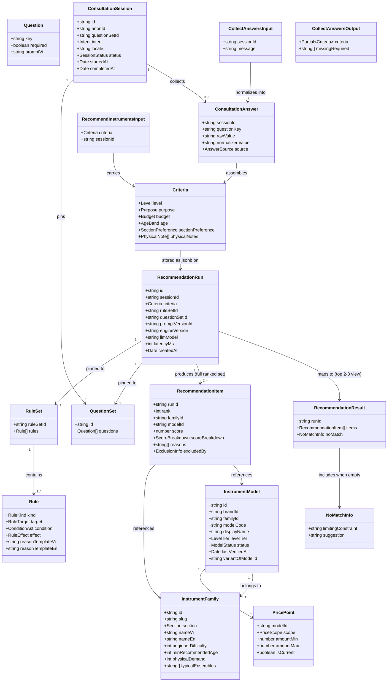

# Guided Instrument Consultation Engine

## Requirements

Build a two-surface guided consultation experience — a natural-language chat
flow and a non-AI multi-step form fallback — that each collect three required
criteria (level, purpose, budget) plus three optional criteria (age, section
preference, physical notes) and, once required criteria are satisfied, call one
shared, pure recommendation engine to return 2-3 ranked, explainable instrument
recommendations with plain-language reasons and trust signals (verification
date, source link, scope-labeled price). The result must be persisted as an
immutable, version-pinned run addressable by a permanent shareable URL, "other
options" must re-slice that same run rather than recompute, and the form path
must remain fully functional with zero dependency on LLM provider availability.
This feature also stands up the platform's M0/M1 foundation packages
(`@windwise/schemas`, `@windwise/core`, `@windwise/db`, `@windwise/ai`), since
no prior work item created them.

## Entities

**Conservative constraints**: `Criteria` is not wrapped in a generic
`FormValues`/`ChatState` type per surface — both the form and the chat tool
produce exactly this one Valibot-defined shape, which is also the literal
`jsonb` payload stored on `RecommendationRun.criteria`. Do not introduce a
`ConsultationDraft` entity distinct from `ConsultationAnswer[]` — draft/resume
state is just the session's persisted answers, read back on load. Reuse
`InstrumentFamily`, `InstrumentModel`, `PricePoint`, `RuleSet`/`Rule`,
`QuestionSet`/`Question`, `ConsultationSession`, `ConsultationAnswer`,
`RecommendationRun`, `RecommendationItem` exactly as defined in `data-model.md`
— do not rename fields or add speculative columns for features 006-011; those
work items extend these same tables later. `excludedBy` exists on
`RecommendationItem` but must never appear in the consumer-facing
`RecommendationResult` view (server-side filtering, not a UI-side redaction).

## Approach

1. **Solution architecture — one engine, two thin callers**:
   - `@windwise/core` exposes exactly one entry point,
     `recommend(criteria, catalog, ruleSet): RecommendationResult`, as a pure
     function with no React/TanStack/DB imports (enforced by an oxlint import
     boundary rule scoped to `packages/core/src/**`).
   - The chat surface (`@windwise/ai`'s `recommendInstruments` tool) and the
     form surface (a TanStack Start server function) both: (a) validate input
     against the same `@windwise/schemas` `Criteria` schema, (b) load catalog +
     rule set from `@windwise/db`, (c) call `recommend()`, (d) persist the
     result via `@windwise/db`'s `persistRun`. Neither surface computes anything
     `recommend()` doesn't already own — this is what makes "identical answers →
     identical output" true by construction (FR-007, SC-004), not by convention.
   - Chat free-text normalization (`collectAnswers`) is a distinct, separately
     testable step that runs _before_ `recommend()`, not inside it — the parity
     guarantee covers everything from normalized `Criteria` onward; chat-only
     normalization determinism is validated by golden-file tests on
     `collectAnswers` output, not folded into the engine's own test suite.

2. **Technical implementation**:
   - TanStack Start server functions (`createServerFn`) are the only callers of
     `@windwise/db` and `@windwise/core` from the app layer — no direct DB or
     catalog access from route components or the chat tool's client side.
   - `@windwise/ai`'s `tools.ts` defines `collectAnswers` and
     `recommendInstruments` as TanStack AI server-side tools; the LLM is
     restricted to calling these two tools and rephrasing their results in
     Vietnamese — it must never emit a model code, price, or spec not present in
     a tool result. `output-validator.ts` scans the assistant's final text for
     catalog-shaped tokens (model codes, currency amounts) not present in the
     tool call result and rejects/retries the turn if found.
   - Provider API keys (`@tanstack/ai-openai`, `@tanstack/ai-gemini`) stay in
     server-only env vars (`apps/consumer-application/src/env.ts`, extended);
     never exposed to the client bundle.
   - Persistence uses `@windwise/db` (Drizzle + PostgreSQL), additive to the
     existing PowerSync client-sync scaffold, not a replacement — PowerSync
     continues to serve its current offline-sync purpose untouched.
   - Valibot (`@windwise/schemas`) is the single schema source: the same
     `Criteria` schema instance validates chat tool input, form submission, and
     is reused (not duplicated) as the Drizzle `jsonb` column's runtime shape
     check.

3. **Business logic**:
   - No-recommendation-without-required-criteria (FR-008): both `collectAnswers`
     and the form's submit handler check `level`/`purpose`/`budget` presence
     before ever calling `recommend()`; missing fields short-circuit into a
     "need more info" response, never a partial or guessed result.
   - v0 rule engine (`@windwise/core/src/rules/`) is a small fixed
     constraint/modifier interpreter reading `RuleSet`/`Rule` rows shaped
     exactly like the future DB-backed model (009 swaps the data source, not the
     interpreter). Constraints exclude candidates outright (e.g., asthma +
     high-physical-demand family); modifiers adjust score and always attach a
     `reason_template` that becomes a `RecommendationItem.reasons` entry.
   - No-match handling (FR-013): when constraint rules exclude every candidate,
     `recommend()` returns `RecommendationResult.noMatch` naming the single
     rule/field responsible for the largest exclusion count, not a generic empty
     result — the engine tracks per-rule exclusion counts internally to make
     this deterministic.
   - "Other options" (FR-006) re-slices `RecommendationItem` rows already
     persisted for the existing `runId` (the full ranked set, not just top 3) —
     implemented as a paginated read, never a new `recommend()` call.
   - Version pinning (TR-6): `rule_set_id`, `question_set_id`,
     `prompt_version_id`, `engine_version`, `llm_model` are captured once, at
     `RecommendationRun` creation, from the currently-published rows/constants —
     later catalog or rule changes never retroactively alter a persisted run's
     rendering (FR-011, SC-005).

## Structure

### Type Relationships (TS interfaces, not classes)

1. `Criteria` (in `@windwise/schemas`) is a Valibot `object()` schema; its
   inferred TS type (`InferOutput<typeof CriteriaSchema>`) is imported by
   `@windwise/core`, `@windwise/ai`, `@windwise/db`, and the app — one type,
   four consumers, zero duplication.
2. `RecommendationResult` and `RecommendationItem` (in `@windwise/schemas`) are
   the shared return shape of `recommend()`; `@windwise/db`'s `persistRun`
   accepts this shape directly, and the consumer app's `result/$runId.tsx` route
   renders it directly — no per-layer DTO translation.
3. `RuleEffect` is a discriminated union
   (`{type: 'score', delta} | {type: 'exclude', reasonKey} | {type: 'require', reasonKey}`)
   — `@windwise/core`'s rule interpreter switches on `effect.type`; no class
   hierarchy.
4. `CollectAnswersOutput` and `RecommendInstrumentsInput` (in
   `@windwise/schemas`) are the two TanStack AI tool I/O contracts; both compile
   from the same `Criteria` partial/full shapes rather than being hand-written
   twins.

### Dependencies

1. `apps/consumer-application` depends on `@windwise/schemas`, `@windwise/core`
   (via server functions only), `@windwise/db` (via server functions only),
   `@windwise/ai`, `@windwise/ui` (existing), `@windwise/query` (existing) — all
   `workspace:*`.
2. `@windwise/ai` depends on `@windwise/schemas` (tool I/O validation) and
   `@windwise/core` (calls `recommend()` inside the `recommendInstruments` tool
   handler) and `@windwise/db` (loads catalog/rule set, persists runs).
3. `@windwise/core` depends only on `@windwise/schemas` (types) — no React, no
   TanStack, no DB driver. This is enforced, not just documented (oxlint
   boundary rule).
4. `@windwise/db` depends on `@windwise/schemas` (runtime validation of jsonb
   columns) and `drizzle-orm` + `postgres`/`pg` driver — new dependencies,
   scoped to this package only.
5. `apps/manager-dashboard` is untouched by this work item but is documented as
   a future consumer of `@windwise/core` directly (009's Test Recommendation
   tool) — do not add manager-dashboard routes here.
6. No package may import `apps/consumer-application` code — dependency direction
   is strictly packages → apps.

### Layered Architecture

1. **Route layer** (`apps/consumer-application/src/routes/consult/`,
   `.../form/`, `.../result/$runId.tsx`): React components, TanStack Router
   loaders, calls server functions only — no direct DB/engine imports.
2. **Server function layer** (colocated `.server.ts` or inline `createServerFn`
   in route files): thin glue — validates via `@windwise/schemas`, calls
   `@windwise/core`/`@windwise/db`, returns plain serializable data.
3. **AI tool layer** (`@windwise/ai`): TanStack AI tool definitions bound to the
   same server function logic; owns the output validator; the only layer allowed
   to talk to the LLM provider SDKs.
4. **Engine layer** (`@windwise/core`): pure `recommend()` and the rule
   interpreter; framework-free, fully unit-testable in isolation.
5. **Data layer** (`@windwise/db`): Drizzle schema, migrations, and query
   modules (`getSessionState`, `saveAnswers`, `persistRun`, `getRun`,
   `listPublishedCatalog`); the only layer that opens a DB connection.

## Operations

Ordered by dependency: schemas → db → core engine → ai tool wiring → app
routes/UI → tests/changesets.

### Create Package - `packages/schemas/package.json` + scaffold

1. Responsibility: New workspace member providing the single Valibot schema
   source of truth for criteria, catalog, and recommendation shapes.
2. Files: `package.json` (`"name": "@windwise/schemas"`, `"version": "0.1.0"`,
   `"private": true`, `exports` map for `.`, `./criteria`, `./catalog`,
   `./recommendation`), `tsconfig.json` extending the workspace base,
   `src/index.ts` re-exporting all schemas/types.
3. Dependencies: `valibot: catalog:` only.
4. Constraints: no React, no DB, no fetch — pure schema definitions and inferred
   types.

### Create Schema - `packages/schemas/src/criteria.ts`

1. Responsibility: Define `CriteriaSchema` and its inferred `Criteria` type per
   data-model.md's field table.
2. Definitions:
   - `LevelSchema = v.picklist(['beginner', '1_3_years', 'advanced', 'professional'])`
   - `PurposeSchema = v.picklist(['school', 'concert_band', 'jazz', 'orchestra', 'marching', 'personal'])`
   - `BudgetSchema = v.picklist(['under_20m', '20_50m', '50_100m', 'over_100m'])`
   - `AgeBandSchema`, `SectionPreferenceSchema`, `PhysicalNoteSchema` per
     data-model.md
   - `CriteriaSchema = v.object({ level: LevelSchema, purpose: PurposeSchema, budget: BudgetSchema, age: v.optional(AgeBandSchema), sectionPreference: v.optional(SectionPreferenceSchema), physicalNotes: v.optional(v.array(PhysicalNoteSchema)) })`
   - `RequiredCriteriaKeysSchema` exported as a const tuple
     `['level', 'purpose', 'budget']` so both surfaces check the same list.
3. Constraints: enum values are the literal strings from data-model.md — do not
   rename or add values not present there.

### Create Schema - `packages/schemas/src/catalog.ts`

1. Responsibility: Define read-side catalog shapes (`InstrumentFamily`,
   `InstrumentModel`, `PricePoint`) matching data-model.md exactly, for use as
   `@windwise/core`'s input types and `@windwise/db`'s row-to-domain mapping.
2. Constraints: field names/types match data-model.md tables verbatim; no extra
   speculative fields for 006-011.

### Create Schema - `packages/schemas/src/recommendation.ts`

1. Responsibility: Define `RecommendationResult`, `RecommendationItem`,
   `ScoreBreakdown`, `NoMatchInfo`, and the two tool I/O schemas
   (`CollectAnswersOutputSchema`, `RecommendInstrumentsInputSchema`).
2. Methods: none (pure schema module); exports types via `v.InferOutput`.
3. Constraints: `RecommendationItem`'s public/consumer-facing variant omits
   `excludedBy`; define a separate `PublicRecommendationItemSchema` (via
   `v.omit`) rather than filtering ad hoc at each call site.

### Create Package - `packages/db/package.json` + scaffold

1. Responsibility: New workspace member owning Drizzle schema, migrations, and
   query modules against PostgreSQL.
2. Files: `package.json` (`"name": "@windwise/db"`,
   `dependencies: drizzle-orm, postgres`, `devDependencies: drizzle-kit`),
   `drizzle.config.ts`, `src/schema/` , `src/queries/`, `src/client.ts` (creates
   the pooled connection from `DATABASE_URL` env var).
3. Constraints: connection string read via `@t3-oss/env-core` validated env,
   server-only; package must not be imported from any client-bundled route
   component.

### Create Schema - `packages/db/src/schema/catalog.ts`

1. Responsibility: Drizzle table definitions for `instrument_families`,
   `instrument_models`, `price_points` per data-model.md.
2. Constraints: `instrument_models.status` is a Postgres enum
   (`draft|in_review|published|archived`); only `published` rows are ever read
   by this feature's queries (008 owns the write path).

### Create Schema - `packages/db/src/schema/consultation.ts`

1. Responsibility: Drizzle table definitions for `question_sets`, `questions`,
   `consultation_sessions`, `consultation_answers`, `recommendation_runs`,
   `recommendation_items`, `rule_sets`, `rules`.
2. Constraints: `consultation_sessions.anon_id` is the only session-identifying
   column — no name/email/phone columns anywhere in this schema (FR-012).
   `recommendation_runs` is never updated after insert (immutable-by-convention;
   no `updated_at` column).

### Create Migration + Seed - `packages/db/src/seed.ts`

1. Responsibility: Populate one published `question_set` (6 questions), one
   published `rule_set` (small fixed constraint/modifier list per research.md
   §2), and 4 seeded `instrument_families` (trumpet, clarinet, flute, alto sax)
   with a handful of `published` `instrument_models` and `price_points` (both
   `msrp_global` and `vn_street` scopes) so the feature is testable end-to-end.
2. Constraints: idempotent (safe to re-run in dev); not run automatically in
   CI/build — invoked explicitly via a `vp run db:seed` script.

### Create Queries - `packages/db/src/queries/consultation.ts`

1. Responsibility: Encapsulate all reads/writes this feature needs.
2. Methods:
   - `getSessionState(sessionId): Promise<{session, answers}>` — loads a session
     and its answers for resume (edge case: abandon-and-return).
   - `createSession(input: {questionSetId, intent, locale}): Promise<ConsultationSession>`
     — pins `question_set_id` at creation.
   - `saveAnswers(sessionId, answers: ConsultationAnswer[]): Promise<void>` —
     upserts by `(sessionId, questionKey)` so re-answering a field overwrites
     rather than duplicates.
   - `getPublishedCatalog(): Promise<{families, models, prices}>` — reads only
     `status = 'published'` models.
   - `getPublishedRuleSet(): Promise<RuleSet>` — reads the single
     `status = 'published'` rule set row plus its rules.
   - `persistRun(run: RecommendationResult, pins: VersionPins): Promise<{runId}>`
     — inserts one `recommendation_runs` row and all `recommendation_items` rows
     in one transaction.
   - `getRun(runId): Promise<{run, items}>` — used by both the shareable result
     page and "other options" pagination.
3. Constraints: every method is a plain async function (no class), takes a
   Drizzle client instance as an injected first-class dependency for
   testability.

### Create Package - `packages/core/package.json` + scaffold

1. Responsibility: New workspace member for the pure recommendation engine.
2. Files: `package.json` (`"name": "@windwise/core"`, dependency on
   `@windwise/schemas` only), `src/recommend.ts`, `src/rules/`,
   `src/ __tests__/`.
3. Constraints: zero dependency on `react`, `@tanstack/*`, `drizzle-orm`, or any
   DB driver — verified by an oxlint `no-restricted-imports` rule scoped to
   `packages/core/src/**`.

### Create Function - `packages/core/src/recommend.ts`

1. Responsibility: The single pure computation this whole feature exists to
   guarantee is called identically from both surfaces.
2. Signature:
   `recommend(criteria: Criteria, catalog: {families, models, prices}, ruleSet: RuleSet): RecommendationResult`
3. Logic:
   - Filter `models` to `status === 'published'`.
   - For each candidate model, evaluate every `constraint` rule in `ruleSet`; if
     a `constraint` rule's condition matches and its effect is `exclude`, drop
     the candidate and increment an internal `exclusionCounts[reasonKey]`
     counter.
   - For surviving candidates, evaluate every `modifier` rule; apply
     `score.delta` and push `reason_template_{vi,en}` rendered against
     `criteria` into that item's `reasons`.
   - Sort remaining candidates by score descending; assign `rank` 1..N over the
     _full_ surviving set (not just top 3) so "other options" has something to
     slice into.
   - If the surviving set is empty, compute `noMatch.limitingConstraint` as the
     `reasonKey` with the highest `exclusionCounts` value and populate
     `noMatch.suggestion` from that rule's `reason_template`.
   - Return
     `{ items: rankedItems, noMatch: rankedItems.length === 0 ? noMatchInfo : undefined }`.
4. Constraints: deterministic — no `Date.now()`, no randomness, no I/O; same
   `(criteria, catalog, ruleSet)` input always produces byte-identical output
   (this determinism is what SC-004's integration test asserts). Absent optional
   criteria fields must never be treated as excluding — only evaluate a rule
   whose condition references a field that is present.

### Create Module - `packages/core/src/rules/interpreter.ts`

1. Responsibility: Evaluate a single `Rule.condition` (fixed-operator AST)
   against a candidate + criteria pair.
2. Methods:
   - `evaluateCondition(condition: ConditionAst, ctx: {criteria, family, model}): boolean`
     — supports a small fixed operator set (`equals`, `in`, `includes`, `gte`,
     `lte`, `and`, `or`) sufficient for the v0 rule list in research.md §2; do
     not build a general expression language.
   - `applyEffect(effect: RuleEffect, item: WorkingItem): WorkingItem` —
     switches on `effect.type` (`score` adds `delta` to running score;
     `exclude`/`require` mark the item excluded with `reasonKey`).
3. Constraints: no `eval`/`Function` construction — the AST is a plain JSON
   object interpreted by a switch, never executed as code (security: no rule
   data can become arbitrary code execution).

### Create Tests - `packages/core/src/__tests__/recommend.test.ts`

1. Responsibility: Golden-file tests proving engine correctness and determinism
   per rule kind and full-run scenarios.
2. Cases: required-only criteria → non-empty ranked result; braces + brass
   purpose → steered toward woodwind (US1.2's named example); all-criteria
   excluded → `noMatch` names the correct limiting constraint; identical input
   called twice → byte-identical output (determinism check); required-only +
   zero-optional submission → still produces 2-3 items.
3. Constraints: `vite-plus/test`
   (`import { describe, expect, it } from 'vite-plus/test'`); fixtures are small
   hand-built catalog/rule-set objects colocated in `__tests__/fixtures.ts`, not
   the seed script's data.

### Create Package - `packages/ai/package.json` + scaffold

1. Responsibility: New workspace member for TanStack AI tool definitions and the
   anti-hallucination output validator.
2. Files: `package.json` (`"name": "@windwise/ai"`, deps on `@windwise/schemas`,
   `@windwise/core`, `@windwise/db`, `@tanstack/ai`), `src/tools.ts`,
   `src/output-validator.ts`, `src/prompts/` (versioned system prompt text,
   matching `prompt_version_id`).
3. Constraints: this package's tool handlers are the only place LLM provider
   calls and DB/engine calls are wired together — no duplicate wiring in the app
   layer.

### Create Tool - `packages/ai/src/tools.ts` — `collectAnswers`

1. Responsibility: Normalize a chat message into structured `Criteria` field
   updates, server-side only.
2. Signature:
   `collectAnswers(input: {sessionId: string, message: string}): Promise<CollectAnswersOutput>`
3. Logic:
   - Load current session answers via `getSessionState`.
   - Call the LLM (constrained prompt) to map free text to one or more
     `Criteria` field values from the fixed enum sets in `@windwise/schemas` —
     reject/discard any LLM output value not a member of the target field's enum
     (anti-hallucination: normalization output is schema-validated, not trusted
     verbatim).
   - Persist newly normalized answers via `saveAnswers` with `source: 'chat'`
     and both `rawValue` (original text) and `normalizedValue`.
   - Compute `missingRequired` by diffing collected keys against
     `RequiredCriteriaKeysSchema`.
   - Return `{criteria: partialCriteria, missingRequired}`.
4. Constraints: never calls `recommend()`; this tool only updates criteria
   state. Must reject and re-prompt (not guess) when free text does not map
   cleanly to any enum value for a field.

### Create Tool - `packages/ai/src/tools.ts` — `recommendInstruments`

1. Responsibility: The chat-side entry point into the shared engine.
2. Signature:
   `recommendInstruments(input: {sessionId: string}): Promise<RecommendationResult>`
3. Logic:
   - Load session answers via `getSessionState`; assemble full `Criteria`.
   - Validate against `CriteriaSchema`; if `level`/`purpose`/`budget` missing,
     throw a typed `MissingRequiredCriteriaError` (caught by the tool wrapper,
     surfaced to the LLM as "ask for X" instruction, never silently producing a
     partial result) — mirrors FR-008 for the chat surface.
   - Load `getPublishedCatalog()` and `getPublishedRuleSet()`.
   - Call `@windwise/core`'s `recommend(criteria, catalog, ruleSet)`.
   - Persist via `persistRun` with version pins (`ruleSetId`, `questionSetId`,
     `promptVersionId`, `engineVersion` from a package-level constant,
     `llmModel` from the active provider config).
   - Return the public-view `RecommendationResult` (top 2-3 items; full ranked
     set persisted but only top slice returned here — "other options" is a
     separate read).
4. Constraints: this is the _only_ place `recommend()` is called from the chat
   surface — no inline scoring logic duplicated in the tool handler.

### Create Module - `packages/ai/src/output-validator.ts`

1. Responsibility: Post-generation scan preventing the assistant from inventing
   catalog facts not present in a tool result (AGENTS.md §10).
2. Methods:
   - `validateAssistantText(text: string, toolResults: unknown[]): ValidationOutcome`
     — extracts catalog-shaped tokens (currency-formatted numbers, known
     model-code patterns) from `text`; flags any token not traceable to a value
     present in `toolResults`.
   - Returns `{ok: true} | {ok: false, flaggedTokens: string[]}`.
3. Logic: on `ok: false`, the calling chat handler must retry generation with an
   explicit "only restate tool results" instruction once, then fall back to a
   templated rephrase of the raw tool result if the retry still fails — never
   surface a flagged response to the visitor.
4. Constraints: pattern-matching only (no second LLM call to "judge" the first,
   to avoid unbounded latency/cost); false positives fail closed (block and
   retry), not open.

### Create Route - `apps/consumer-application/src/routes/consult/index.tsx`

1. Responsibility: Chat entry point using `@tanstack/ai-react`'s `useChat` wired
   to the `@windwise/ai` tool set.
2. Logic: creates/resumes a `ConsultationSession` (via a server function calling
   `createSession`/`getSessionState`) on mount; renders the chat transcript
   using existing `@windwise/ui` primitives (`card`, `field`, `badge` for
   criteria chips); on `recommendInstruments` tool result, navigates to
   `/result/$runId`.
3. Constraints: composes `@windwise/ui` primitives only — no new domain
   components added to `packages/ui` (AGENTS.md §9). Renders a visible "Switch
   to form" link at all times (User Story 4 discoverability), not only on error.

### Create Route - `apps/consumer-application/src/routes/form/index.tsx`

1. Responsibility: Non-AI multi-step form fallback covering the same six
   criteria fields, independent of any LLM provider.
2. Logic: multi-step wizard (Zustand-backed local step state, matching
   `plan.md`'s `consultation-store.ts`) rendering one `@windwise/ui` `field`
   group per required criterion, then optional criteria; on final submit, calls
   a server function (`submitForm`) that assembles `Criteria`, validates, calls
   the same catalog/rule-set load + `recommend()` + `persistRun` sequence as
   `recommendInstruments` (factored into a shared `runRecommendation()` helper
   in `@windwise/ai` or a neutral shared location both surfaces import, to avoid
   duplicating the five-step sequence).
3. Constraints: must render and submit successfully with zero network calls to
   any LLM provider — verified by a test that mocks/blocks provider SDK calls
   during this route's test suite.

### Create Server Function - `apps/consumer-application/src/lib/server/consultation.ts`

1. Responsibility: Thin TanStack Start `createServerFn` wrappers the route layer
   calls; the shared seam between chat and form for the actual
   recommend-and-persist sequence.
2. Methods:
   - `runRecommendation(criteria: Criteria, sessionId: string): Promise<RecommendationResult>`
     — the single function both `recommendInstruments` (chat tool) and the
     form's submit handler call; lives in a package (not app-local) if reused by
     `@windwise/ai`, to avoid the app importing the tool internals or vice
     versa. (Resolve exact placement — `@windwise/ai` vs. a small neutral module
     — during implementation; do not duplicate the five-step sequence in two
     places regardless of where it lives.)
   - `getOtherOptions(runId: string, afterRank: number): Promise< RecommendationItem[]>`
     — calls `getRun`, slices `items` starting at `afterRank + 1`.
3. Constraints: server-only (`createServerFn`); never imported into a
   client-only bundle path.

### Create Route - `apps/consumer-application/src/routes/result/$runId.tsx`

1. Responsibility: Shareable, pinned recommendation result page (FR-011).
2. Logic: loader calls `getRun(runId)` server-side; renders top items with
   reasons, verification date, source link, and scope-labeled price per item
   using existing `@windwise/ui` `card`/`badge`; renders a "show other options"
   button calling `getOtherOptions`; renders `noMatch` state (with
   `limitingConstraint` + `suggestion`) when `items` is empty.
3. Constraints: never re-runs `recommend()` — reads persisted
   `recommendation_items` only, so a shared link renders identically regardless
   of later catalog/rule changes (FR-011, SC-005). Staleness of `lastVerifiedAt`
   must be visually indicated (e.g., a `badge` variant) when past a defined
   threshold, not hidden.

### Create Test - `apps/consumer-application` chat/form parity integration test

1. Responsibility: Prove SC-004 — identical criteria via chat vs. form produce
   identical `RecommendationResult`.
2. Logic: for a sampled set of `Criteria` combinations, call `runRecommendation`
   directly with the same criteria object twice (once simulating the chat path's
   normalized output, once the form's direct submission) and assert deep-equal
   results (excluding `runId`, `createdAt`, `latencyMs`).
3. Constraints: `vite-plus/test`; does not require a live LLM call — chat-path
   normalization determinism is covered separately by `collectAnswers`
   golden-file tests in `@windwise/ai`.

### Create Changesets - `.changeset/*.md`

1. Responsibility: Record new packages and consumer app changes per AGENTS.md
   §7.
2. Content: `minor` changesets for `@windwise/schemas`, `@windwise/core`,
   `@windwise/db`, `@windwise/ai` (new packages at `0.1.0`,
   `"version": "0.1.0"`, `"private": true` per AGENTS.md); `minor` for
   `@windwise/consumer-application` (new routes/behavior).
3. Constraints: no `Co-authored-by` trailer; do not run `changeset:version` as
   part of this work.

## Norms

1. **Imports**: workspace packages import each other via `workspace:*` and
   published entry points (`@windwise/schemas`, not relative paths across
   package boundaries). Within a package, use the `#/*` import alias convention
   already established in `packages/ui` (`imports: {"#/*": "./src/*"}`) for
   `packages/schemas`, `packages/core`, `packages/db`, `packages/ai`.
2. **Test framework**: `vite-plus/test` everywhere
   (`import { describe, expect, it } from 'vite-plus/test'`); engine tests use
   golden fixtures colocated under `__tests__/`; component tests (if any new UI
   composition needs one) follow `packages/ui/src/tests/` conventions with
   `happy-dom` + `@testing-library/react`, but only as devDependencies of the
   package that needs them.
3. **Package boundaries**: `@windwise/core` must not import React, TanStack, or
   a DB driver (enforced via oxlint). `@windwise/db` must not be imported by any
   client-bundled route component — server functions only. `packages/ ui` must
   not gain instrument/recommendation/consultation-named components (AGENTS.md
   §9) — those compose in `apps/consumer-application`.
4. **Error handling**: no `GlobalExceptionHandler`-style pattern. Server
   functions throw typed errors (e.g., `MissingRequiredCriteriaError`,
   `NoPublishedCatalogError`); route loaders/actions catch and map to TanStack
   Router error boundaries or inline UI empty/error states, matching the
   existing `@windwise/ui` notice/dialog/toast patterns from work item 004.
   LLM/provider failures degrade to a visible "switch to form" affordance (User
   Story 4), not a generic error page.
5. **Changesets**: one changeset per package whose public API or shipped
   behavior changes; skip for docs/spec/test-only edits. New workspace members
   ship `"version": "0.1.0"`, `"private": true` at creation.
6. **Documentation**: no new markdown tree beyond what's already in
   `docs/specs/005-guided-instrument-consultation/`; package-level READMEs only
   if a package's usage isn't obvious from its exports (optional, not required
   by this prompt).
7. **Determinism discipline**: any function that is part of the parity guarantee
   (`recommend()`, the rule interpreter, `runRecommendation`'s non-LLM steps)
   must not read wall-clock time, randomness, or ambient state as part of its
   scoring logic — only as metadata (`createdAt`, `latencyMs`) attached after
   the deterministic computation.

## Safeguards

1. **Functional**: Do not build user accounts, checkout, cart, or real-time
   multi-store price comparison (explicitly out of scope per spec.md
   Assumptions). Do not build the catalog authoring UI (008), rule-authoring UI
   (009), or question-set authoring UI (010) — this feature only reads a
   manually seeded catalog/rule set/question set. Do not add
   InstrumentCard/RecommendationCard/ConsultationStep components to
   `packages/ui`.
2. **Performance**: `recommend()` evaluation must stay under 50ms p95 against
   the seeded catalog size (in-memory, no per-call DB round trip inside the pure
   function — catalog/rule set are loaded once by the caller and passed in).
   First chat token target <1.5s p95; full consultation <60s median end-to-end
   (plan.md NFRs, carried into SC-001).
3. **Security**: LLM provider API keys never leave server-only env vars
   (`env.ts`), never appear in client bundles or logs. The rule `condition` AST
   is interpreted via a fixed-operator switch — never `eval`'d as code. No
   prompt text, system instructions, or raw provider error bodies are ever
   returned to the client in an error response.
4. **Integration**: `@windwise/core` has zero React/TanStack/DB imports
   (build-time enforced). `@windwise/db` is never imported outside server
   functions. `apps/manager-dashboard` is untouched by this work item.
   PowerSync's existing wiring in `apps/consumer-application` is not modified or
   routed through for catalog/consultation data.
5. **Business rules**: Every `RecommendationResult` item returned to a consumer
   route must include a non-empty `reasons` array, a `lastVerifiedAt` date, a
   source link, and a scope-labeled price — an item missing any of these is a
   bug, not a partial-but-acceptable result (SC-003's "zero recommendations
   shown without this trust information"). Chat and form paths must produce
   byte-identical `RecommendationResult` for identical `Criteria` (SC-004) —
   verified by the parity integration test, not just asserted by architecture.
   "Other options" must never trigger a new `recommend()` call or new LLM
   generation (FR-006). A `RecommendationRun` is immutable once persisted — no
   update path exists for `recommendation_runs`/`recommendation_items` rows.
6. **Technical constraints**: No new production dependency added to
   `@windwise/core` beyond `@windwise/schemas`. No `Function`/`eval`
   construction anywhere in the rule interpreter. New Postgres/Drizzle
   dependency is scoped to `@windwise/db` only, not added to
   `apps/consumer-application`'s direct dependencies.
7. **Data constraints**: `consultation_sessions` and related tables store no PII
   — `anon_id` (a cookie-issued session identifier) is the only person-linkable
   column anywhere in this feature's schema (FR-012). `instrument_models` reads
   are filtered to `status = 'published'` only, everywhere, with no exception
   path.
8. **API constraints**: `recommend(criteria, catalog, ruleSet)`'s signature is
   the stable contract both surfaces depend on — changing it requires updating
   both callers in the same change, not independently. Tool schemas
   (`collectAnswers`, `recommendInstruments`) are versioned by
   `prompt_version_id`; do not silently change accepted input/output shape
   without bumping that pin.
9. **Verification gate**: `vp -C packages/schemas test`,
   `vp -C packages/core test`, `vp -C packages/db test`,
   `vp -C packages/ai test`, `vp -C apps/consumer-application test` must all
   pass; `vp run ready` is the workspace-wide gate before this work item is
   considered complete. Golden- file engine tests and the chat/form parity
   integration test are required, not optional, given SC-002/SC-003/SC-004's
   measurable-outcome status.
