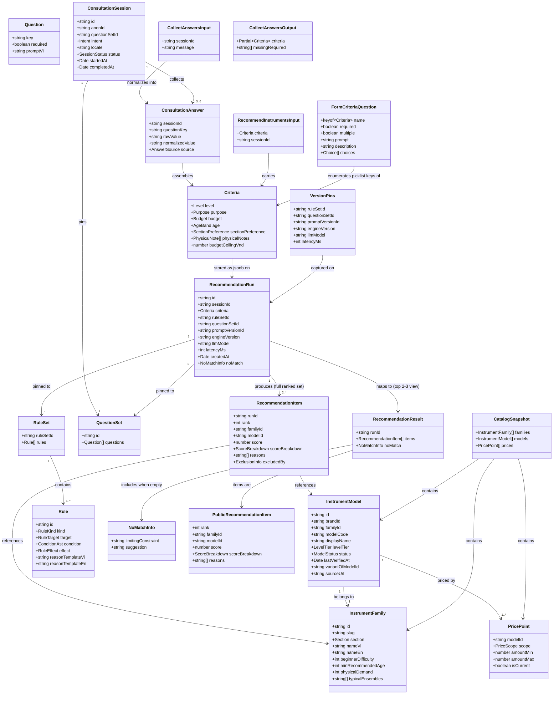

# Guided Instrument Consultation Engine

## Requirements

Build a two-surface guided consultation experience — a natural-language chat
flow and a non-AI multi-step form fallback — that each collect three required
criteria (level, purpose, budget) plus three optional criteria (age, section
preference, physical notes) and, once required criteria are satisfied, call one
shared, pure recommendation engine to return 2-3 ranked, explainable instrument
recommendations with plain-language reasons and trust signals (verification
date, source link, scope-labeled price). The result must be persisted as an
immutable, version-pinned run addressable by a permanent shareable URL, "other
options" must re-slice that same run rather than recompute, and the form path
must remain fully functional with zero dependency on LLM provider availability.
This feature also stands up the platform's M0/M1 foundation packages
(`@windwise/schemas`, `@windwise/core`, `@windwise/db`, `@windwise/ai`), since
no prior work item created them.

## Entities

**Conservative constraints**: `Criteria` is not wrapped in a generic
`FormValues`/`ChatState` type per surface — both the form and the chat tool
produce exactly this one Valibot-defined shape, which is also the literal
`jsonb` payload stored on `RecommendationRun.criteria`. Chat may additionally
set optional `budgetCeilingVnd` (a stated VND amount used as a hard ceiling
inside the budget band); the form never sets this field because
`formCriteriaQuestions()` skips non-picklist schema entries. Do not introduce a
`ConsultationDraft` entity distinct from `ConsultationAnswer[]` — draft/resume
state is just the session's persisted answers, read back on load. Reuse
`InstrumentFamily`, `InstrumentModel`, `PricePoint`, `RuleSet`/`Rule`,
`QuestionSet`/`Question`, `ConsultationSession`, `ConsultationAnswer`,
`RecommendationRun`, `RecommendationItem` exactly as defined in `data-model.md`
— do not rename fields or add speculative columns for features 006-011; those
work items extend these same tables later. Domain `InstrumentModel.sourceUrl` is
derived at catalog-read time (not a DB column). `excludedBy` exists on
`RecommendationItem` but must never appear in the consumer-facing
`RecommendationResult` view (`PublicRecommendationItemSchema` via `v.omit`).

## Approach

1. **Solution architecture — one engine, two thin callers**:
   - `@windwise/core` exposes exactly one entry point,
     `recommend(criteria, catalog, ruleSet): RecommendationResult`, as a pure
     function with no React/TanStack/DB imports (enforced by an oxlint import
     boundary rule scoped to `packages/core/src/**`).
   - The chat surface (`@windwise/ai`'s `recommendInstruments` tool) and the
     form surface (a TanStack Start server function) both: (a) validate input
     against the same `@windwise/schemas` `Criteria` schema, (b) load catalog +
     rule set from `@windwise/db`, (c) call `recommend()`, (d) persist the
     result via `@windwise/db`'s `persistRun`. Neither surface computes anything
     `recommend()` doesn't already own — this is what makes "identical answers →
     identical output" true by construction (FR-007, SC-004), not by convention.
   - Chat free-text normalization (`collectAnswers`) is a distinct, separately
     testable step that runs _before_ `recommend()`, not inside it — the parity
     guarantee covers everything from normalized `Criteria` onward. Default
     implementation is `heuristicNormalize` (regex/enum mapping in
     `@windwise/ai/src/normalize.ts`), injected as `CriteriaNormalizer`; it is
     not an LLM call. Unmapped messages throw `UnmappedCriteriaError` rather
     than guessing. Golden-file tests cover `heuristicNormalize` /
     `collectAnswers` output, not the engine's own suite.

2. **Technical implementation**:
   - TanStack Start server functions (`createServerFn`) and the chat POST
     handler are the only callers of `@windwise/db` and `@windwise/core` from
     the app layer. Server functions dynamically import `@windwise/db` /
     `@windwise/ai` so route modules stay off the postgres client (see
     `chat-route-client-safe.test.ts`).
   - `@windwise/ai`'s `tools.ts` implements `collectAnswers` and
     `recommendInstruments`; `tool-defs.ts` is the client-safe TanStack AI
     `toolDefinition` export (`@windwise/ai/tool-defs`) used by `useChat`.
     `createConsultationTools(db, defaultSessionId)` binds handlers. The LLM is
     restricted to those two tools and rephrasing results in Vietnamese.
     `output-validator.ts` scans assistant text for catalog-shaped tokens not
     present in tool results. `handleConsultChat` appends `templatedRephrase`
     when validation fails (fail closed); it does not currently retry a second
     generation pass.
   - Shared recommend-and-persist lives in `@windwise/ai`'s
     `runRecommendation.ts` (`runRecommendation`, `submitFormConsultation`).
     Form pins `llmModel` to `FORM_LLM_MODEL_PIN` (`'form'`); chat uses
     `DEFAULT_LLM_MODEL` (`gpt-4.1-mini`).
   - Provider adapter is OpenAI-only (`createConsultationAdapter` via
     `@tanstack/ai-openai`); `OPENAI_API_KEY` is read from `process.env` in the
     adapter (not from `apps/consumer-application/src/env.ts`). Missing key
     throws `ProviderUnavailableError`.
   - Persistence uses `@windwise/db` (Drizzle + PostgreSQL), additive to the
     existing PowerSync client-sync scaffold, not a replacement — PowerSync
     continues to serve its current offline-sync purpose untouched.
   - Valibot (`@windwise/schemas`) is the single schema source: the same
     `Criteria` schema instance validates chat tool input, form submission, and
     is reused (not duplicated) as the Drizzle `jsonb` column's runtime shape
     check. Form question copy is generated by `formCriteriaQuestions()`.

3. **Business logic**:
   - No-recommendation-without-required-criteria (FR-008): both `collectAnswers`
     (via `missingRequiredCriteria` before `recommendInstruments`) and
     `runRecommendation` / `submitForm` check required keys derived from
     `CriteriaSchema` optionality (`RequiredCriteriaKeys`) before scoring;
     missing fields throw `MissingRequiredCriteriaError`.
   - v0 rule engine (`@windwise/core/src/rules/`) is a small fixed
     constraint/modifier interpreter reading `RuleSet`/`Rule` rows shaped
     exactly like the future DB-backed model (009 swaps the data source, not the
     interpreter). Before rules, `recommend()` drops unpublished models, prices
     that do not overlap the budget band, models above `budgetCeilingVnd` when
     set, and families that do not match `sectionPreference`. Constraints
     exclude candidates; modifiers adjust score and attach `reasonTemplateVi`
     into `RecommendationItem.reasons`. Ties break by `model.id` localeCompare.
     Empty reasons get a budget/level fallback sentence.
   - No-match handling (FR-013): when no candidates survive, `recommend()`
     returns `RecommendationResult.noMatch` naming the `reasonKey` with the
     highest exclusion count, or `'budget'` (with a ceiling-aware suggestion)
     when exclusions were empty. `persistRun` stores `noMatch` on the run row.
   - "Other options" (FR-006) re-slices persisted `recommendation_items` for the
     existing `runId` via `getOtherOptions(runId, afterRank)` — never a new
     `recommend()` call. The result page shows `INITIAL_VISIBLE` (3) then pages
     `MORE_PAGE_SIZE` (3).
   - Version pinning (TR-6): `rule_set_id`, `question_set_id`,
     `prompt_version_id` (`consultation-prompt-v1`), `engine_version`
     (`ENGINE_VERSION` `0.1.0`), `llm_model` are captured once at
     `RecommendationRun` creation. `persistRun` also marks the session
     `completed`.

## Structure

### Type Relationships (TS interfaces, not classes)

1. `Criteria` (in `@windwise/schemas`) is a Valibot `object()` schema; its
   inferred TS type (`InferOutput<typeof CriteriaSchema>`) is imported by
   `@windwise/core`, `@windwise/ai`, `@windwise/db`, and the app — one type,
   four consumers, zero duplication. `RequiredCriteriaKeys` is derived by
   filtering `CriteriaSchema.entries` for non-optional keys (not a handwritten
   tuple). `formCriteriaQuestions()` / `parseStoredCriteriaValue` live in
   `criteria-form.ts` and skip non-picklist fields such as `budgetCeilingVnd`.
2. `RecommendationResult` and `PublicRecommendationItem` (in
   `@windwise/schemas`) are the shared return shape of `recommend()`;
   `@windwise/db`'s `persistRun` accepts this shape directly. `runId` on the
   engine return is empty until `persistRun` assigns it; `toPublicSlice` caps
   the chat/form response at `PUBLIC_RESULT_LIMIT` (3) after persisting the full
   ranked set.
3. `RuleEffect` is a discriminated union
   (`{type: 'score', delta} | {type: 'exclude', reasonKey} | {type: 'require', reasonKey}`)
   — `@windwise/core`'s rule interpreter switches on `effect.type`; no class
   hierarchy. Rule AST types live in `@windwise/schemas/src/rules.ts`.
4. `CollectAnswersOutput` and `RecommendInstrumentsInput` (in
   `@windwise/schemas`) are the two TanStack AI tool I/O contracts; both compile
   from the same `Criteria` partial/full shapes rather than being hand-written
   twins. Tool JSON Schema is produced with `@valibot/to-json-schema`.

### Dependencies

1. `apps/consumer-application` depends on `@windwise/schemas`, `@windwise/core`
   (server functions only), `@windwise/db` (server functions / chat handler
   only), `@windwise/ai`, `@windwise/ui` (existing), `@windwise/query`
   (existing) — all `workspace:*`. Chat UI imports `@windwise/ai/tool-defs` only
   (no DB).
2. `@windwise/ai` depends on `@windwise/schemas` (tool I/O validation) and
   `@windwise/core` (calls `recommend()` inside `runRecommendation`) and
   `@windwise/db` (loads catalog/rule set, persists runs). Also `@tanstack/ai`,
   `@tanstack/ai-openai`, `@valibot/to-json-schema`.
3. `@windwise/core` depends only on `@windwise/schemas` (types) — no React, no
   TanStack, no DB driver. This is enforced, not just documented (oxlint
   `no-restricted-imports` override in workspace `vite.config.ts` scoped to
   `packages/core/src/**`).
4. `@windwise/db` depends on `@windwise/schemas` (runtime validation of jsonb
   columns) and `drizzle-orm` + `postgres` driver — new dependencies, scoped to
   this package only. Env for `DATABASE_URL` is `@windwise/db`'s `src/env.ts`
   (`@t3-oss/env-core`).
5. `apps/manager-dashboard` is untouched by this work item but is documented as
   a future consumer of `@windwise/core` directly (009's Test Recommendation
   tool) — do not add manager-dashboard routes here.
6. No package may import `apps/consumer-application` code — dependency direction
   is strictly packages → apps.

### Layered Architecture

1. **Route layer** (`apps/consumer-application/src/routes/`): thin TanStack
   Router files. Product UI lives in `src/modules/home-page`,
   `src/modules/form-page`, `src/modules/result-page`. Routes: `/`, `/consult/`,
   `/form/`, `/result/$runId`, `POST /api/consult/chat`.
2. **Server function layer** (`src/lib/server/consultation.ts`):
   `createServerFn` wrappers (`startConsultation`, `submitForm`,
   `getSharedResult`, `getOtherOptions`, `getSessionCriteria`). Chat stream
   lives in `src/lib/server/consult-chat.ts` (`handleConsultChat`).
3. **AI tool layer** (`@windwise/ai`): tool defs, handlers, heuristic
   normalizer, output validator, OpenAI adapter, versioned system prompt
   (`prompts/v1.ts`). Owns `runRecommendation`.
4. **Engine layer** (`@windwise/core`): pure `recommend()`, `toPublicSlice`,
   `ENGINE_VERSION`, and the rule interpreter; framework-free.
5. **Data layer** (`@windwise/db`): Drizzle schema, migrations, seed, and query
   modules (`getSessionState`, `createSession`, `saveAnswers`,
   `getPublishedCatalog`, `getPublishedRuleSet`, `getPublishedQuestionSetId`,
   `persistRun`, `getRun`).
6. **UI primitives** (`@windwise/ui`): generic `Questionnaire` (shadcn
   questionnaire wrapper) plus existing `Button`/`Card`/`Badge`/`Field`. No
   instrument/recommendation-named components.

## Operations

Ordered by dependency: schemas → db → core engine → ai tool wiring → app
routes/UI → tests/changesets.

### Create Package - `packages/schemas/package.json` + scaffold

1. Responsibility: New workspace member providing the single Valibot schema
   source of truth for criteria, catalog, and recommendation shapes.
2. Files: `package.json` (`"name": "@windwise/schemas"`, `"version": "0.1.0"`,
   `"private": true`, `exports` map for `.`, `./criteria`, `./catalog`,
   `./recommendation`), `tsconfig.json` extending the workspace base,
   `src/index.ts` re-exporting all schemas/types.
3. Dependencies: `valibot: catalog:` only.
4. Constraints: no React, no DB, no fetch — pure schema definitions and inferred
   types.

### Create Schema - `packages/schemas/src/criteria.ts`

1. Responsibility: Define `CriteriaSchema` and its inferred `Criteria` type per
   data-model.md's field table.
2. Definitions:
   - `LevelSchema = v.picklist(['beginner', 'intermediate', 'advanced', 'professional'])`
   - `PurposeSchema = v.picklist(['school', 'concert_band', 'jazz', 'orchestra', 'marching', 'personal'])`
   - `BudgetSchema = v.picklist(['under_20m', '20_50m', '50_100m', 'over_100m'])`
   - `AgeBandSchema`, `SectionPreferenceSchema`, `PhysicalNoteSchema` per
     data-model.md
   - `CriteriaSchema = v.object({ level: LevelSchema, purpose: PurposeSchema, budget: BudgetSchema, age: v.optional(AgeBandSchema), sectionPreference: v.optional(SectionPreferenceSchema), physicalNotes: v.optional(v.array(PhysicalNoteSchema)), budgetCeilingVnd: v.optional(v.number()) })`
   - `RequiredCriteriaKeys` is derived
     (`CriteriaKeys.filter(isRequiredCriteriaKey)`), not a handwritten tuple —
     currently `['level', 'purpose', 'budget']`.
   - `missingRequiredCriteria(partial)` returns missing required keys.
   - Helpers: `criteria-inspect.ts` (`unwrapCriteriaSchema`,
     `isOptionalCriteriaSchema`, `isArrayCriteriaSchema`,
     `criteriaPicklistOptions`).
3. Constraints: enum values are the literal strings from data-model.md — do not
   rename or add picklist values not present there. `budgetCeilingVnd` is
   chat-only and is not a picklist.

### Create Schema - `packages/schemas/src/catalog.ts`

1. Responsibility: Define read-side catalog shapes (`InstrumentFamily`,
   `InstrumentModel`, `PricePoint`) matching data-model.md exactly, for use as
   `@windwise/core`'s input types and `@windwise/db`'s row-to-domain mapping.
   Includes `CatalogSnapshotSchema` and `sourceUrl` on `InstrumentModel` (domain
   field; catalog query synthesizes it from `modelCode`).
2. Constraints: field names/types match data-model.md tables verbatim; no extra
   speculative fields for 006-011 except `sourceUrl` on the read-side model
   shape (not a Drizzle column).

### Create Schema - `packages/schemas/src/rules.ts`

1. Responsibility: `ConditionAst`, `RuleEffect`, `Rule`, `RuleSet` Valibot
   schemas shared by core and db row mapping.
2. Constraints: operator set is the fixed AST (`equals`, `in`, `includes`,
   `gte`, `lte`, `and`, `or`); `Rule.id` is required.

### Create Schema - `packages/schemas/src/criteria-form.ts`

1. Responsibility: Vietnamese form copy and `formCriteriaQuestions()` /
   `parseStoredCriteriaValue` used by the form page, result chips, and
   `answersToCriteria`.
2. Constraints: only picklist (and picklist-array) criteria keys become
   questions; `budgetCeilingVnd` is omitted from the form.

### Create Schema - `packages/schemas/src/recommendation.ts`

1. Responsibility: Define `RecommendationResult`, `RecommendationItem`,
   `ScoreBreakdown`, `NoMatchInfo`, and the two tool I/O schemas
   (`CollectAnswersOutputSchema`, `RecommendInstrumentsInputSchema`).
2. Methods: none (pure schema module); exports types via `v.InferOutput`.
3. Constraints: `RecommendationItem`'s public/consumer-facing variant omits
   `excludedBy`; define a separate `PublicRecommendationItemSchema` (via
   `v.omit`) rather than filtering ad hoc at each call site.

### Create Package - `packages/db/package.json` + scaffold

1. Responsibility: New workspace member owning Drizzle schema, migrations, and
   query modules against PostgreSQL.
2. Files: `package.json` (`"name": "@windwise/db"`,
   `dependencies: drizzle-orm, postgres, @t3-oss/env-core, valibot, @windwise/schemas`,
   `devDependencies: drizzle-kit`), `drizzle.config.ts`, `src/schema/` ,
   `src/queries/`, `src/client.ts` (`createDb` / `getDb` pooled connection from
   `DATABASE_URL`), `src/env.ts`, `src/seed.ts`, `src/seed-cli.ts`.
3. Constraints: connection string read via `@t3-oss/env-core` validated env,
   server-only; package must not be imported from any client-bundled route
   component.

### Create Schema - `packages/db/src/schema/catalog.ts`

1. Responsibility: Drizzle table definitions for `instrument_families`,
   `instrument_models`, `price_points` per data-model.md.
2. Constraints: `instrument_models.status` is a Postgres enum
   (`draft|in_review|published|archived`); only `published` rows are ever read
   by this feature's queries (008 owns the write path).

### Create Schema - `packages/db/src/schema/consultation.ts`

1. Responsibility: Drizzle table definitions for `question_sets`, `questions`,
   `consultation_sessions`, `consultation_answers`, `recommendation_runs`,
   `recommendation_items`, `rule_sets`, `rules`. `recommendation_runs.no_match`
   is optional jsonb. Primary key on answers is `(session_id, question_key)`.
2. Constraints: `consultation_sessions.anon_id` is the only session-identifying
   column — no name/email/phone columns anywhere in this schema (FR-012).
   `recommendation_runs` is never updated after insert (immutable-by-convention;
   no `updated_at` column). Session `status`/`completed_at` may be updated when
   a run is persisted.

### Create Migration + Seed - `packages/db/src/seed.ts`

1. Responsibility: Populate one published `question_set` (6 questions), one
   published `rule_set` (small fixed constraint/modifier list per research.md
   §2), and 4 seeded `instrument_families` (trumpet, clarinet, flute, alto sax)
   with a handful of `published` `instrument_models` and `price_points` (both
   `msrp_global` and `vn_street` scopes) so the feature is testable end-to-end.
2. Constraints: idempotent (safe to re-run in dev); not run automatically in
   CI/build — invoked explicitly via a `vp run db:seed` script.

### Create Queries - `packages/db/src/queries/consultation.ts`

1. Responsibility: Encapsulate all reads/writes this feature needs.
2. Methods:
   - `getSessionState(sessionId): Promise<{session, answers}>` — loads a session
     and its answers for resume (edge case: abandon-and-return).
   - `createSession(db, input: {questionSetId, intent, locale, anonId?}): Promise<ConsultationSessionRecord>`
     — pins `question_set_id` at creation; generates ids if omitted.
   - `saveAnswers(db, sessionId, answers: ConsultationAnswerRecord[]): Promise<void>`
     — upserts by `(sessionId, questionKey)` so re-answering a field overwrites
     rather than duplicates.
   - `getPublishedCatalog(db): Promise<CatalogSnapshot>` — reads only
     `status = 'published'` models; synthesizes `sourceUrl`; throws
     `NoPublishedCatalogError` when empty.
   - `getPublishedQuestionSetId(db): Promise<string>` — first published question
     set.
   - `getPublishedRuleSet(db): Promise<RuleSet>` — published rule set plus
     rules; throws `NoPublishedRuleSetError`.
   - `persistRun(db, result: RecommendationResult, pins: VersionPins & {sessionId, criteria}): Promise<{runId}>`
     — inserts one `recommendation_runs` row (including `noMatch`) and all
     `recommendation_items` rows in one transaction, then marks the session
     `completed`.
   - `getRun(db, runId): Promise<{run, items}>` — used by both the shareable
     result page and "other options" pagination.
3. Constraints: every method is a plain async function (no class), takes a
   Drizzle client instance as an injected first-class dependency for
   testability.

### Create Package - `packages/core/package.json` + scaffold

1. Responsibility: New workspace member for the pure recommendation engine.
2. Files: `package.json` (`"name": "@windwise/core"`, dependency on
   `@windwise/schemas` only), `src/recommend.ts`, `src/rules/interpreter.ts`,
   `src/__tests__/`.
3. Constraints: zero dependency on `react`, `@tanstack/*`, `drizzle-orm`, or any
   DB driver — verified by oxlint `no-restricted-imports` in workspace
   `vite.config.ts` scoped to `packages/core/src/**`.

### Create Function - `packages/core/src/recommend.ts`

1. Responsibility: The single pure computation this whole feature exists to
   guarantee is called identically from both surfaces.
2. Signature:
   `recommend(criteria: Criteria, catalog: CatalogSnapshot, ruleSet: RuleSet): RecommendationResult`
   plus `toPublicSlice(result, limit = 3)` and `ENGINE_VERSION = '0.1.0'`.
3. Logic:
   - Filter `models` to `status === 'published'`.
   - Drop candidates without a current price, whose price does not overlap the
     budget band, whose `amountMin` exceeds `budgetCeilingVnd` when set, or
     whose family does not match `sectionPreference` (`undecided`/absent = pass;
     otherwise family `section` or `slug`).
   - For each remaining candidate, evaluate every `constraint` rule; skip rules
     whose condition references absent optional criteria
     (`conditionReferencesAbsentCriteria`). If a matching constraint effect is
     `exclude`/`require`, drop the candidate and increment
     `exclusionCounts[reasonKey]`.
   - For surviving candidates, evaluate every `modifier` rule; apply
     `score.delta` and push rendered `reasonTemplateVi` into `reasons`. Starting
     score is `BASE_SCORE` (50). If no modifier reasons, attach a budget/level
     fallback sentence.
   - Sort remaining candidates by score descending, then `model.id`; assign
     `rank` 1..N over the _full_ surviving set.
   - If empty, `noMatch.limitingConstraint` is the highest-count `reasonKey`,
     else `'budget'` with a ceiling-aware or generic suggestion.
   - Return `{ runId: '', items, noMatch }`. Callers persist then slice.
4. Constraints: deterministic — no `Date.now()`, no randomness, no I/O; same
   `(criteria, catalog, ruleSet)` input always produces byte-identical output
   (this determinism is what SC-004's integration test asserts). Absent optional
   criteria fields must never be treated as excluding — only evaluate a rule
   whose condition references a field that is present.

### Create Module - `packages/core/src/rules/interpreter.ts`

1. Responsibility: Evaluate a single `Rule.condition` (fixed-operator AST)
   against a candidate + criteria pair.
2. Methods:
   - `evaluateCondition(condition: ConditionAst, ctx: EvaluationContext): boolean`
     — supports a small fixed operator set (`equals`, `in`, `includes`, `gte`,
     `lte`, `and`, `or`) sufficient for the v0 rule list in research.md §2; do
     not build a general expression language. Fields are dotted (`criteria.*`,
     `family.*`, `model.*`).
   - `conditionReferencesAbsentCriteria(condition, criteria): boolean` — skip
     rules that mention optional criteria not present.
   - `applyEffect(effect: RuleEffect, item: WorkingItem): WorkingItem` —
     switches on `effect.type` (`score` adds `delta` to running score;
     `exclude`/`require` mark the item excluded with `reasonKey`).
3. Constraints: no `eval`/`Function` construction — the AST is a plain JSON
   object interpreted by a switch, never executed as code (security: no rule
   data can become arbitrary code execution).

### Create Tests - `packages/core/src/__tests__/recommend.test.ts`

1. Responsibility: Golden-file tests proving engine correctness and determinism
   per rule kind and full-run scenarios.
2. Cases: required-only criteria → non-empty ranked result; braces + brass
   purpose → steered toward woodwind (US1.2's named example); all-criteria
   excluded → `noMatch` names the correct limiting constraint; identical input
   called twice → byte-identical output (determinism check); required-only +
   zero-optional submission → still produces 2-3 items; `budgetCeilingVnd` below
   catalog starting prices → `noMatch` with `limitingConstraint: 'budget'`.
3. Constraints: `vite-plus/test`
   (`import { describe, expect, it } from 'vite-plus/test'`); fixtures are small
   hand-built catalog/rule-set objects colocated in `__tests__/fixtures.ts`, not
   the seed script's data.

### Create Package - `packages/ai/package.json` + scaffold

1. Responsibility: New workspace member for TanStack AI tool definitions and the
   anti-hallucination output validator.
2. Files: `package.json` (`"name": "@windwise/ai"`, deps on `@windwise/schemas`,
   `@windwise/core`, `@windwise/db`, `@tanstack/ai`, `@tanstack/ai-openai`,
   `@valibot/to-json-schema`, `valibot`), exports `.` and `./tool-defs`,
   `src/tools.ts`, `src/tool-defs.ts`, `src/run-recommendation.ts`,
   `src/answers.ts`, `src/normalize.ts`, `src/adapter.ts`, `src/errors.ts`,
   `src/constants.ts`, `src/output-validator.ts`, `src/prompts/v1.ts`.
3. Constraints: this package's `runRecommendation` is the only place DB +
   engine + persist are sequenced. Tool defs (`./tool-defs`) must stay
   importable from the client chat route without pulling postgres.

### Create Tool - `packages/ai/src/tools.ts` — `collectAnswers`

1. Responsibility: Normalize a chat message into structured `Criteria` field
   updates, server-side only.
2. Signature:
   `collectAnswers(db, input: {sessionId: string, message: string}, normalize: CriteriaNormalizer = heuristicNormalize): Promise<CollectAnswersOutput>`
3. Logic:
   - Load current session answers via `getSessionState`; throw if unknown
     session.
   - Call `normalize(message)` (default `heuristicNormalize`) to map free text
     to enum/ceiling fields. Discard values not in the target enum by
     construction of the hint tables. Throw `UnmappedCriteriaError` when nothing
     maps.
   - Persist newly normalized answers via `saveAnswers` with `source: 'chat'`
     (`criteriaToAnswers`) including `rawValue` (original text) and
     `normalizedValue`.
   - Merge with existing answers (`mergeCriteria` / `answersToCriteria`).
   - Compute `missingRequired` via `missingRequiredCriteria`.
   - Return `{criteria: partialCriteria, missingRequired}`.
4. Constraints: never calls `recommend()`; this tool only updates criteria
   state. Default path does not call an LLM.

### Create Module - `packages/ai/src/normalize.ts` — `heuristicNormalize`

1. Responsibility: Deterministic Vietnamese/English regex mapping onto
   `PartialCriteria`, including `budgetCeilingVnd` from stated "N triệu" amounts
   and band inference.
2. Constraints: must throw `UnmappedCriteriaError` when no field maps; mixed
   brass+woodwind section hints collapse to `undecided`.

### Create Module - `packages/ai/src/answers.ts`

1. Responsibility: `criteriaToAnswers`, `answersToCriteria`, `mergeCriteria`
   bridging session rows and `PartialCriteria` via `parseStoredCriteriaValue`.

### Create Tool - `packages/ai/src/tools.ts` — `recommendInstruments`

1. Responsibility: The chat-side entry point into the shared engine.
2. Signature:
   `recommendInstruments(db, input: {sessionId: string}, llmModel = DEFAULT_LLM_MODEL): Promise<RecommendationResult>`
3. Logic:
   - Load session answers via `getSessionState`; assemble `Criteria`.
   - If `missingRequiredCriteria` is non-empty, throw
     `MissingRequiredCriteriaError`.
   - Delegate to `runRecommendation(db, criteria, sessionId, llmModel)`.
4. Constraints: this is the _only_ place the chat surface reaches `recommend()`
   — no inline scoring in the tool handler. `createConsultationTools` fills
   empty `sessionId` from the chat URL default.

### Create Function - `packages/ai/src/run-recommendation.ts`

1. Responsibility: Shared recommend-and-persist sequence for chat and form.
2. Methods:
   - `runRecommendation(db, criteria, sessionId, llmModel)` — parse
     `CriteriaSchema`, load catalog + rule set, time `recommend()`, `persistRun`
     with pins (`PROMPT_VERSION_ID`, `ENGINE_VERSION`, `llmModel`, `latencyMs`),
     return `toPublicSlice(..., PUBLIC_RESULT_LIMIT)`.
   - `submitFormConsultation(db, criteria, sessionId)` — `saveAnswers` with
     `source: 'form'`, then `runRecommendation` with `FORM_LLM_MODEL_PIN`.

### Create Module - `packages/ai/src/output-validator.ts`

1. Responsibility: Post-generation scan preventing the assistant from inventing
   catalog facts not present in a tool result (AGENTS.md §10).
2. Methods:
   - `validateAssistantText(text: string, toolResults: unknown[]): ValidationOutcome`
     — extracts catalog-shaped tokens (currency-formatted numbers, known
     model-code patterns) from `text`; flags any token not traceable to a value
     present in `toolResults`.
   - Returns `{ok: true} | {ok: false, flaggedTokens: string[]}`.
3. Logic: on `ok: false`, `handleConsultChat` appends
   `templatedRephrase(toolResults)` to the SSE stream rather than surfacing the
   flagged tokens as the sole answer. There is no second LLM retry pass in the
   current implementation.
4. Constraints: pattern-matching only (no second LLM call to "judge" the first,
   to avoid unbounded latency/cost); false positives fail closed (append
   `templatedRephrase`, do not show unverified catalog tokens).

### Create Route - `apps/consumer-application/src/routes/index.tsx`

1. Responsibility: Member landing (`HomePage` in `src/modules/home-page`) with
   two entry points: `/consult` and `/form`. Undraw illustrations colocated
   under `modules/home-page/illustrations/`.

### Create Route - `apps/consumer-application/src/routes/consult/index.tsx`

1. Responsibility: Chat entry point using `@tanstack/ai-react`'s `useChat`
   (`fetchServerSentEvents` to `/api/consult/chat?sessionId=`) wired to
   `@windwise/ai/tool-defs` client tools.
2. Logic: `startConsultation` on mount (anon cookie `ww_anon`, published
   question set, intent `discover`, locale `vi`); on `recommendInstruments` tool
   result, navigate to `/result/$runId`. Always shows "Chuyển sang biểu mẫu".
   Provider/start errors also link to `/form`.
3. Constraints: composes `@windwise/ui` primitives only — no new domain
   components added to `packages/ui` (AGENTS.md §9).

### Create Route - `apps/consumer-application/src/routes/api/consult/chat.ts`

1. Responsibility: POST SSE handler dynamically importing `handleConsultChat` so
   the route module itself does not load postgres.
2. Logic (`consult-chat.ts`): `chat()` with `createConsultationAdapter()`,
   `SYSTEM_PROMPT_V1`, `createConsultationTools(db, sessionId)`; after the
   stream, `validateAssistantText` and possibly append `templatedRephrase`.

### Create Route - `apps/consumer-application/src/routes/form/index.tsx`

1. Responsibility: Thin route rendering `FormPage`
   (`src/modules/form-page/form-page.tsx`).
2. Logic: multi-step `@windwise/ui` `Questionnaire` driven by
   `formCriteriaQuestions()` (one item per picklist criterion, skip allowed on
   optional). No Zustand store. On submit, `criteriaFromFormData` + `submitForm`
   server function → navigate to `/result/$runId`. Always shows "Chuyển sang hội
   thoại".
3. Constraints: must render and submit successfully with zero network calls to
   any LLM provider — verified by `form-no-llm.test.ts` (importing the form
   route must not call `@tanstack/ai-openai` / `@tanstack/ai-gemini`).

### Create Primitive - `packages/ui/src/components/questionnaire.tsx`

1. Responsibility: Generic shadcn Questionnaire wrapper (progress, items,
   choices, skip/next/submit). Not a Windwise-domain component.
2. Constraints: AGENTS.md §9 — no `ConsultationStep` naming. App supplies
   criteria copy and submit behavior.

### Create Server Function - `apps/consumer-application/src/lib/server/consultation.ts`

1. Responsibility: Thin TanStack Start `createServerFn` wrappers the route layer
   calls. Recommend-and-persist itself lives in `@windwise/ai`
   (`runRecommendation` / `submitFormConsultation`).
2. Methods:
   - `startConsultation()` — cookie `ww_anon`, `createSession`, returns
     `{sessionId, questionSetId, engineVersion}`.
   - `submitForm` — validates `CriteriaSchema`, creates a session, calls
     `submitFormConsultation`.
   - `getSharedResult({runId})` — `getRun`; `{error: 'NOT_FOUND'}` when missing.
   - `getOtherOptions({runId, afterRank})` — `getRun`, filter
     `rank > afterRank`.
   - `getSessionCriteria({sessionId})` — `answersToCriteria`.
3. Constraints: server-only (`createServerFn`); dynamic-import `@windwise/db`
   and `@windwise/ai` so they are never pulled into a client-only bundle path.

### Create Route - `apps/consumer-application/src/routes/result/$runId.tsx`

1. Responsibility: Shareable, pinned recommendation result page (FR-011); UI in
   `src/modules/result-page/result-page.tsx`.
2. Logic: loader calls `getSharedResult`; renders ranked items with reasons,
   verification date, source link, and scope-labeled price; "Xem gợi ý khác"
   calls `getOtherOptions` in pages of 3; `noMatch` and not-found states with
   form/chat CTAs; copy-share-link; criteria chips via
   `formCriteriaQuestions()`. Stale verification: `STALE_AFTER_MS` = 180 days
   (`badge` destructive).
3. Constraints: never re-runs `recommend()` — reads persisted
   `recommendation_items` only (FR-011, SC-005).

### Create Test - `apps/consumer-application` chat/form parity integration test

1. Responsibility: Prove SC-004 — identical criteria via chat vs. form produce
   identical `RecommendationResult`.
2. Logic: for a sampled set of `Criteria` combinations, call `runRecommendation`
   directly with the same criteria object twice (once simulating the chat path's
   normalized output, once the form's direct submission) and assert deep-equal
   results (excluding `runId`, `createdAt`, `latencyMs`).
3. Constraints: `vite-plus/test`; does not require a live LLM call — chat-path
   normalization is covered by `@windwise/ai` `normalize` / `collectAnswers`
   tests. Additional app tests: `form-no-llm.test.ts`,
   `chat-route-client-safe.test.ts`.

### Create Changesets - `.changeset/*.md`

1. Responsibility: Record new packages and consumer app changes per AGENTS.md
   §7.
2. Content: `minor` changesets for `@windwise/schemas`, `@windwise/core`,
   `@windwise/db`, `@windwise/ai` (new packages at `0.1.0`); `minor` for
   `@windwise/consumer-application`; `patch` for `@windwise/ui` Questionnaire
   button typing.
3. Constraints: no `Co-authored-by` trailer; do not run `changeset:version` as
   part of this work.

## Norms

1. **Imports**: workspace packages import each other via `workspace:*` and
   published entry points (`@windwise/schemas`, not relative paths across
   package boundaries). Within a package, use the `#/*` import alias convention
   already established in `packages/ui` (`imports: {"#/*": "./src/*"}`) for
   `packages/schemas`, `packages/core`, `packages/db`, `packages/ai`.
2. **Test framework**: `vite-plus/test` everywhere
   (`import { describe, expect, it } from 'vite-plus/test'`); engine tests use
   golden fixtures colocated under `__tests__/`; component tests (if any new UI
   composition needs one) follow `packages/ui/src/tests/` conventions with
   `happy-dom` + `@testing-library/react`, but only as devDependencies of the
   package that needs them.
3. **Package boundaries**: `@windwise/core` must not import React, TanStack, or
   a DB driver (enforced via oxlint). `@windwise/db` must not be imported by any
   client-bundled route component — server functions and `consult-chat.ts` only,
   typically via dynamic `import()`. `packages/ui` must not gain
   instrument/recommendation/consultation-named components (AGENTS.md §9) —
   those compose in `apps/consumer-application`. Generic `Questionnaire` in
   `@windwise/ui` is allowed. `@windwise/ai/tool-defs` is the only
   `@windwise/ai` entry the consult chat client may import.
4. **Error handling**: no `GlobalExceptionHandler`-style pattern. Server
   functions throw typed errors (e.g., `MissingRequiredCriteriaError`,
   `NoPublishedCatalogError`, `ProviderUnavailableError`,
   `UnmappedCriteriaError`); route loaders/actions catch and map to inline UI
   empty/error states. LLM/provider failures degrade to a visible "switch to
   form" affordance (User Story 4), not a generic error page.
5. **Changesets**: one changeset per package whose public API or shipped
   behavior changes; skip for docs/spec/test-only edits. New workspace members
   ship `"version": "0.1.0"`, `"private": true` at creation.
6. **Documentation**: no new markdown tree beyond what's already in
   `docs/specs/005-guided-instrument-consultation/`; package-level READMEs only
   if a package's usage isn't obvious from its exports (optional, not required
   by this prompt).
7. **Determinism discipline**: any function that is part of the parity guarantee
   (`recommend()`, the rule interpreter, `runRecommendation`'s non-LLM steps,
   `heuristicNormalize`) must not read wall-clock time, randomness, or ambient
   state as part of its scoring/normalization logic — only as metadata
   (`createdAt`, `latencyMs`) attached after the deterministic computation.
8. **Form questions from schema**: do not hand-maintain a parallel question list
   in the app; drive the questionnaire from `formCriteriaQuestions()`.

## Safeguards

1. **Functional**: Do not build user accounts, checkout, cart, or real-time
   multi-store price comparison (explicitly out of scope per spec.md
   Assumptions). Do not build the catalog authoring UI (008), rule-authoring UI
   (009), or question-set authoring UI (010) — this feature only reads a
   manually seeded catalog/rule set/question set. Do not add
   InstrumentCard/RecommendationCard/ConsultationStep components to
   `packages/ui`.
2. **Performance**: `recommend()` evaluation must stay under 50ms p95 against
   the seeded catalog size (in-memory, no per-call DB round trip inside the pure
   function — catalog/rule set are loaded once by the caller and passed in).
   First chat token target <1.5s p95; full consultation <60s median end-to-end
   (plan.md NFRs, carried into SC-001).
3. **Security**: LLM provider API keys never leave server-only process env
   (`OPENAI_API_KEY` read in `@windwise/ai` `adapter.ts`), never appear in
   client bundles or logs. The rule `condition` AST is interpreted via a
   fixed-operator switch — never `eval`'d as code. No prompt text, system
   instructions, or raw provider error bodies are ever returned to the client in
   an error response.
4. **Integration**: `@windwise/core` has zero React/TanStack/DB imports
   (build-time enforced). `@windwise/db` is never imported outside server
   functions / `consult-chat.ts`. `apps/manager-dashboard` is untouched by this
   work item. PowerSync's existing wiring in `apps/consumer-application` is not
   modified or routed through for catalog/consultation data.
5. **Business rules**: Every `RecommendationResult` item returned to a consumer
   route must include a non-empty `reasons` array, a `lastVerifiedAt` date, a
   source link, and a scope-labeled price — an item missing any of these is a
   bug, not a partial-but-acceptable result (SC-003's "zero recommendations
   shown without this trust information"). Chat and form paths must produce
   byte-identical `RecommendationResult` for identical `Criteria` (SC-004) —
   verified by the parity integration test, not just asserted by architecture.
   "Other options" must never trigger a new `recommend()` call or new LLM
   generation (FR-006). A `RecommendationRun` row is immutable once inserted —
   no update path exists for `recommendation_runs`/`recommendation_items`
   (session status may still flip to `completed`). `budgetCeilingVnd` must not
   be collected by the form.
6. **Technical constraints**: No new production dependency added to
   `@windwise/core` beyond `@windwise/schemas`. No `Function`/`eval`
   construction anywhere in the rule interpreter. New Postgres/Drizzle
   dependency is scoped to `@windwise/db` only, not added to
   `apps/consumer-application`'s direct dependencies. Result-page stale
   threshold is 180 days.
7. **Data constraints**: `consultation_sessions` and related tables store no PII
   — `anon_id` (cookie `ww_anon`) is the only person-linkable column anywhere in
   this feature's schema (FR-012). `instrument_models` reads are filtered to
   `status = 'published'` only, everywhere, with no exception path.
8. **API constraints**: `recommend(criteria, catalog, ruleSet)`'s signature is
   the stable contract both surfaces depend on — changing it requires updating
   both callers in the same change, not independently. Tool schemas
   (`collectAnswers`, `recommendInstruments`) are versioned by
   `prompt_version_id`; do not silently change accepted input/output shape
   without bumping that pin.
9. **Verification gate**: `vp -C packages/schemas test`,
   `vp -C packages/core test`, `vp -C packages/db test`,
   `vp -C packages/ai test`, `vp -C apps/consumer-application test` must all
   pass; `vp run ready` is the workspace-wide gate before this work item is
   considered complete. Golden- file engine tests and the chat/form parity
   integration test are required, not optional, given SC-002/SC-003/SC-004's
   measurable-outcome status.
