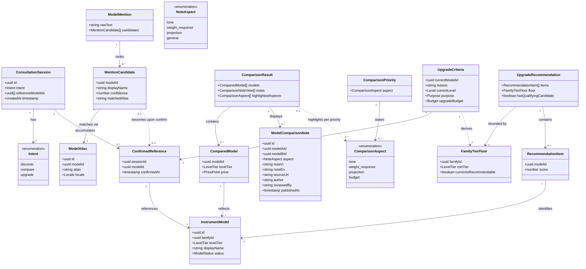

# Instrument Compare & Upgrade Flows

## Requirements

Give an experienced visitor two new, guarded entry points into 005's guided
consultation engine — a compare flow that resolves free-text mentions of named
instrument models to confirmed catalog references and renders a structured,
priority-scoped side-by-side comparison, and an upgrade flow that resolves a
visitor's stated current instrument to a confirmed family/tier and produces a
same-family, same-or-higher-tier recommendation without repeating family
questions the visitor has already effectively answered — both sitting behind an
upfront, sticky discover/compare/upgrade intent choice, both refusing to act on
any model reference the visitor has not explicitly confirmed in the current
session, and both reusing 005's session model, catalog, and recommendation
engine and 008's catalog data rather than duplicating any of them.

## Entities

## Approach

1. **Three guarded entry points, one engine**: Compare and upgrade are new
   branches into 005's single consultation engine, not a second recommendation
   system. `ConsultationSession.intent` (`discover | compare | upgrade`) is set
   once at session creation and never changes mid-session — this enum already
   exists on `consultation_sessions` (005 anticipated it), so no session-schema
   migration is needed, only the new branch handling.

2. **Deterministic mention resolution, never LLM guessing**: `resolveMention()`
   in `@windwise/core` performs deterministic fuzzy matching against
   `model_aliases` and catalog `display_name` (across all `status` values, so an
   archived current instrument is still resolvable), returning a ranked
   `MentionCandidate[]`. It never collapses to a single auto-selected match
   regardless of confidence — the LLM tool layer only calls this function and
   surfaces its ranked output; it does not itself decide which model was meant.

3. **One shared, server-side confirmation gate**: Confirmation is recorded via
   `pinReferenceModel()` writing a `ConfirmedReference` row, and read via one
   shared `confirmed-model-ids.ts` query. Both `compareModels` and
   `suggestUpgrade` call this same query before doing anything else — the check
   is never duplicated per flow, and it is never inferred from conversational
   state ("the LLM believes X was confirmed" is not a valid confirmation
   source).

4. **Upgrade reuses `recommend()` unmodified, through input scoping, not a
   staged entry point**: 005's actual `recommend(criteria, catalog, ruleSet)` in
   `packages/core/src/recommend.ts` is a single-pass function — it filters the
   whole published catalog against budget/rules/section-preference in one loop
   and has no separable "family-selection" vs. "candidate-selection" stage to
   enter directly. `suggestUpgrade()` instead achieves "family already decided"
   purely through its inputs:
   - it derives a `FamilyTierFloor` from the confirmed current instrument's
     `familyId`/`levelTier`;
   - it sets `criteria.sectionPreference` to that family, reusing
     `recommend()`'s existing `matchesSectionPreference()` filter — the exact
     same mechanism a visitor's stated family preference already uses in
     discover;
   - it passes a `CatalogSnapshot` whose `models` are additionally pre-filtered
     to `levelTier >= floor.minTier` within that family (a new filter, since
     `recommend()` has no built-in tier floor — rules only target
     `family | model | brand`, not tier);
   - it then calls the unmodified `recommend()` against that scoped input.
     `recommend()` itself is never modified, and no second scorer is written.
     The possibly-archived current instrument is resolved (by id, regardless of
     `status`) to derive the floor but is always excluded from the returned
     candidate set — both because it is filtered out by id and because
     `recommend()` only considers `status === 'published'` models.

5. **Comparison notes are looked up, never generated**: `compareModelsCore()`
   performs a pure diff of `instrument_models` + `price_points` for the
   confirmed models, then looks up published `model_comparison_notes` rows for
   the pair. A missing note for an aspect is an omission in the `notes` array —
   the function never fabricates note content, and this behavior is not
   configurable.

6. **Priority reorders, never filters**: A visitor's stated `ComparisonPriority`
   only changes `ComparisonResult.highlightedAspects`; it is derived data laid
   on top of a comparison that always includes every confirmed model's full
   specs/tier/price. No aspect or model row is ever dropped because of a stated
   priority. For 3+-model comparisons, the same rule applies — priority scoping
   affects which rows are emphasized, not how many models appear.

7. **Two new UI flows compose 004's shared primitives**: The intent-choice
   screen, mention-candidate picker, confirmation step, comparison table, and
   upgrade result view are built from `@windwise/ui` primitives (`Card`, `Tabs`,
   `Dialog` for confirmation, `Table`/`Card` for comparison rows, `Skeleton` for
   loading, `Notice`/`Toast` for the "no match" / "no qualifying candidate"
   empty states) — no one-off controls forked in the app, consistent with 004's
   FR-006 boundary.

## Structure

### Type Relationships

- `MentionCandidate[]` (in-memory, `@windwise/schemas`) is the output shape of
  `resolveMention()`; it is never persisted.
- `ConfirmedReference` (persisted, `@windwise/db`) is the only durable record
  that a `MentionCandidate` became trusted; it is written once per
  `(session_id, model_id)` pair and never updated.
- `ComparisonResult` and `UpgradeCriteria`/`UpgradeRecommendation` (in-memory,
  `@windwise/schemas`) are pure function outputs of `compareModelsCore()` and
  `suggestUpgrade()` respectively — both reuse 005's `Criteria.level`,
  `Criteria.purpose`, and `Criteria.budget` enums (from
  `packages/schemas/src/criteria.ts`) rather than defining parallel ones.
  `purpose` is required in `UpgradeCriteria` because `suggestUpgrade()` builds a
  full `Criteria` object to pass into the unmodified `recommend()`, and
  `Criteria.purpose` is a required field there.
- `ConsultationSession.intent` and `reference_model_ids` extend 005's session
  row; `intent`'s `compare`/`upgrade` values already exist in the
  `session_intent` pg enum — only `reference_model_ids` is a net-new column.

### Dependencies

1. `apps/consumer-application` depends on `@windwise/schemas`, `@windwise/core`,
   `@windwise/db` (indirectly, via server functions), `@windwise/ai`,
   `@windwise/ui`, `@windwise/query` — all `workspace:*`, none new to the
   workspace graph.
2. `@windwise/core`'s new modules (`resolve-mention.ts`, `compare-models.ts`,
   `suggest-upgrade.ts`) depend on `@windwise/db` query functions and on 005's
   existing `recommend()` in the same package — `suggest-upgrade.ts` imports and
   calls `recommend()` unmodified; it must not reimplement or fork its
   scoring/rule logic.
3. `@windwise/db`'s new schema files (`model-aliases.ts`,
   `model-comparison-notes.ts`) depend on 005's `instrument_models` and
   `price_points` tables via foreign keys; new query files
   (`fuzzy-match-catalog.ts`, `get-model-by-id.ts`, `pin-reference-model.ts`,
   `confirmed-model-ids.ts`) are additive to 005's query layer
   (`packages/db/src/queries/consultation.ts`).
4. `@windwise/ai`'s `tools.ts`/`tool-defs.ts` gain four new tool definitions
   (`resolveMention`, `confirmMention`, `compareModels`, `suggestUpgrade`) that
   call into `@windwise/core`; the LLM layer must not perform resolution or
   scoring itself (AGENTS.md §10).
5. This feature depends on 005 (guided-instrument-consultation) and 008
   (catalog-management-workflow), both already built —
   `packages/db/src/schema/{catalog,consultation}.ts`,
   `packages/core/src/recommend.ts`, and `packages/ai/src/{tools,tool-defs}.ts`
   all exist and are the actual surface this feature extends. 006 is purely
   additive on top of them.
6. `packages/ui` gains no new domain components; it stays domain-free per
   AGENTS.md §9 — comparison table and intent-choice screens live in
   `apps/consumer-application`, composed from existing `@windwise/ui`
   primitives.

### Layered Architecture

1. **Schema layer** (`@windwise/schemas`): `mention.ts`, `comparison.ts` —
   Valibot shapes for tool inputs/outputs; no persistence, no side effects.
2. **Engine layer** (`@windwise/core`): pure, deterministic functions
   (`resolveMention`, `compareModelsCore`, `suggestUpgrade`) alongside 005's
   unmodified `recommend()` — same purity/determinism contract, golden-file
   tested.
3. **Persistence layer** (`@windwise/db`): Drizzle schema + query functions;
   owns the confirmation gate's source of truth (`confirmed-model-ids.ts`).
4. **Tool layer** (`@windwise/ai`): exposes the engine functions as LLM tool
   calls; enforces the confirmation gate server-side before invoking
   `compareModelsCore`/`suggestUpgrade`, independent of LLM-claimed state.
5. **Route/UI layer** (`apps/consumer-application`): intent choice, mention →
   confirm → result screens; composes `@windwise/ui` primitives; renders the "no
   match," "unconfirmed reference refused," and "no qualifying candidate" states
   as new empty/error states following 005's empty-state pattern.

## Operations

### Create Schema - `packages/schemas/src/mention.ts`

1. Responsibility: Define input/output Valibot shapes for mention resolution and
   confirmation (spec FR-002, FR-003).
2. Exports (as shipped):
   - `MentionInput = v.object({ sessionId: v.string(), rawText: v.pipe(v.string(), v.minLength(1)) })`
   - `MentionCandidateSchema = v.object({ modelId: v.string(), displayName: v.string(), confidence: v.pipe(v.number(), v.minValue(0), v.maxValue(1)), matchedAlias: v.string() })`
   - `ConfirmInput = v.object({ sessionId: v.string(), modelId: v.string() })`
   - `ConfirmOutputSchema = v.object({ confirmed: v.literal(true), modelId: v.string() })`
     — the `confirmMention` tool's return shape; added during implementation,
     not originally called out here.
   - `RawCandidateRowSchema = v.object({ modelId: v.string(), displayName: v.string(), matchedAlias: v.string(), similarity: v.number() })`
     — the shape `fuzzyMatchCatalog()` returns and `resolveMention()` consumes;
     added during implementation as the explicit boundary type between the db
     query and the core ranking function (previously only referenced generically
     as `RawCandidateRow[]`).
3. Constraints: no default export. Ids are plain `v.string()` — this codebase
   has no established `v.uuid()` validator (see
   `packages/schemas/src/recommendation.ts`), so don't invent one. Pipe
   validators use `v.pipe(...)`, matching `packages/schemas/src/catalog.ts`'s
   existing style, not the array-form `v.string([...])` syntax.

### Create Schema - `packages/schemas/src/comparison.ts`

1. Responsibility: Define shapes for `CompareInput`, `ComparisonResult`,
   `UpgradeCriteria` (spec FR-004, FR-006, FR-008).
2. Exports (as shipped):
   - `CompareInput = v.object({ sessionId: v.string(), modelIds: v.pipe(v.array(v.string()), v.minLength(2)), priority: v.optional(ComparisonAspectEnum) })`
   - `ComparisonAspectEnum = v.picklist(['tone', 'weight_response', 'projection', 'budget'])`
   - `NoteAspectEnum = v.picklist(['tone', 'weight_response', 'projection', 'general'])`
     — separate from `ComparisonAspectEnum` because a note's `general` aspect
     has no corresponding visitor-facing priority option.
   - `ComparedModelSchema` —
     `{ modelId, specs: { displayName, modelCode, familyId, sourceUrl }, tier: LevelTierSchema, price: v.optional(PricePointSchema) }`.
     `price` is optional because `selectPrice()` can return `undefined` for a
     model with no current price row; the original spec implied price is always
     present.
   - `ComparisonNoteViewSchema = v.object({ aspect: NoteAspectEnum, noteVi: v.string(), noteEn: v.string() })`
   - `ComparisonResultSchema = v.object({ models: v.array(ComparedModelSchema), notes: v.array(ComparisonNoteViewSchema), highlightedAspects: v.array(ComparisonAspectEnum) })`
   - `UnconfirmedReferenceErrorSchema = v.object({ error: v.literal('unconfirmed_reference'), modelId: v.string() })`
     — the confirmation-gate refusal shape, shared by both `compareModels` and
     `suggestUpgrade`.
   - `CompareModelsOutputSchema = v.union([ComparisonResultSchema, UnconfirmedReferenceErrorSchema])`
     — `compareModels` always **returns** this union, it never throws; the
     original Operations text for the `compareModels` tool below said
     "throws/returns," which this schema resolves in favor of always returning.
   - `ModelComparisonNoteSchema` — mirrors the db row (`id`, `modelAId`,
     `modelBId`, `aspect`, `noteVi`, `noteEn`, `sourceUrl`, `author`,
     `reviewedBy`, `publishedAt`); added as the `@windwise/schemas` boundary
     type between `packages/db`'s `model_comparison_notes` rows and
     `compareModelsCore()`'s input, not originally itemized here.
   - `UpgradeCriteriaSchema = v.object({ sessionId: v.string(), currentModelId: v.string(), reason: v.string(), currentLevel: LevelSchema, purpose: PurposeSchema, upgradeBudget: BudgetSchema })`
     — `LevelSchema`/`PurposeSchema`/`BudgetSchema` imported from
     `@windwise/schemas`'s existing `criteria.ts`.
   - `FamilyTierFloorSchema = v.object({ familyId: v.string(), minTier: LevelTierSchema, currentIsRecommendable: v.boolean() })`
   - `UpgradeRecommendationSchema = v.object({ items: v.array(PublicRecommendationItemSchema), floor: FamilyTierFloorSchema, hasQualifyingCandidate: v.boolean() })`
     — `items` reuses 005's existing `PublicRecommendationItemSchema` from
     `recommendation.ts` rather than a new `RecommendationItem` shape.
   - `SuggestUpgradeOutputSchema = v.union([UpgradeRecommendationSchema, UnconfirmedReferenceErrorSchema])`
     — same always-return-never-throw pattern as `CompareModelsOutputSchema`.
3. Constraints: `currentLevel`/`purpose`/`upgradeBudget` MUST import and reuse
   005's `Criteria` enums, not redeclare parallel ones. `purpose` is required
   (not optional) because `suggest-upgrade.ts` builds a full `Criteria` object
   for `recommend()`, which requires it. Confirmation-gate refusals are a typed
   union member of the tool's output schema, not a thrown error — this is the
   authoritative resolution of the "throws/returns" ambiguity in the AI Tool
   operation below.

### Create Db Schema - `packages/db/src/schema/model-aliases.ts`

1. Responsibility: Persist alias strings per model (data-model.md `ModelAlias`).
2. Definition: Drizzle
   `pgTable('model_aliases', { id: uuid().primaryKey().defaultRandom(), modelId: uuid('model_id').notNull().references(() => instrumentModels.id), alias: text().notNull(), locale: text().notNull() })`
   with a unique index on `(alias, locale)`.
3. Constraints: `modelId` FK to 005's `instrument_models` table (defined in
   `packages/db/src/schema/catalog.ts`); do not duplicate the FK target as a new
   models table.

### Create Db Schema - `packages/db/src/schema/model-comparison-notes.ts`

1. Responsibility: Persist reviewed playing-character notes (data-model.md
   `ModelComparisonNote`; spec FR-005).
2. Definition: Drizzle `pgTable('model_comparison_notes', ...)` with
   `modelAId`/`modelBId` uuid FKs, `aspect` as a pgEnum
   (`tone | weight_response | projection | general`), `noteVi`/`noteEn` text,
   `sourceUrl` text, `author`/`reviewedBy` text, `publishedAt` nullable
   timestamp.
3. Constraints: writes MUST normalize `(modelAId, modelBId)` lesser-id-first
   (per data-model.md) so lookups are a single unordered-pair query; enforce via
   a check constraint or write-path normalization helper, not query-time `OR`.
   No `sources` table exists in this codebase (catalog only carries a plain
   `sourceUrl` text field on `instrument_models` — see `manufacturerSourceUrl()`
   in `packages/db/src/queries/consultation.ts`); do not invent a `sources` FK —
   follow that established plain-text-URL pattern instead.

### Create Db Query - `packages/db/src/queries/fuzzy-match-catalog.ts`

1. Responsibility: Deterministic similarity lookup against `model_aliases` +
   `instrument_models.display_name` for a given raw text (spec FR-002).
2. Signature:
   `async function fuzzyMatchCatalog(db: Database, rawText: string): Promise<RawCandidateRow[]>`.
3. Logic: normalize `rawText` (lowercase, trim, strip punctuation) the same way
   aliases are seeded; run a bounded similarity query (e.g. trigram/`pg_trgm` or
   an indexed `ILIKE`+Levenshtein scoring depending on what 005's db setup
   already provides); return rows with a raw similarity score, unranked. Query
   across `instrument_models` regardless of `status` (not just `published`,
   unlike `getPublishedCatalog()`) — an upgrade flow's "current instrument" may
   be `archived`, and it must still be resolvable by mention.
4. Constraints: pure query function, no side effects; must produce the same
   ranked order for the same input against a fixed catalog snapshot (determinism
   requirement, plan.md TR-2).

### Create Db Query - `packages/db/src/queries/get-model-by-id.ts`

1. Responsibility: Fetch a single `instrument_models` row by id regardless of
   `status`, for resolving a confirmed reference whose model may not be
   `published` (e.g. an archived current instrument in the upgrade flow).
2. Signature:
   `async function getModelById(db: Database, modelId: string): Promise<InstrumentModel | undefined>`.
3. Constraints: does not filter by `status`; `getPublishedCatalog()` (existing,
   in `packages/db/src/queries/consultation.ts`) remains the only source for the
   candidate set used by `recommend()`, unchanged.

### Create Db Query - `packages/db/src/queries/pin-reference-model.ts`

1. Responsibility: Record a session-scoped confirmation (data-model.md
   `ConfirmedReference`; spec FR-003).
2. Signature:
   `async function pinReferenceModel(db: Database, sessionId: string, modelId: string): Promise<void>`.
3. Logic: `INSERT ... ON CONFLICT (session_id, model_id) DO NOTHING` —
   confirming twice is idempotent, never an error.
4. Constraints: never updates an existing row (data-model.md: "created only via
   confirmMention; never updated, only read").

### Create Db Query - `packages/db/src/queries/confirmed-model-ids.ts`

1. Responsibility: The single shared read used by both `compareModels` and
   `suggestUpgrade` to answer "has this model been confirmed in this session"
   (research.md §2; spec FR-010).
2. Signature:
   `async function confirmedModelIds(db: Database, sessionId: string): Promise<Set<string>>`.
3. Logic: `SELECT model_id FROM confirmed_references WHERE session_id = $1`,
   returned as a `Set` for O(1) membership checks by callers.
4. Constraints: this is the only place either flow may check confirmation state
   — no caller may re-derive it from session/tool-call state.

### Create Core Function - `packages/core/src/resolve-mention.ts`

1. Responsibility: Deterministic, ranked mention resolution (spec FR-002).
2. Signature:
   `function resolveMention(rawCandidates: RawCandidateRow[]): MentionCandidate[]`.
3. Logic: score/normalize confidence to `0..1`, sort descending by confidence,
   dedupe by `modelId` keeping the highest-scoring alias match, cap the returned
   list (e.g. top 5) so the visitor is never shown an unbounded candidate list.
   Never collapses to a single result regardless of the top score's margin over
   the rest.
4. Constraints: pure function — no db/network access; `fuzzy-match-catalog.ts`
   supplies the raw rows. Golden-file tested for determinism (plan.md TR-2).

### Create Core Function - `packages/core/src/compare-models.ts`

1. Responsibility: Pure spec/price diff plus note lookup (spec FR-004, FR-005,
   FR-006).
2. Signature:
   `function compareModelsCore(models: InstrumentModel[], prices: PricePoint[], notes: ModelComparisonNote[], priority?: ComparisonAspect): ComparisonResult`.
3. Logic:
   - Build `ComparedModel[]` directly from the passed `models`/`prices` — no row
     is ever omitted regardless of `priority`.
   - Filter `notes` to only `publishedAt IS NOT NULL` entries touching the
     compared model pair(s); map to `{ aspect, noteVi, noteEn }`; empty array
     when none exist — never synthesize a note.
   - Derive `highlightedAspects` from `priority` (if given) — a lookup table
     mapping stated priority to the aspects it emphasizes; if no priority was
     given, `highlightedAspects` is empty and all rows render with equal weight
     (spec US2 acceptance scenario default).
4. Constraints: pure function, no db access — caller passes in already-fetched
   rows. MUST NOT throw or drop a model for lacking a note.

### Create Core Function - `packages/core/src/suggest-upgrade.ts`

1. Responsibility: Family/tier-constrained recommendation that reuses
   `recommend()` unmodified via input scoping (spec FR-007, FR-009, FR-011).
2. Signature:
   `function suggestUpgrade(currentModel: InstrumentModel, criteria: UpgradeCriteria, catalog: CatalogSnapshot, ruleSet: RuleSet): UpgradeRecommendation`.
3. Logic:
   - Derive `FamilyTierFloor` from
     `currentModel.familyId`/`currentModel.levelTier` using the fixed tier order
     `['student', 'intermediate', 'professional', 'custom']`; set
     `currentIsRecommendable = currentModel.status === 'published'`.
   - Build a `CatalogSnapshot` copy whose `models` are filtered to
     `familyId === floor.familyId && tierRank(levelTier) >= tierRank(floor.minTier)`,
     always excluding `currentModel.id` itself (whether `published` or not);
     `families`/`prices` pass through unchanged.
   - Construct a full `Criteria` object —
     `{ level: criteria.currentLevel, purpose: criteria.purpose, budget: criteria.upgradeBudget, sectionPreference: <current family's slug or section> }`
     — and call the unmodified
     `recommend(fullCriteria, filteredCatalog, ruleSet)` imported from
     `packages/core/src/recommend.ts`. Setting `sectionPreference` reuses
     `recommend()`'s existing `matchesSectionPreference()` filter as a
     defense-in-depth family lock, on top of the catalog pre-filter.
     `recommend()` already filters to `status === 'published'`, so an archived
     current instrument is excluded from candidates as a side effect of that
     filter too. Do not re-derive or duplicate any of `recommend()`'s
     scoring/rule logic here.
   - Set `hasQualifyingCandidate = items.length > 0`; when `false`, return an
     empty `items` array rather than relaxing the floor or returning lower-tier
     candidates (spec FR-011).
4. Constraints: MUST NOT reimplement or fork any part of `recommend()`'s
   scoring; MUST NOT modify `packages/core/src/recommend.ts`; MUST NOT return a
   candidate outside `floor.familyId`/`floor.minTier` under any circumstance,
   including when `hasQualifyingCandidate` is false — this is enforced entirely
   by the pre-filter and `sectionPreference`, since `recommend()` never sees
   out-of-scope candidates.

### Update Ai Tool - `packages/ai/src/tools.ts`, `packages/ai/src/tool-defs.ts`

1. Responsibility: Expose `resolveMention`, `confirmMention`, `compareModels`,
   `suggestUpgrade` as LLM-callable tools, enforcing the confirmation gate
   server-side (spec FR-003, FR-010; plan.md constraint).
2. Additions (alongside 005's existing `collectAnswers`/`recommendInstruments`
   tool definitions):
   - `resolveMention(input: MentionInput)`: calls `fuzzyMatchCatalog` then
     `resolveMention()` core function; returns `MentionCandidate[]`. Never
     auto-confirms.
   - `confirmMention(input: ConfirmInput)`: calls `pinReferenceModel`; returns
     `{ confirmed: true, modelId }`.
   - `compareModels(input: CompareInput): Promise<CompareModelsOutput>`: first
     calls `confirmedModelIds(sessionId)`; if any `input.modelIds` entry is
     absent from that set, **returns** (never throws)
     `{ error: 'unconfirmed_reference', modelId }` — the
     `CompareModelsOutputSchema` union — and does not proceed. Otherwise fetches
     models/prices/notes and calls `compareModelsCore`.
   - `suggestUpgrade(input: UpgradeCriteria): Promise<SuggestUpgradeOutput>`:
     same confirmation-gate check on `currentModelId` first, same
     return-never-throw refusal shape; if `getModelById` finds nothing for
     `currentModelId` (should not happen once confirmed, but the tool checks
     anyway) it also returns the `unconfirmed_reference` refusal rather than
     throwing. On pass, fetches the current model via `getModelById` (regardless
     of status), fetches the published `CatalogSnapshot` via the existing
     `getPublishedCatalog()` and rule set via `getPublishedRuleSet()` (both
     already used by 005's `recommendInstruments` tool), and calls the
     `suggestUpgrade` core function with them.
3. Constraints: the confirmation-gate check MUST be the same
   `confirmed-model-ids.ts` call in both `compareModels` and `suggestUpgrade` —
   no duplicated inline query. The LLM must never be trusted to have "already
   confirmed" a model; this check runs unconditionally on every call.

### Component organization (as shipped)

Route files under
`apps/consumer-application/src/routes/{consult,compare,upgrade}/` stay thin
(TanStack Router loaders/actions only); the actual UI composition lives in
sibling `apps/consumer-application/src/modules/<flow>-page/` directories —
`intent-page/`, `compare-page/`, `upgrade-page/`, `consult-page/`, plus a shared
`mention-flow/` module holding the resolve → confirm components reused by both
compare and upgrade (per the "shared, not forked" constraint below). This
mirrors the existing `home-page/`, `form-page/`, `result-page/` module
convention from 004/005 — not called out explicitly in the original Operations
below, which only specified route responsibilities.

### Create Route - `apps/consumer-application/src/routes/consult/intent.tsx`

1. Responsibility: Upfront discover/compare/upgrade entry choice (spec FR-001).
2. Logic: renders three options (via `@windwise/ui` `Card`/`Tabs`); selecting
   one creates/updates the session's `intent` field once via a server function,
   then navigates into the matching flow (`discover` → existing 005 route
   unchanged; `compare` → `/compare`; `upgrade` → `/upgrade`). UI composition
   lives in `modules/intent-page/`.
3. Constraints: intent, once set, is not editable from this screen again in the
   same session; selecting "discover" must not alter any 005 route or component.

### Create Route - `apps/consumer-application/src/routes/compare/*`

1. Responsibility: Mention entry → candidate confirmation → comparison rendering
   (spec US2, FR-002–FR-006).
2. Components:
   - Mention input (free text) calling the `resolveMention` tool; renders
     `MentionCandidate[]` as a selectable list (never auto-picks the top result
     even at high confidence).
   - Confirmation step: visitor selects one candidate per mention; calls
     `confirmMention`; only after confirmation does the "add another model /
     compare now" action become available.
   - Comparison view: calls `compareModels` with all confirmed IDs for this
     session plus the visitor's stated `priority` (asked as a follow-up question
     after first render); renders `ComparisonResult` as a table (`@windwise/ui`
     `Table`/`Card`) with `highlightedAspects` visually emphasized (e.g.
     bold/border), not filtered out.
   - No-match state: when `resolveMention` returns zero candidates, render a
     `Notice`/empty state offering "fall back to discover" (links to
     `/consult/intent` with discover pre-selected).
3. Constraints: the UI must never call `compareModels` with a model ID that has
   not passed through the confirmation step in this same session; rely on the
   route/component state machine, not on remembering LLM conversational claims.

### Create Route - `apps/consumer-application/src/routes/upgrade/*`

1. Responsibility: Current-instrument entry → confirmation → reason/level/
   budget collection → upgrade recommendation (spec US3, FR-007–FR-011).
2. Components:
   - Current-instrument mention input, reusing the same resolve/confirm
     components as `/compare` (shared, not forked).
   - Reason/level/budget form (3 fields) submitted only after the current
     instrument is confirmed; calls `suggestUpgrade` tool.
   - Result view: when `hasQualifyingCandidate` is true, renders ranked
     `RecommendationItem[]` using the same recommendation card pattern 005's
     discover flow uses; when false, renders a clear "no qualifying candidate
     within your family/tier" message (`Notice`) — never a lateral/downgrade
     suggestion, never an empty-looking silent result.
3. Constraints: must not present the family-selection questions from 005's
   discover flow at any point in this route — family is fixed by the confirmed
   current instrument both in logic (via `suggestUpgrade()`'s input scoping) and
   in UI (no family question is ever asked here).

### Create Tests - `packages/core/src/__tests__/resolve-mention.test.ts`, `compare-models.test.ts`, `suggest-upgrade.test.ts`

1. Responsibility: Golden-file determinism and business-rule tests (plan.md
   Testing section; spec FR-002, FR-005, FR-009, FR-011).
2. Cases:
   - `resolveMention`: same raw candidates → same ranked output across runs
     (determinism); never returns a single-item list collapsed from ambiguous
     input without preserving all plausible candidates.
   - `compareModelsCore`: model pair with a published note renders it; model
     pair with no note yields an empty `notes` array, never a placeholder
     string; `priority` changes `highlightedAspects` but never removes a
     `ComparedModel` or a spec/tier/price field.
   - `suggestUpgrade`: candidate outside family or below tier is never returned;
     an archived (`status !== 'published'`) current instrument is excluded from
     candidates but still used to derive the floor; empty catalog match yields
     `hasQualifyingCandidate: false` with an empty `items` array, not a thrown
     error. Since the family/tier boundary is enforced entirely by
     `suggestUpgrade()`'s own pre-filter (not by `recommend()`), this suite is
     the single point of test coverage for FR-009 and needs explicit
     boundary-crossing cases (e.g. a same-family-lower-tier model, a
     different-family-same-tier model), not just happy-path cases.
3. Constraints: `import { describe, expect, it } from 'vite-plus/test'`; no
   network/db access — all inputs are in-memory fixtures.

### Create Test - `packages/ai/src/__tests__/confirmation-gate.test.ts`

1. Responsibility: Integration test proving the server-side confirmation gate
   (spec FR-010; SC-002; plan.md Testing section).
2. Case: calling `compareModels` (and separately `suggestUpgrade`) with a
   `modelId` not present in `confirmed_references` for the session MUST fail
   with a structured refusal, regardless of any conversational/LLM-supplied
   claim of prior confirmation.
3. Constraints: crosses the `ai` ↔ `db` boundary per plan.md's Constitution
   Check II — exercised against a real (test) db connection, not mocked past the
   gate.

### Create Changeset - `.changeset/compare-upgrade-flows.md`

1. Responsibility: Record shipped behavior per AGENTS.md §7 (Changesets).
2. Content: `minor` for `@windwise/schemas`, `@windwise/core`, `@windwise/db`,
   `@windwise/ai` (new public exports/tables/tool definitions); `minor` for
   `@windwise/consumer-application` (new routes).
3. Constraints: one changeset file listing all affected packages per AGENTS.md
   §7 convention; do not add `Co-authored-by`.

### Verify - workspace quality gate

1. Responsibility: Constitution I/II compliance (AGENTS.md §11).
2. Steps: `vp run -r test` (unit + golden-file + integration tests above);
   `vp check` (format/lint/typecheck); `vp run ready` as the final gate.
3. Constraints: do not merge with a failing confirmation-gate integration test
   or a failing determinism golden-file test — these two are the safety-
   critical checks for this feature (SC-002, TR-2).

## Norms

1. **Imports**: apps and packages import shared code via `workspace:*` package
   names (`@windwise/schemas`, `@windwise/core`, `@windwise/db`, `@windwise/ai`,
   `@windwise/ui`, `@windwise/query`) — never relative `../../packages/...`
   paths across package boundaries. Within a package, follow that package's
   existing `#/` alias convention where established (matches `packages/core`'s
   and `packages/db`'s existing `#/...ts` imports).
2. **Tests**: `vite-plus/test`
   (`import { describe, expect, it } from 'vite-plus/test'`). Pure-function
   tests live under each package's `src/__tests__/`; UI component/route tests,
   if added, follow `packages/ui/src/tests/` conventions (`happy-dom` +
   `@testing-library/react` as devDependencies only where needed).
3. **Package boundaries**: `packages/ui` stays domain-free — no
   `ComparisonTable`, `IntentChoice`, or instrument-specific component is added
   there; those live in `apps/consumer-application`. `packages/core` holds all
   deterministic engine logic (resolution, diffing, scoring) — the `ai` tool
   layer and app routes never reimplement scoring or matching inline.
4. **Changesets**: one `.changeset/*.md` per work item covering every package
   whose public API or shipped behavior changed (AGENTS.md §7); `minor` for new
   exports/tables/routes, `patch` for behavior-only fixes with no new surface.
   Skip changesets for docs/specs-only edits.
5. **Error handling**: server-side confirmation-gate failures and "no qualifying
   candidate" outcomes are structured return values / typed errors from tool
   functions (`{ error: 'unconfirmed_reference', modelId }`,
   `{ hasQualifyingCandidate: false, items: [] }`), not thrown exceptions
   surfaced raw to the visitor — routes render them as `Notice`/empty states,
   consistent with 005's empty-state pattern (plan.md Constitution Check III).
6. **Recommendation boundary (AGENTS.md §10)**: the LLM tool layer in
   `@windwise/ai` never invents model names, prices, specs, scores, or catalog
   facts — every fact rendered in a comparison or upgrade result traces back to
   `@windwise/core`/`@windwise/db` data.
7. **Determinism**: `resolveMention`, `compareModelsCore`, and `suggestUpgrade`
   are pure functions with no hidden randomness or wall-clock dependence,
   golden-file tested exactly like 005's `recommend()`.

## Safeguards

1. **Functional**: Do not build a second recommendation/scoring system, a second
   confirmation-check implementation, or an LLM-driven entity resolver. Do not
   add a fourth intent beyond discover/compare/upgrade. Do not let `intent`
   change after session creation. Do not modify `packages/core/src/recommend.ts`
   — `suggestUpgrade()` reuses it purely through scoped inputs
   (`sectionPreference`
   - pre-filtered `CatalogSnapshot`), never by editing its internals or adding a
     staged entry point to it.
2. **Performance**: `resolveMention`'s fuzzy match must stay within a single
   bounded, indexed query against the seed-scale `model_aliases` table — no new
   runtime dependency, no unbounded scan, and no added latency budget beyond one
   more server-side tool call per turn (plan.md Performance Goals).
3. **Security**: Confirmation state (`ConfirmedReference`) is checked
   server-side on every `compareModels`/`suggestUpgrade` call — never trusted
   from client-supplied or LLM-conversational state. No visitor can compare or
   get an upgrade recommendation for a model they have not explicitly confirmed
   in their own session.
4. **Integration**: 005 and 008 are already built in this codebase — this
   feature is purely additive on top of `packages/db/src/schema/catalog.ts`,
   `consultation.ts`, `packages/core/src/recommend.ts`, and
   `packages/ai/src/tools.ts`/`tool-defs.ts`. `packages/ui` must not gain any
   new domain-specific component. Apps must not import `shadcn`/`@base-ui/react`
   directly.
5. **Business rules**: Never auto-select a mention match. Never proceed on an
   unconfirmed reference. Never fabricate a playing-character note. Priority
   reorders comparison rows, never hides a spec/tier/price row or drops a model.
   Upgrade candidates must stay within the same family and at-or-above tier with
   zero exceptions; when none qualify, say so rather than relaxing the floor or
   returning a lateral/lower-tier suggestion.
6. **Technical constraints**: Extend `@windwise/schemas`/`core`/`db`/`ai`
   exactly as 005 establishes them — do not create a new package for
   comparison/upgrade logic. `resolveMention`, `compareModelsCore`, and
   `suggestUpgrade` must remain pure functions (no db/network access inside
   them); all I/O happens in the `db`/`ai` layers that call them.
7. **Data constraints**: `ModelAlias` unique on `(alias, locale)`.
   `ConfirmedReference` unique on `(session_id, model_id)`, insert-only, never
   updated. `ModelComparisonNote` pairs normalized lesser-id-first on write;
   only rows with a non-null `published_at` are ever returned to a comparison.
   `ModelComparisonNote.sourceUrl` is plain text, not an FK — no `sources` table
   exists in this codebase.
8. **API constraints**: The four new tool schemas
   (`resolveMention`/`confirmMention`/`compareModels`/`suggestUpgrade`) are the
   only new public surface in `@windwise/ai`; do not rename or alter 005's
   existing `collectAnswers`/`recommendInstruments` tool signatures as part of
   this work. `CompareInput.modelIds` requires `minLength(2)`.
9. **Verification gate**: `vp run -r test` and `vp check` must pass, with
   particular attention to the confirmation-gate integration test (FR-010,
   SC-002) and the mention/comparison/upgrade golden-file determinism tests
   (TR-2) — these are the two safety-critical suites for this feature.
   `vp run ready` is the final workspace gate before this work item is
   considered done.
