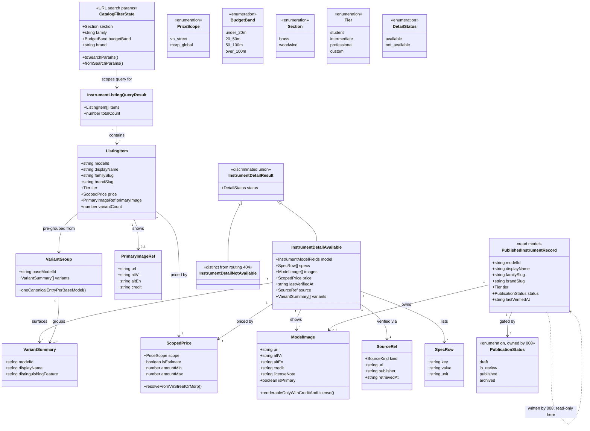

# Instrument Catalog Browsing

## Requirements

Make every published instrument freely browsable and individually viewable in
`apps/consumer-application` — via SSR'd listing pages filterable by section,
family, budget band, and brand, and via canonical detail pages that surface full
specs, scoped pricing, verification trust signals, and grouped variants — so a
visitor arriving from a search engine or a shared link can go from discovery to
a trustworthy decision on a single instrument in two clicks or fewer, without
ever starting or completing a chat/form consultation, and without ever seeing a
draft, in-review, or archived record.

## Entities

## Approach

1. **Read-only presentation layer over 008's published records, not a new
   domain**: This feature introduces zero new tables and zero new write paths.
   `InstrumentFamily`, `InstrumentModel`, `PricePoint`, `ModelImage`, `Source`
   already exist (or are defined) in `@windwise/db` per 005's/007's own
   data-model.md. All new code here is query functions that read those tables
   and shape them into `InstrumentListingQueryResult` /
   `InstrumentDetailResult`, plus SSR routes and presentation components that
   render them. No mutation endpoints, no admin actions, nothing that competes
   with 008's authoring/ publish pipeline as the source of truth for catalog
   state.

2. **SSR-first via TanStack Start route loaders, not client-fetched listings**:
   Because this is explicitly the SEO/trust surface, listing and detail content
   MUST be present at first paint. Both `/catalog/*` and `/instrument/$modelId`
   routes use `loader` functions that call the `@windwise/db` query layer
   directly on the server and return fully-formed view models to the route
   component — no client-side loading spinner guards the primary content.
   TanStack Query is layered on top only for enhancements (prefetch on hover
   from listing to detail), never as the route's primary data path.

3. **Filter state lives in the URL via TanStack Router typed search params**:
   `section`, `family`, `budgetBand`, `brand` are validated search params on the
   `/catalog` route (using Router's `validateSearch`), not component-local
   state. Every filtered view is therefore a shareable, crawlable URL. Filter
   changes navigate (`router.navigate` with new search params) rather than
   mutate client state and re-render in place.

4. **Budget-band resolution is shared with 005, implemented once**: The
   `vn_street`-preferred, MSRP-fallback-with-estimate-flag rule is implemented
   as a single function in `@windwise/db` (e.g. `resolve-budget-price.ts`) and
   imported by both this feature's listing filter/detail pricing and 005's
   consultation budget matching. This feature does not reimplement or fork that
   logic under a browsing-specific name.

5. **Variant grouping happens at the query layer, not in components**:
   `list-published-instruments.ts` and `get-instrument-detail.ts` return
   already-grouped results — one row per base model on listing, with a
   `variants` array on detail. Components never receive raw per-variant rows and
   never do their own grouping/deduplication. This guarantees "one canonical
   entry per base model" holds everywhere the query is reused, not just in this
   feature's specific components.

6. **Published-only visibility is enforced in the query layer, not by filtering
   in the route/component**: Every query function this feature adds hardcodes a
   `status = 'published'` predicate (or equivalent) at the SQL/ query-builder
   level — it is never left to the caller to remember to filter. A direct link
   to a model whose current status is not `published` resolves through
   `get-instrument-detail.ts` to `{ status: 'not_available' }`, a distinct
   in-band result the detail route renders as an explicit "not available" page
   state — not a routing-level 404 and not a generic error boundary.

7. **Trust signals and image licensing are non-negotiable render conditions, not
   optional fields**: `lastVerifiedAt` and `source` are required (non-nullable)
   fields on `InstrumentDetailAvailable` — if the underlying data is incomplete,
   that is a data-quality bug in 008's pipeline, not a state this feature's UI
   needs to tolerate by hiding the trust block. `ModelImage` rows without both
   `credit` and `licenseNote` are excluded by the query layer before they ever
   reach a component; the detail page never receives an unlicensed image to
   accidentally render.

8. **Empty results get an explicit message, not a bare empty grid**: When a
   filter combination matches zero published instruments,
   `InstrumentListingQueryResult.items` is `[]` and the listing page renders a
   dedicated empty-state message (composed from `@windwise/ui` primitives,
   following 005's existing empty-state pattern) rather than an unexplained
   blank area.

## Structure

### Type Relationships

1. `CatalogFilterState` (URL search params, validated in the route) is the sole
   input to `listPublishedInstruments()`; it is never held as React local state
   independent of the URL.
2. `InstrumentListingQueryResult` and `InstrumentDetailResult` are the only
   shapes route loaders return; presentation components receive these directly
   as loader data and never re-fetch or re-shape them.
3. `ScopedPrice` is a value type reused identically inside `ListingItem` and
   `InstrumentDetailAvailable` — one shared shape, not two pricing DTOs.
4. `VariantGroup`/`VariantSummary` exist only as the shape the query layer
   returns; there is no separate client-side variant-merging step.

### Dependencies

1. Depends on 008 (`008-catalog-management-workflow`) to actually populate
   `published`-status rows in `@windwise/db`; this feature has no fixtures or
   seed data of its own beyond what tests need.
2. Depends on 005's data-model.md for `InstrumentFamily`, `InstrumentModel`,
   `PricePoint` table shapes, and reuses (does not fork) its budget-band
   resolution rule.
3. Depends on `@windwise/ui` for all presentation primitives (card, badge, tabs,
   skeleton for non-primary-content loading, notice/empty-state pattern) — no
   one-off catalog-specific controls invented outside it.
4. Depends on `@windwise/query`'s TanStack Query client setup for the
   prefetch-on-hover enhancement only.
5. `apps/consumer-application` depends on `@windwise/db` (`workspace:*`) for the
   first time via this feature's query calls from route loaders — if
   `@windwise/db` does not yet exist as a package, this feature's task list must
   stand up its minimal query-layer skeleton (package scaffold + the three query
   files below) as a prerequisite step, not assume it is already in place.
6. `@windwise/core` is untouched — no scoring or recommendation logic
   participates in browsing.

### Layered Architecture

1. **Query layer** (`packages/db/src/queries/`):
   `list-published-instruments.ts`, `get-instrument-detail.ts`,
   `resolve-budget-price.ts` (shared with 005). Owns published-only filtering,
   variant grouping, and price resolution. Pure functions over the database — no
   React, no route awareness.
2. **Route/loader layer** (`apps/consumer-application/src/routes/catalog/`,
   `.../instrument/`): TanStack Start `loader`s call the query layer, validate
   search params, and hand fully-resolved view models to route components. Owns
   SSR data-fetch timing and the not-available/empty-result branch decisions.
3. **Presentation layer** (route components + any new
   `apps/consumer-application/src/components/catalog/` composites): Renders
   `InstrumentListingQueryResult` / `InstrumentDetailResult` via `@windwise/ui`
   primitives. Owns layout, filter controls (bound to search params, not local
   state), and the empty/not-available UI states. No data fetching of its own
   beyond the hover-prefetch enhancement.
4. **Validation layer**: `vp -C packages/db test` (query unit tests) and
   `vp -C apps/consumer-application test` (route-loader integration tests), then
   `vp run ready` as the workspace gate.

## Operations

### Create Package Skeleton - `packages/db/package.json`

1. Responsibility: Stand up the minimal `@windwise/db` package this feature (and
   005/006) depends on, if it does not already exist at implementation time.
2. Content: `"name": "@windwise/db"`, `"version": "0.1.0"`, `"private": true`,
   `"type": "module"`, `exports` map for `./queries/*` → `./src/queries/*.ts`,
   `devDependencies` including `typescript` and `vite-plus` from `catalog:`,
   `scripts.test = "vp test"`.
3. Constraints: Do not add a database driver or migration tool not already
   decided elsewhere in the platform plan; if connection/schema setup is
   genuinely out of this feature's scope, stub the query functions against an
   injectable query executor/interface so unit tests can run without a live
   Postgres instance. Do not duplicate this package if it already exists — check
   `packages/db` on disk before creating.

### Create Query - `packages/db/src/queries/resolve-budget-price.ts`

1. Responsibility: Single shared implementation of `vn_street`-preferred,
   MSRP-fallback-with-estimate-flag price resolution (spec FR-006), reused by
   this feature's listing filter/detail pricing and by 005's consultation budget
   matching.
2. Signature and logic:
   - `resolveBudgetPrice(pricePoints: PricePoint[]): ScopedPrice`:
     - Filter `pricePoints` to `scope: 'vn_street'`; if one or more exist, take
       the most recently verified and return
       `{ scope: 'vn_street', isEstimate: false, amountMin, amountMax }`.
     - Otherwise, filter to `scope: 'msrp_global'`; if none exist, throw (a
       model with zero price points is a data-quality error, not a renderable
       state).
     - Derive an estimated Vietnamese-market range from the MSRP figure using
       the platform's documented MSRP→estimate conversion (do not invent a new
       formula here — reuse whatever constant/rule 005's plan.md or research.md
       specifies; if none exists yet, mark this sub-step `SPEC GAP` and flag for
       clarification rather than guessing a multiplier).
     - Return
       `{ scope: 'msrp_global', isEstimate: true, amountMin, amountMax }`.
   - `matchesBudgetBand(price: ScopedPrice, band: BudgetBand): boolean`: pure
     range-overlap check against the band's numeric bounds.
3. Constraints: No I/O in this file — accepts already-fetched `PricePoint[]`.
   Must be the only place this resolution logic is implemented; if 005 has
   already implemented an inline version elsewhere, this task includes promoting
   it here and updating 005's call site, not leaving two copies.

### Create Query - `packages/db/src/queries/list-published-instruments.ts`

1. Responsibility: Return one row per base model for a given filter combination,
   published-only, variants pre-grouped, priced via `resolveBudgetPrice` (spec
   FR-001, FR-002, FR-005, FR-006, FR-007).
2. Signature and logic:
   - `listPublishedInstruments(filters: CatalogFilterState): Promise<InstrumentListingQueryResult>`:
     - Query `instrument_models` joined to `instrument_families`, `brands`,
       current `price_points`, primary `model_images`, hardcoding
       `status = 'published'` and `is_variant_of IS NULL` (base models only) in
       the query builder itself — never as a post-fetch filter.
     - Apply `section`, `family`, `brand` as additional `WHERE` predicates when
       present in `filters`.
     - For each base model, count grouped variant rows
       (`status = 'published' AND is_variant_of = model.id`) into
       `variantCount`, without fetching full variant details (detail-only
       concern).
     - Resolve each row's price via `resolveBudgetPrice`; if `budgetBand` is
       present in `filters`, apply `matchesBudgetBand` as an in-query or
       post-query filter — but note in code comments that this must eventually
       be pushable into SQL for scale, per plan.md's N+1 performance check.
     - Map to `ListingItem[]`, set `primaryImage` from the row flagged
       `is_primary = true` (or `null` if none), return with `totalCount`.
3. Constraints: Never returns a row for a non-`published` or variant model.
   Never returns more than one row per base model regardless of variant count.
   No client-side pagination logic added unless already specified elsewhere (out
   of this spec's stated scope — do not invent it).

### Create Query - `packages/db/src/queries/get-instrument-detail.ts`

1. Responsibility: Return the full detail payload for one base model, including
   trust signals and grouped variants, or an explicit not-available result (spec
   FR-003, FR-004, FR-005, FR-008).
2. Signature and logic:
   - `getInstrumentDetail(modelId: string): Promise<InstrumentDetailResult>`:
     - Fetch the model row by `id = modelId`. If missing, or
       `status !== 'published'`, return `{ status: 'not_available' }`
       immediately — do not throw, do not 404 at this layer.
     - Fetch `specs`, `model_images` (filtered to rows where both `credit` and
       `license_note` are non-null — unlicensed images are excluded here, not in
       the component layer), current price points → `resolveBudgetPrice`, the
       model's verification `source` row, and sibling rows where
       `is_variant_of = modelId AND status = 'published'` mapped to
       `VariantSummary[]`.
     - Assert `lastVerifiedAt` and `source` are present; if either is null,
       treat as a data-quality error (log/throw), since spec SC-002 is
       zero-tolerance — this function must not silently return a detail page
       missing trust signals.
     - Return
       `{ status: 'available', model, specs, images, price, lastVerifiedAt, source, variants }`.
3. Constraints: A variant's own `modelId` requested directly resolves to its own
   base model's canonical page per FR-005/edge-case guidance — the base model
   page is the entry point; do not add a separate "variant detail page" route in
   this task. Never includes an image lacking `credit`/`licenseNote` in the
   returned `images` array.

### Create Route - `apps/consumer-application/src/routes/catalog/index.tsx`

1. Responsibility: SSR listing page with URL-reflected filters (spec FR-001,
   FR-002, US1).
2. Logic:
   - `validateSearch`: parse/validate `section`, `family`, `budgetBand`, `brand`
     from the URL into `CatalogFilterState`, defaulting all to `undefined` (no
     filter applied).
   - `loader({ deps: { search } })`: calls `listPublishedInstruments(search)`
     server-side; returns the result as loader data.
   - `component`: renders filter controls (bound to `Route.useSearch()` /
     `navigate`) composed from `@windwise/ui` (tabs or select for section/
     family/budgetBand/brand), a grid of instrument cards built from
     `@windwise/ui` `Card`/`Badge`, and the zero-results empty-state notice when
     `items.length === 0`.
3. Constraints: No client-side spinner gates the initial grid — it is present
   from the SSR loader on first paint. Filter changes call
   `navigate({ search: (prev) => ({ ...prev, ... }) })`, never local `useState`
   for filter values.

### Create Route - `apps/consumer-application/src/routes/catalog/$familySlug.tsx`

1. Responsibility: Family-scoped listing entry point (spec FR-002, SC-001 —
   ensures every published instrument is reachable from at least one listing
   filter combination, including direct family-slug URLs for SEO).
2. Logic:
   - `loader({ params: { familySlug } })`: calls
     `listPublishedInstruments({ family: familySlug })`.
   - `component`: reuses the same listing presentation composite as
     `catalog/index.tsx` (extract a shared `<CatalogListing />` component rather
     than duplicating markup) with `family` locked and the other filter controls
     still active via search params.
3. Constraints: Must not diverge in filtering/grouping behavior from the root
   listing route — both call the same query function.

### Create Route - `apps/consumer-application/src/routes/instrument/$modelId.tsx`

1. Responsibility: SSR detail page with trust signals, scoped pricing, and
   variant grouping, plus the distinct not-available state (spec FR-003, FR-004,
   FR-005, FR-008, US2).
2. Logic:
   - `loader({ params: { modelId } })`: calls `getInstrumentDetail(modelId)`.
   - `component`: branches on `result.status`:
     - `'available'`: renders specs table, image gallery (each image showing its
       `credit`/license note per spec FR-003), price block labeled by `scope`
       (`vn_street` vs `msrp_global`, with an "estimated" flag when
       `isEstimate`), a trust-signal block (`lastVerifiedAt` + `source` link,
       satisfying SC-002 on every render path), and a variants section listing
       `VariantSummary[]` when non-empty.
     - `'not_available'`: renders a dedicated "not available" notice
       (`@windwise/ui` notice pattern) — distinct component/branch from any
       router-level 404 boundary, explaining the instrument isn't currently
       published rather than presenting a broken link.
3. Constraints: Do not render a partial detail page when trust signals are
   missing — the query layer already guarantees their presence for `'available'`
   results, so the component trusts that contract rather than adding defensive
   optional-chaining that would silently hide a missing signal.

### Create Component - `apps/consumer-application/src/components/catalog/catalog-listing.tsx`

1. Responsibility: Shared listing grid + filter-control composite reused by both
   `catalog/index.tsx` and `catalog/$familySlug.tsx`, so filtering/ empty-state
   behavior is implemented once (Structure §Layered Architecture, presentation
   layer).
2. Props/logic:
   - `CatalogListing({ result, filters, lockedFilter? }: { result: InstrumentListingQueryResult; filters: CatalogFilterState; lockedFilter?: keyof CatalogFilterState })`:
     renders filter controls (skipping the locked one, if any) wired to
     `navigate`, then a card grid mapping `result.items` to instrument cards
     (image, name, tier badge, scoped price, variant-count indicator when
     `variantCount > 0`), each card linking to `/instrument/$modelId` and
     prefetching on hover via `@windwise/query`'s client.
   - Renders the empty-state notice when `result.items.length === 0`.
3. Constraints: Composed entirely from `@windwise/ui` primitives; no new one-off
   visual styling of primitives themselves (per 004's "spacing around, not
   restyling" norm). No domain-specific component added to `@windwise/ui` itself
   — this composite lives in the app.

### Create Component - `apps/consumer-application/src/components/catalog/instrument-detail.tsx`

1. Responsibility: Shared detail-page presentation (specs, images, price, trust
   signals, variants) so the route component stays a thin loader/ branch
   wrapper.
2. Logic: `InstrumentDetail({ detail }: { detail: InstrumentDetailAvailable })`
   renders each section described in the route task above using `@windwise/ui`
   `Card`, `Badge`, `Tabs` (if variants warrant tabbed presentation) or a simple
   list — implementer's choice within existing primitives, no new primitive
   added.
3. Constraints: Receives only the `'available'` branch's payload (typed as
   `InstrumentDetailAvailable`, not the full union) — the not-available branch
   is handled entirely in the route component, keeping this component free of
   status-branching logic.

### Create Tests - `packages/db/src/queries/*.test.ts`

1. Responsibility: Prove published-only visibility, variant grouping, and
   budget-band price resolution are correct and deterministic (plan.md Testing
   Standards; spec SC-001, SC-004).
2. Files/cases:
   - `resolve-budget-price.test.ts`: `vn_street` preferred when present; MSRP
     fallback flagged `isEstimate: true` when absent; throws on zero price
     points; `matchesBudgetBand` boundary cases (min/max inclusive per whatever
     convention the platform's band definitions use — verify against 005's
     existing budget tests rather than assuming).
   - `list-published-instruments.test.ts`: draft/in-review/archived fixtures
     never appear in results; variants never appear as separate rows and
     correctly roll into `variantCount`; each filter dimension (section, family,
     budgetBand, brand) narrows results correctly in isolation and combined.
   - `get-instrument-detail.test.ts`: non-published or missing `modelId` returns
     `{ status: 'not_available' }`; images without credit/license are excluded;
     requesting a variant's own id still resolves through its base model per
     FR-005 (or is explicitly out of scope if the query layer only accepts
     base-model ids — document whichever behavior is implemented).
3. Constraints: Use `import { describe, expect, it } from 'vite-plus/test'`.
   Fixtures are minimal in-memory/test-db rows, not copies of production catalog
   data.

### Create Tests - `apps/consumer-application/src/routes/**/*.test.ts(x)`

1. Responsibility: Integration-level proof that SSR route loaders never leak
   non-published records and that the not-available/empty states render (plan.md
   Testing Standards, constitution II).
2. Cases: loader for `/catalog` returns only published items given mixed fixture
   statuses; loader for `/instrument/$modelId` on an archived id returns the
   not-available branch and the route renders the notice, not a crash or blank
   page; empty filter combination renders the empty-state message.
3. Constraints: `vite-plus/test`; do not spin up a full browser — test loaders
   and component branches at the unit/integration level TanStack Start supports,
   following existing patterns in `apps/consumer-application/src/env.test.ts`
   for structure/imports.

### Create Changeset - `.changeset/catalog-browsing-pages.md`

1. Responsibility: Record shipped behavior per AGENTS.md §7.
2. Content: `minor` for `@windwise/db` (new query exports:
   `listPublishedInstruments`, `getInstrumentDetail`, `resolveBudgetPrice`);
   `minor` for `@windwise/consumer-application` (new catalog and instrument
   detail routes/pages).
3. Constraints: No changeset entry for `@windwise/ui` unless this work adds a
   new primitive to it (it should not, per Approach §1/§7 — reuse only).

### Verify - workspace quality gate

1. Responsibility: Constitution I/II gate before considering this feature done.
2. Steps: `vp -C packages/db test`, `vp -C apps/consumer-application test`, then
   `vp run ready` for the full workspace gate (format, lint, typecheck, test).
3. Constraints: Do not treat pre-existing, unrelated format/lint debt outside
   this feature's touched files as a regression to fix here (same allowance 004
   documented); do treat any N+1 query pattern flagged during implementation of
   the listing loader as a must-fix per plan.md's Constitution IV note, not a
   deferred item.

## Norms

1. **Imports**: Apps import `@windwise/db` query functions via
   `@windwise/db/queries/*`, mirroring `@windwise/ui`'s `./components/*` export
   pattern — never a relative path across package boundaries. Route/component
   files use the existing app-internal `#/` alias for same-package imports (e.g.
   `#/components/catalog/catalog-listing`). Follow existing import grouping
   conventions already in `apps/consumer-application/src/routes/__root.tsx`
   (external packages, then `@windwise/*` workspace packages, then `#/`
   internal, then relative).
2. **Tests**: `vite-plus/test` exclusively
   (`import { describe, expect, it } from 'vite-plus/test'`), colocated
   `*.test.ts(x)` next to the module under test — query tests in
   `packages/db/src/queries/`, route/loader tests in
   `apps/consumer-application/src/routes/`. No new test framework, no jest-dom
   matchers (DOM property/Testing Library query assertions only, per 004's
   precedent).
3. **Package boundaries**: `@windwise/db` exposes only its `queries` (and any
   schema types needed by consumers) — it does not import from
   `apps/consumer-application` or `@windwise/ui`. `@windwise/ui` gains no new
   domain-named components; catalog-specific composites live under
   `apps/consumer-application/src/components/catalog/`, not in the shared
   library (per 004's forbidden-domain-UI rule).
4. **Changesets**: One record per package whose public exports or shipped
   behavior changes (`@windwise/db` new queries = minor; consumer app new routes
   = minor). Skip changesets for test-only or docs-only edits. No
   `Co-authored-by` line, per AGENTS.md.
5. **Error handling**: Query-layer functions surface "not found" / "not
   published" as typed result values (`InstrumentDetailResult`'s `not_available`
   branch), not thrown exceptions — routes must never need a try/catch to render
   the standard not-available UX. Genuine data-quality violations (missing trust
   signals, zero price points) throw, since those indicate a bug in 008's
   publish pipeline rather than an expected browsing-time state, and should
   surface loudly in tests/logs rather than being swallowed into a rendered
   page.
6. **SSR discipline**: Route `loader`s are the only place server-side data
   fetching happens for primary content; components never call query functions
   directly. Client-side TanStack Query usage is limited to explicitly-labeled
   enhancements (hover prefetch).

## Safeguards

1. **Functional**: No cart, checkout, wishlist, or purchase action anywhere on
   these pages in v1 (spec Assumptions) — do not add any transactional UI. No
   separate "variant detail page" route — variants render only as a section on
   their base model's canonical page (FR-005). No admin/edit affordances on
   these read-only pages — authoring lives entirely in 008.
2. **Performance**: Listing and detail pages must render primary content via SSR
   on first paint — no loading spinner may gate the initial grid or detail body.
   Listing query implementation must avoid N+1 patterns when joining variant
   counts, primary images, and current prices per row (flagged explicitly in
   plan.md's Constitution IV check) — batch/join at the query layer, not per-row
   follow-up queries.
3. **Security**: No new authentication/authorization surface — these are public,
   unauthenticated pages by design. Do not expose any field from
   draft/in-review/archived records, even inadvertently through a shared
   serializer; the published-only predicate must live in the query itself, not
   be trusted to route-level filtering.
4. **Integration**: This feature depends on 008 landing a working publish
   pipeline that sets `status = 'published'` on real records — if 008 has not
   shipped, this feature can and should still ship against seeded/ fixture
   published rows for its own tests, but production behavior is contingent
   on 008. Do not have this feature write to catalog tables to compensate for
   008 being incomplete.
5. **Business rules**: Published-only visibility (FR-007) and one-canonical-
   entry-per-base-model (FR-005) are zero-tolerance invariants enforced at the
   query layer — never bypassable via a raw id in the URL. Price scope must
   always be labeled (never an unscoped number, per data-model.md's
   `ScopedPrice.scope`). Budget-band filtering must use the single shared
   `resolveBudgetPrice`/`matchesBudgetBand` functions, never a second inline
   implementation (duplicates the constitution's Code Quality violation
   004/005/007 all flag).
6. **Technical constraints**: No new shared package beyond `@windwise/db`'s
   query additions — do not create a `packages/catalog-browsing` or similar.
   `@windwise/core` remains untouched; no scoring/recommendation logic is
   introduced by this feature.
7. **Data constraints**: An image without both `credit` and `license_note` must
   never reach a rendered page (platform §4.3, spec FR-003) — enforced by
   exclusion at the query layer, verified by a test, not merely a UI convention.
   Every `'available'` detail result must carry a non-null `lastVerifiedAt` and
   `source` (SC-002) — treat a violation as a thrown error surfaced in tests,
   not a silently incomplete page.
8. **API constraints**: `listPublishedInstruments` and `getInstrumentDetail` are
   the only two catalog read entry points this feature adds to `@windwise/db`;
   do not add a third ad hoc query for a one-off page need — extend the existing
   two functions' filter/shape instead.
9. **Verification gate**: `vp -C packages/db test` and
   `vp -C apps/consumer-application test` must pass before considering any task
   in Operations complete; `vp run ready` is the final workspace gate.
   Pre-existing, unrelated format/lint failures outside this feature's touched
   files do not block completion, but any failure inside touched files does.
