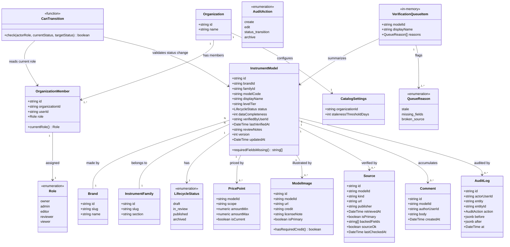

# Catalog Management Workflow

## Requirements

Build the manager-dashboard catalog authoring system that lets Editors draft
instrument records and moves every record through a server-enforced Draft → In
Review → Published → Archived lifecycle so that nothing reaches consumer-facing
surfaces without an explicit Reviewer approval; gate every transition and every
catalog write by a five-role model (Owner, Admin, Editor, Reviewer, Viewer)
evaluated against the actor's current assignment at call time, not a cached
session role; surface published records that have gone stale, are missing
required fields, or carry a broken source link in a verification queue; and
record every create, edit, status transition, and archive action as a
same-transaction audit entry with a before/after diff, so the catalog is
trustworthy as the single foundation that specs 005/006/007/009 all read from or
build on top of. **Verified finding**: `@windwise/db` and `@windwise/schemas`
already exist — built out by 005/007 with the six catalog tables (`brands`,
`instrument_families`, `instrument_models`, `price_points`, `model_images`,
`sources`) and the full `draft | in_review | published | archived` lifecycle
enum already typed on `instrument_models.status`. This feature is not
scaffolding those packages; it is their **first writer** — 005/006/007 only ever
read from them.

## Entities

Conservative-constraint notes:

- `Brand`, `InstrumentFamily`, `InstrumentModel`, `PricePoint`, `ModelImage`,
  `Source` are the exact six tables already defined in
  `packages/db/src/schema/catalog.ts` by 007 — there is no `ModelSpec` or
  `ModelSource` table in this codebase; specs are plain columns on
  `InstrumentModel` (`modelCode`, `displayName`, `levelTier`, already present)
  and a `Source` row already carries `modelId` directly, so FR-007's "which
  fields that source backs" is a new `backedFields` column added **to
  `Source`**, not a new join table. Do not add fields those reading specs
  (005/006/007) would need without confirming against their data-model docs;
  this spec only adds write-path fields (`status` write, `dataCompleteness`,
  `verifiedByUserId`, `reviewNotes`, `version`/`updatedAt` on `InstrumentModel`;
  `backedFields`, `sourceOk`, `lastCheckedAt` on `Source`).
- `reviewNotes` is modeled as a single nullable text column on
  `InstrumentModel`, not a separate table (simplification vs. the prior draft of
  this prompt): US1.3's "reviewer's notes attached" is a single note transported
  with one `in_review → draft` transition, not an accumulating thread — it is
  captured in the audit entry's `after` diff like any other field change and
  overwritten on the next `in_review → draft` transition. `Comment`
  (Viewer-authored, US3.1) stays a separate accumulating table because it is
  explicitly plural ("add comments") and not gated by a lifecycle transition.
- `VerificationQueueItem` and `QueueReason` are in-memory query output
  (`@windwise/schemas`), never persisted tables, per data-model.md.
- `CanTransition` is a function, not a table — represented here to make the
  centralized-check architecture explicit in the entity graph.

## Approach

1. **Roles via better-auth organization plugin, not a custom table**: Add the
   `organization` plugin to `apps/manager-dashboard/src/lib/auth.ts` (currently
   configured with only `emailAndPassword` + `tanstackStartCookies()` and no
   database adapter at all), extend its `member.role` field to the five-value
   enum (`owner | admin | editor | reviewer | viewer`) via the plugin's
   `additionalFields` mechanism. Do not build a parallel `organization_members`
   table — the plugin already models org → member → role and 008's spec role set
   maps directly onto it.

2. **One centralized lifecycle/role check, `can-transition.ts`**: Every server
   function that creates, edits, transitions, or archives a catalog record calls
   `canTransition(actorRole, currentStatus, targetStatus)` first. No route or
   server function re-implements the role matrix or the Draft→In
   Review→Published→Archived rules inline. This is what makes FR-012 ("current
   role, every time") true by construction — the function re-reads the member
   row at call time, never trusts a cached/session-start role.

3. **Same-transaction audit writes, no async/queued logging**:
   `catalog-write.ts` mutation functions wrap the record mutation and a call to
   `writeAuditEntry(...)` in a single Drizzle transaction. If the audit write
   fails, the mutation rolls back. This is a hard constraint (SC-003 "zero
   unattributed changes") — never split audit writes into a background job or
   event queue.

4. **Verification queue as a live read query plus a periodically-refreshed
   staleness flag on sources**: Staleness (`last_verified_at` vs. configurable
   threshold) and missing-required-fields are computed live on every query
   against already-loaded data — cheap and deterministic, no background job
   needed. Broken-source detection is different: it is an external network call,
   so a separate periodic job writes `sources.source_ok` and
   `sources.last_checked_at`, and the live query only reads that flag. Never
   perform a synchronous HTTP check inside a verification-queue page load.

5. **Optimistic concurrency for concurrent edits**: Every catalog write accepts
   the `version` (or `updatedAt`) the editor started from; the write is rejected
   with a conflict error if the stored version has since moved. This is the
   minimal mechanism the spec's edge case requires (a conflict signal, not
   real-time co-editing) — do not build pessimistic locking or CRDT-based
   collaboration.

6. **Publish gate uses one canonical required-field list, shared by three
   consumers**: Define the required-field list per entity type once (e.g.
   `packages/db/src/authz/required-fields.ts`), and have the publish gate
   (FR-009), the verification queue's missing-field check (FR-004), and the
   editor form's inline validation all read from it. Never let two of these
   three drift into separately-maintained lists — that was flagged as a design
   risk in the strategic analysis.

7. **No new shared package for lifecycle/role/audit logic**: This logic has
   exactly one consumer, `apps/manager-dashboard`. It lives in the existing
   `@windwise/db` package (adjacent to the catalog tables it governs, in a new
   `src/authz/` subdirectory), not a new `packages/catalog-authz` or similar —
   `@windwise/db` and `@windwise/schemas` already exist and are consumed by
   005/006/007 today; this feature extends them rather than creating any new
   workspace member.

8. **Owner vs. Admin resolved conservatively as functionally equivalent for this
   feature**: The spec (FR-008, US3.4) never differentiates their powers;
   `can-transition.ts` treats `owner` and `admin` as the same permission tier
   for every check in this feature (archive, restore, role management, threshold
   configuration). Do not invent a distinction the spec doesn't state — if a
   future spec needs one, that is a spec update, not a silent implementation
   choice here.

9. **At-least-one-Reviewer guarantee is out of scope**: The strategic analysis
   flags that an organization could end up with zero Reviewers, stalling every
   in-review record. This spec does not add an enforcement mechanism for it (no
   spec FR requires one) — do not build seat-count validation on role
   assignment; document it as a known operational gap in Safeguards instead.

## Structure

### Type Relationships

- `OrganizationMember.role` is the single source of truth `can-transition.ts`
  reads; nothing else stores a duplicate/cached role.
- `InstrumentModel.status` is the single lifecycle field; `PricePoint`,
  `ModelImage`, `Source` are children scoped by `modelId` and do not carry their
  own independent status.
- `VerificationQueueItem` and `AuditTrailEntry` are `@windwise/schemas`
  Valibot-validated shapes, never Drizzle table types — they are query output,
  not persisted rows, matching the existing pattern of `ListingResult`/
  `DetailResult` in `packages/schemas/src/catalog-browsing.ts`.
- `AuditLog.before`/`after` are `jsonb` diffs keyed by changed field name only
  (not full-row snapshots), consistent with FR-010's "before/after diff of
  changed fields."

### Dependencies

1. This spec is upstream of 005 (guided consultation) and 007 (catalog browsing)
   — both already read `status = 'published'` records from the tables this spec
   makes writable for the first time. Do not change the read-side query shape
   those specs already depend on (`listPublishedInstruments`,
   `getInstrumentDetail`, `listCatalogFacets`, `getModelById` in
   `packages/db/src/queries/`) without confirming against their plans.
2. This spec is upstream of 006 (instrument compare) for the same reason —
   compare surfaces only published records.
3. This spec is upstream of 009 (recommendation rules authoring) — rules attach
   to catalog entities this spec is the source of truth for; 009 must not
   duplicate lifecycle/role/audit logic, it consumes the same `@windwise/db`
   tables and `can-transition.ts`.
4. `apps/manager-dashboard` depends on `@windwise/db` (existing, extended with a
   write path), `@windwise/schemas` (existing, extended with new in-memory
   shapes), `@windwise/ui` (existing, dashboard theme), `@windwise/query`
   (existing, TanStack Query helpers), `better-auth` (existing dependency,
   organization plugin newly configured, database adapter newly wired).
5. `@windwise/db` depends on `better-auth`'s organization/member tables for
   `OrganizationMember` (extended, not duplicated) and owns `AuditLog`, the
   extended catalog tables, and `CatalogSettings` outright.
6. `apps/consumer-application` has no new dependency from this spec — it
   continues to read the same catalog tables it already reads via 005/007's
   established read path; this spec must not require consumer-application code
   changes.

### Layered Architecture

1. **Route/dashboard layer** (`apps/manager-dashboard/src/routes/`): TanStack
   Start route modules and React components. Calls server functions only; never
   imports Drizzle or touches `@windwise/db` internals directly.
2. **Service layer** (`packages/db/src/authz/`, `packages/db/src/queries/`):
   `can-transition.ts`, `catalog-write.ts`, `verification-queue.ts`,
   `audit-trail.ts`, `required-fields.ts`. This is where role checks, lifecycle
   rules, and audit writes are centralized. Exposed to the route layer as
   TanStack Start server functions. Existing read-only query functions
   (`list-published-instruments.ts`, `get-instrument-detail.ts`,
   `list-catalog-facets.ts`, `get-model-by-id.ts`) are untouched by this layer —
   this spec adds write-side siblings, it does not modify them.
3. **DB/audit layer** (`packages/db/src/schema/`): Drizzle schema definitions.
   `catalog.ts` is **extended** (new columns on `instrument_models` and
   `sources`, no new catalog tables); `organization-members.ts` (better-auth
   plugin extension), `audit-logs.ts`, `catalog-settings.ts`, and `comments.ts`
   are new files. This layer has no business logic, only table shape and
   constraints (foreign keys, `NOT NULL`, enum types).
4. **Validation layer**: `vp -C packages/db test`,
   `vp -C apps/manager-dashboard test`, then workspace-wide `vp run ready`.

## Operations

### Extend Schema - `packages/db/src/schema/catalog.ts`

1. Responsibility: Add the write-path columns this spec needs to the existing
   `instrument_models` and `sources` table definitions — **no new catalog
   tables** (`brands`, `instrument_families`, `price_points`, `model_images`
   already exist unchanged from 007).
2. New columns on `instrumentModels`:
   - `dataCompleteness`: integer 0-100, not null, default 0
   - `verifiedByUserId`: uuid, nullable, fk to better-auth's `user.id`
   - `reviewNotes`: text, nullable — set on `in_review → draft`
     (request-changes), cleared on the next `draft → in_review` transition
   - `version`: integer, not null, default 1, incremented by `catalog-write.ts`
     on every successful write (optimistic-concurrency token; use `version`, not
     `updatedAt`, for the explicit integer-comparison semantics
     `editInstrumentModel`'s contract needs)
3. New columns on `sources`:
   - `backedFields`: text array, not null, default `'{}'` — satisfies FR-007
     ("which fields that source backs")
   - `sourceOk`: boolean, nullable (`null` = not yet checked)
   - `lastCheckedAt`: timestamp with timezone, nullable
4. Constraints: `instrument_models.status` already exists as the
   `draft | in_review | published | archived` `pgEnum` from 007 — do not
   redefine or alter it, only start writing to it. All new columns are additive
   (`ALTER TABLE ... ADD COLUMN`), generated via the existing Drizzle migration
   workflow (`db:generate`) alongside 0002's precedent for backfilling any NOT
   NULL column against existing rows.

### Create Schema - `packages/db/src/schema/organization-members.ts`

1. Responsibility: Extend better-auth's organization plugin `member` table with
   the five-value role enum (data-model.md's `OrganizationMember`).
2. Logic: Define
   `roleEnum = pgEnum('role', ['owner','admin','editor','reviewer','viewer'])`
   and attach it via better-auth's `additionalFields` on the organization plugin
   config (`apps/manager-dashboard/src/lib/auth.ts`), backed by this Drizzle
   column definition matching the plugin's expected table shape.
3. Constraints: Do not create a second, independent members table — this must be
   the same physical table better-auth's plugin manages, with the role column
   added, not a shadow table joined by `user_id`.

### Create Schema - `packages/db/src/schema/audit-logs.ts`

1. Responsibility: `AuditLog` table per data-model.md — `id`, `actor_user_id`
   (fk), `entity` (text), `entity_id` (uuid), `action` (pgEnum
   `create | edit | status_transition | archive`), `before` (jsonb, nullable),
   `after` (jsonb), `at` (timestamp, default now).
2. Constraints: `entity_id` is not a strict FK to any single table (it
   references whichever entity type `entity` names) — index on
   `(entity, entity_id, at)` for the audit-trail read query's chronological
   lookup.

### Create Schema - `packages/db/src/schema/catalog-settings.ts`

1. Responsibility: Per-organization `staleness_threshold_days` (integer,
   default 180) — resolves the "configurable by whom, at what scope" ambiguity
   as organization-scoped, editable by Owner/Admin only (spec Assumptions:
   "configurable by an Owner/Admin").
2. Constraints: One row per `organization_id`; do not add per-entity-type
   thresholds — spec does not ask for that granularity.

### Create Schema - `packages/db/src/schema/comments.ts`

1. Responsibility: `Comment` table for Viewer (and any role) annotations on a
   catalog record (FR-008/US3.1), decoupled from `reviewNotes`.
2. Fields: `id` (uuid pk), `modelId` (uuid, fk to `instrument_models.id`),
   `authorUserId` (uuid, fk), `body` (text, not null), `createdAt` (timestamp,
   default now).
3. Constraints: Read/write does not go through `can-transition.ts` — adding a
   comment is not a lifecycle transition and does not require an audit entry
   under FR-010 (which scopes audit to "create, edit, status transition,
   archive" of the record itself, not comment threads); any role that can view a
   record can add a comment per FR-008.

### Create Function - `packages/db/src/authz/can-transition.ts`

1. Responsibility: Single shared lifecycle/role check (research.md §2); every
   catalog mutation routes through this.
2. Signature:
   `canTransition(actorRole: Role, currentStatus: LifecycleStatus, targetStatus: LifecycleStatus): { allowed: boolean; reason?: string }`.
3. Logic steps:
   - Look up the legal-transition table: `draft → in_review` (editor+),
     `in_review → published` (reviewer+), `in_review → draft` (reviewer+,
     request-changes), `published → archived` (reviewer+/admin+),
     `archived → draft` (admin+, explicit restore only).
   - Reject any transition not in the table (e.g. `draft → published` directly)
     regardless of role.
   - Return `{ allowed: false, reason: 'role' }` vs
     `{ allowed: false, reason: 'illegal-transition' }` distinctly so callers
     can surface the right error.
4. Constraints: Pure function, no DB access — the caller (`catalog-write.ts`) is
   responsible for reading the actor's _current_ role fresh from the DB before
   calling this, never from a cached session value (FR-012).

### Create Function - `packages/db/src/authz/required-fields.ts`

1. Responsibility: Canonical required-field list per entity type, the single
   source of truth for the publish gate, verification queue, and editor form
   (Approach §6).
2. Signature: `getRequiredFields(entityType: 'instrument_model'): string[]` and
   `computeMissingFields(entityType, record): string[]`.
3. Logic: For `instrument_model`, a record is publish-ready only if all of the
   following hold — `brandId`, `familyId`, `modelCode`, and `displayName` are
   non-empty (already `NOT NULL` at the schema level, checked here for
   completeness reporting); at least one current `PricePoint` exists for the
   model; at least one `ModelImage` exists with `isPrimary = true` (its
   `credit`/`licenseNote` are already schema-enforced `NOT NULL`, so a
   publishable image is never missing them by construction); at least one
   `Source` row exists for the model. This list is deliberately the minimum the
   spec's FRs name (FR-004, FR-006, FR-009) — treat any additional field as a
   **SPEC GAP / OPEN QUESTION** to raise, not silently add.

### Create Function - `packages/db/src/queries/catalog-write.ts`

1. Responsibility: The single mutation entry point for create, edit, status
   transition, and archive — nothing else in the codebase may write to catalog
   tables (research.md §2 risk: "if any future mutation path is added without
   routing through the shared write function, the guarantee silently breaks").
2. Signatures and logic:
   - `createInstrumentModel(actorUserId, orgId, input): Promise<InstrumentModel>`
     — inserts with `status: 'draft'`, `version: 1`, `dataCompleteness` computed
     via `required-fields.ts`; within the same transaction, calls
     `writeAuditEntry(actor, 'instrument_model', newId, 'create', null, after)`.
   - `editInstrumentModel(actorUserId, orgId, modelId, expectedVersion, patch): Promise<InstrumentModel>`
     — reads current role via `getCurrentRole(actorUserId, orgId)`; rejects if
     `expectedVersion !== stored version` with a conflict error (optimistic
     concurrency, research.md §5); recomputes `dataCompleteness`; computes the
     diff of changed fields; writes the row (incrementing `version`) and an
     `edit` audit entry in one transaction. `patch` may never include `status` —
     status only changes through `transitionInstrumentModel`.
   - `transitionInstrumentModel(actorUserId, orgId, modelId, expectedVersion, targetStatus, note?): Promise<InstrumentModel>`
     — reads current role and current status fresh; calls `canTransition`; if
     target is `published`, calls `computeMissingFields` and rejects with the
     missing-field list if non-empty (FR-009); on `in_review → draft` with a
     `note`, sets `reviewNotes = note` on the same row in the same transaction;
     on `draft → in_review`, clears `reviewNotes` to `null`; writes a
     `status_transition` audit entry.
   - `archiveInstrumentModel(actorUserId, orgId, modelId, expectedVersion): Promise<InstrumentModel>`
     — same pattern, `action: 'archive'`.
3. Constraints: Every function re-reads the actor's role from
   `organization_members` at call time — never accept a role passed in from a
   client-trusted session claim. Every function wraps mutation + audit write in
   one `db.transaction(...)` call; a failed audit write rolls back the mutation.

### Create Function - `packages/db/src/authz/write-audit-entry.ts`

1. Responsibility: Shared audit-write helper called only from within
   `catalog-write.ts`'s transactions (research.md §3).
2. Signature:
   `writeAuditEntry(tx, actorUserId, entity, entityId, action, before, after): Promise<void>`.
3. Logic: Computes the field-level diff (before/after keys that changed only,
   not full snapshots) if both `before` and `after` are provided; inserts one
   `audit_logs` row using the passed transaction handle `tx`, never a fresh
   connection.
4. Constraints: Must accept a transaction handle as a parameter — never open its
   own connection/transaction, or the same-transaction guarantee breaks.

### Create Query - `packages/db/src/queries/verification-queue.ts`

1. Responsibility: Read-only query producing `VerificationQueueItem[]`
   (research.md §4).
2. Signature: `getVerificationQueue(orgId): Promise<VerificationQueueItem[]>`.
3. Logic steps:
   - Read `catalog_settings.staleness_threshold_days` for the org (default 180
     if no row).
   - Select all `instrument_models` where `status = 'published'`.
   - For each: compute `stale` reason if `last_verified_at` older than the
     threshold; compute `missing_fields` reason via
     `computeMissingFields('instrument_model', record)`; compute `broken_source`
     reason by checking whether any `Source` row for the model has
     `source_ok = false` (batched `inArray` lookup, matching the N+1-avoidance
     convention `list-published-instruments.ts` already establishes).
   - A record may carry more than one reason simultaneously (data-model.md,
     confirmed intentional in strategic analysis) — group by record, not by
     reason.
4. Constraints: No live HTTP calls inside this function — `source_ok` is read
   from the periodically-refreshed flag only (Approach §4). An archived record
   is never included, even if it was flagged before archiving (SPEC GAP resolved
   conservatively: queue is explicitly scoped to `status = 'published'` per
   FR-003's wording — archiving removes a record from the queue as a consequence
   of the status filter, not a special case).

### Create Job - `packages/db/src/jobs/check-source-liveness.ts`

1. Responsibility: Periodic (not per-page-load) check that updates
   `sources.source_ok`/`last_checked_at` (research.md §4).
2. Signature: `checkSourceLiveness(sourceIds?: string[]): Promise<void>` —
   HEAD/GET request per source URL with a short timeout; sets `source_ok = true`
   on 2xx/3xx, `false` on failure, always updates `last_checked_at`.
3. Constraints: Must not run inside a request/response cycle triggered by a
   dashboard page load. Wire it as a scheduled task per whatever job-running
   convention the platform later adopts — if none exists yet, implement as an
   invokable function with a documented manual/cron trigger, not inline in
   `verification-queue.ts`. Include basic retry/backoff (research.md §4 risk:
   false positives from transient failures) — do not flag a source broken from a
   single failed attempt; require the check to fail twice consecutively before
   flipping `source_ok` to `false`.

### Create Query - `packages/db/src/queries/audit-trail.ts`

1. Responsibility: Chronological audit history for one entity (FR-011).
2. Signature:
   `getAuditTrail(entity: string, entityId: string): Promise<AuditTrailEntry[]>`.
3. Logic: Selects from `audit_logs` filtered by `(entity, entity_id)`, ordered
   by `at` ascending; joins `actor_user_id` to a display name (via better-auth's
   `user` table); maps `before`/`after` jsonb into the
   `diff: Array<{field, before, after}>` shape from data-model.md.
4. Constraints: Read-only; no pagination cap unless a record's history exceeds a
   size that makes the dashboard view unusable — if so, paginate with TanStack
   Router search params, not an arbitrary hard truncation.

### Update Auth Config - `apps/manager-dashboard/src/lib/auth.ts`

1. Responsibility: Configure better-auth's organization plugin with the
   five-role enum (Approach §1).
2. Logic: Add `organization({ ... })` to the `plugins` array alongside the
   existing `tanstackStartCookies()`; configure `additionalFields.role` on the
   member schema to reference the Drizzle `roleEnum`; wire the `database`
   adapter to `@windwise/db`'s existing Drizzle instance (`getDb()` from
   `packages/db/src/client.ts`) — `auth.ts` currently has **no database adapter
   configured at all**, so this is the first time `apps/manager-dashboard`'s
   auth layer connects to Postgres, not an extension of an existing DB-backed
   config.
3. Constraints: Do not remove `emailAndPassword` or `tanstackStartCookies()` —
   those are out of scope (spec Assumptions: "account creation/authentication
   mechanics themselves are out of scope").

### Create Route - `apps/manager-dashboard/src/routes/catalog/index.tsx`

1. Responsibility: Record list with status filter (US1, plan.md structure).
2. Logic: TanStack Query hook calling a server function wrapping a read query
   over `instrument_models` filtered by `status` search param (TanStack Router
   typed search params per plan.md's Technical Context); role-gated action
   buttons (Edit only if actor role is editor+; the create button only if
   editor+).
3. Constraints: Read path only — no direct DB access from the route component;
   reads status via the server function, not client-side. Replaces the current
   placeholder `apps/manager-dashboard/src/routes/index.tsx` welcome content as
   the app's real landing surface (existing index route content is out of scope
   to preserve — it is scaffold boilerplate, not product content).

### Create Route - `apps/manager-dashboard/src/routes/catalog/$modelId/edit.tsx`

1. Responsibility: Editor form for draft/in-review records (US1).
2. Logic: Loads the record with its current `version`; on save, calls the
   `editInstrumentModel` server function passing the loaded `version` as
   `expectedVersion`; on conflict-error response, surfaces a conflict message
   (not a silent overwrite) per the concurrent-edit edge case; "mark ready"
   button calls `transitionInstrumentModel(..., 'in_review')`.
3. Constraints: Zustand used only for unsaved-draft form state per plan.md's
   Technical Context ("not used for anything with a server counterpart") — do
   not use Zustand for the record data itself, that stays in TanStack Query
   cache.

### Create Route - `apps/manager-dashboard/src/routes/catalog/review/index.tsx`

1. Responsibility: Reviewer queue — in-review records (US1.2's "reviewer's
   queue" resolved as a filtered list view, not a separate table, per strategic
   analysis's noted gap).
2. Logic: Server function query for `status = 'in_review'`; approve button calls
   `transitionInstrumentModel(..., 'published')` (blocked with a missing-field
   message if FR-009 rejects it); request-changes control requires a note field
   and calls `transitionInstrumentModel(..., 'draft', note)`, which lands in
   `InstrumentModel.reviewNotes`.
3. Constraints: Only rendered/actionable for reviewer+ role — editor/viewer
   sessions see a role-appropriate empty/denied state, not a broken page.

### Create Route - `apps/manager-dashboard/src/routes/verification-queue.tsx`

1. Responsibility: Verification queue view (US2).
2. Logic: Server function calling `getVerificationQueue(orgId)`; renders
   grouped-by-record reason badges (stale / missing fields / broken source).
3. Constraints: No client-side polling that triggers live URL checks — reads
   only the precomputed `source_ok` flag.

### Create Route - `apps/manager-dashboard/src/routes/audit/$entityId.tsx`

1. Responsibility: Chronological diff view for one record (US4).
2. Logic: Server function calling `getAuditTrail('instrument_model', entityId)`;
   renders each entry's actor, timestamp, action, and field-level diff in order.
3. Constraints: Read-only; viewable by all roles including Viewer (spec: Viewers
   "can still read records").

### Create Route - `apps/manager-dashboard/src/routes/settings/members.tsx`

1. Responsibility: Owner/Admin role-assignment UI (US3.4).
2. Logic: Lists org members with current role; role-change control calls a
   better-auth organization-plugin update; takes effect immediately because
   `can-transition.ts` always re-reads the role at call time (no cache
   invalidation step needed for correctness, though TanStack Query cache for the
   members list itself should still invalidate on save).
3. Constraints: Only rendered for owner/admin role. Also hosts the
   `staleness_threshold_days` setting field (Approach: org-scoped,
   Owner/Admin-editable).

### Create Tests - `packages/db/src/authz/can-transition.test.ts`

1. Responsibility: Every legal/illegal transition per role (plan.md Testing).
2. Cases: All five legal transitions × each of five roles (25 combinations,
   asserting exactly which allow); at least one illegal transition attempt
   (`draft → published` direct) rejected regardless of role.
3. Framework: `import { describe, expect, it } from 'vite-plus/test'`.

### Create Tests - `packages/db/src/queries/catalog-write.test.ts`

1. Responsibility: Integration coverage for the publish gate and audit writes
   (plan.md Testing — "cross-package-boundary behaviors... not assumptions").
2. Cases: publish blocked when a required field is missing, with the specific
   missing fields returned; every mutation type (create/edit/
   transition/archive) produces exactly one corresponding `audit_logs` row with
   correct before/after; concurrent edit with a stale `expectedVersion` is
   rejected with a conflict error, not silently applied; revoked-role save
   attempt (actor's role changed between session start and save) is denied.
3. Framework: `vite-plus/test`, following the same DB-test setup convention
   `packages/db`'s existing tests (e.g. `list-published-instruments`'s query
   coverage) already use — inspect before inventing a new one.

### Create Tests - `packages/db/src/queries/verification-queue.test.ts`

1. Responsibility: US2 acceptance scenarios directly.
2. Cases: stale record appears; missing-field record appears with fields named;
   broken-source record appears; fully current/complete/working record does not
   appear; a record with multiple simultaneous reasons appears once with all
   reasons listed; archived record never appears even if previously flagged.

### Create Changeset - `.changeset/catalog-management-workflow.md`

1. Responsibility: Record shipped package/app changes per AGENTS.md §7.
2. Content: `minor` for `@windwise/db` (new write-path public API surface:
   `catalog-write.ts`, `verification-queue.ts`, `audit-trail.ts`, `authz/`),
   `minor` for `@windwise/schemas` (new `VerificationQueueItem`/
   `AuditTrailEntry` shapes), `minor` for `@windwise/manager-dashboard` (new
   catalog/verification-queue/audit/settings routes and role-gated behavior).
3. Constraints: No `Co-authored-by` trailer (AGENTS.md §7). Follow the `0.y.z`
   baseline — do not jump to `1.0.0` for this feature alone.

### Verify - workspace quality gate

1. Responsibility: Constitution I/II per AGENTS.md.
2. Steps: `vp -C packages/db test`, `vp -C apps/manager-dashboard test`, then
   workspace-wide `vp run ready`.
3. Constraints: Do not merge/report complete if `vp run ready` fails on files
   this work item touches; pre-existing unrelated format debt (per the 004
   precedent) is not this work item's responsibility to fix, but any failure
   inside `packages/db`, `packages/schemas`, or the new `apps/manager-dashboard`
   routes/tests is.

## Norms

1. **Package boundary**: `@windwise/db` owns all Drizzle schema and
   catalog/audit/authz query functions; `@windwise/schemas` owns Valibot
   in-memory shapes; `apps/manager-dashboard` never imports `drizzle-orm` or
   writes raw SQL directly — only through `@windwise/db`'s exported functions.
   `apps/consumer-application` must not gain a new dependency from this work.
2. **Imports**: Use `@windwise/db`, `@windwise/schemas`, `@windwise/ui`,
   `@windwise/query` via `workspace:*`, matching existing app import grouping.
   Within `packages/db`, follow the `#/*` → `./src/*` alias convention already
   declared in `packages/db/package.json`'s `imports` field (matching
   `get-model-by-id.ts`'s existing `#/client.ts` / `#/schema/index.ts` import
   style) for internal imports — do not introduce a new alias scheme.
3. **Tests**: `vite-plus/test` exclusively —
   `import { describe, expect, it } from 'vite-plus/test'`. Colocate tests next
   to source (`can-transition.test.ts` beside `can-transition.ts`), matching
   `packages/schemas/src/pricing.test.ts`'s colocation pattern.
4. **Changesets**: One changeset per PR covering all packages/apps touched
   (AGENTS.md §7); `minor` for new public exports on `@windwise/db`/
   `@windwise/schemas`; skip changesets only for docs/spec-only edits.
5. **Error handling**: Server functions return typed error shapes (e.g.
   `{ ok: false, reason: 'conflict' | 'role-denied' | 'missing-fields', details }`)
   rather than throwing raw exceptions across the client/server boundary —
   TanStack Start server functions surface these to the route's TanStack Query
   error state, which renders role-appropriate messaging. Do not use Java-style
   global exception handler middleware; this is a TS/Node/React stack with typed
   return-value error handling at the service-function boundary, matching the
   platform plan's stated approach elsewhere in the monorepo.
6. **Formatting/linting**: oxfmt/oxlint via `vp check`; no additional lint
   config invented for this work item.
7. **No domain leakage into `@windwise/ui`**: Catalog/audit/verification-queue
   UI is dashboard-app-specific; only generic primitives (table, badge, dialog)
   come from `@windwise/ui` — do not add `InstrumentCard` or `AuditDiffView`
   components to the shared UI package (AGENTS.md §9), mirroring 007's identical
   rule for `apps/consumer-application`'s catalog-page composites.

## Safeguards

1. **Functional — out of scope**: Do not build rule authoring or
   recommendation-test tooling (that is 009). Do not build real-time
   collaborative/CRDT editing. Do not build pessimistic row locking. Do not
   build a background job framework beyond the one periodic source-liveness
   check this spec requires. Do not build seat-count/at-least-one-Reviewer
   enforcement (documented gap, not this spec's scope).
2. **Performance**: Verification-queue reads must not perform live HTTP calls;
   broken-source detection is strictly the periodic job's flag.
   Status-transition and edit round-trips must reflect in the UI via TanStack
   Query invalidation without a full page reload (plan.md's stated performance
   target). Any per-model lookup across a set of matched models (broken-source
   checks, missing-field checks) must be batched (`inArray`), matching the
   N+1-avoidance rule 007's `list-published-instruments.ts` already establishes
   for this codebase.
3. **Security**: Every catalog mutation re-reads the actor's role from the
   database at call time — no role read from a client-supplied or session-cached
   claim is ever trusted for an authorization decision (FR-012). Audit log rows
   are append-only from application code — no update/delete function is exposed
   for `audit_logs`; tamper-resistance is enforced by never writing an update
   path, not by database-level permissions this spec doesn't scope in.
4. **Integration**: This is the foundation 005/006/007/009 depend on — do not
   change the shape of already-established read queries those specs use
   (`list-published-instruments.ts`, `get-instrument-detail.ts`,
   `list-catalog-facets.ts`, `get-model-by-id.ts`) without checking their
   plan/data-model docs first. `apps/consumer-application` must not gain any new
   dependency or route from this work.
5. **Business rules**: Nothing reaches `status = 'published'` through any path
   other than the reviewer-gated `transitionInstrumentModel` function (FR-001).
   Publish is always blocked when required fields are missing (FR-009) — this
   check cannot be bypassed by directly calling `editInstrumentModel` with
   `status: 'published'` in the patch; `editInstrumentModel` must reject any
   patch that includes `status` at all — status changes only happen through the
   transition function. Archival is never automatically reversed (spec Edge
   Cases) — restore is always an explicit Admin+ action. The staleness threshold
   is a per-organization, Owner/Admin-configurable setting (SPEC GAP resolved)
   and changing it must be reflected on the next verification-queue read, not
   retroactively backfilled onto records.
6. **Technical constraints**: `@windwise/db` and `@windwise/schemas` already
   exist — do not re-scaffold them or duplicate their `package.json`/`tsconfig`
   setup; this work item only adds new files inside them. Optimistic concurrency
   (`version`) is mandatory on every catalog write function; a write without a
   version check on a mutable record is a safeguard violation.
7. **Data constraints**: `model_images.credit`/`license_note` are already
   `NOT NULL` at the schema level (007) — this spec does not weaken that
   constraint; the publish gate additionally requires at least one
   `isPrimary = true` image to exist at all (`required-fields.ts`), which is an
   application-level check the schema cannot express. `AuditLog.before`/ `after`
   store field-level diffs, not full-row snapshots, to keep entries reviewable.
8. **API constraints**: Every catalog-mutating server function accepts and
   validates `expectedVersion`; every function reads role fresh, never accepts a
   role parameter from the client. `getVerificationQueue` and `getAuditTrail`
   are read-only — no mutation branch inside either.
9. **Verification gate**: `vp -C packages/db test` and
   `vp -C apps/manager-dashboard test` must pass; `vp run ready` is the
   workspace gate for this work item's touched files (schema, authz, queries,
   routes, tests) — pre-existing unrelated format debt elsewhere in the repo is
   not blocking, per the 004 precedent, but nothing newly added by this work
   item may fail it.
