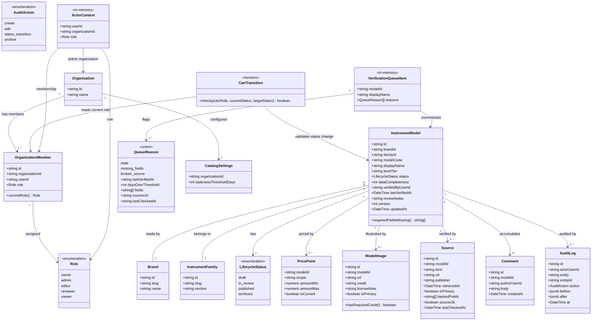

# Catalog Management Workflow

## Requirements

Build the manager-dashboard catalog authoring system that lets Editors draft
instrument records and moves every record through a server-enforced Draft → In
Review → Published → Archived lifecycle so that nothing reaches consumer-facing
surfaces without an explicit Reviewer approval; gate every transition and every
catalog write by a five-role model (Owner, Admin, Editor, Reviewer, Viewer)
evaluated against the actor's current assignment at call time, not a cached
session role; surface published records that have gone stale, are missing
required fields, or carry a broken source link in a verification queue; and
record every create, edit, status transition, and archive action as a
same-transaction audit entry with a before/after diff, so the catalog is
trustworthy as the single foundation that specs 005/006/007/009 all read from or
build on top of. **Verified finding**: `@windwise/db` and `@windwise/schemas`
already exist — built out by 005/007 with the six catalog tables (`brands`,
`instrument_families`, `instrument_models`, `price_points`, `model_images`,
`sources`) and the full `draft | in_review | published | archived` lifecycle
enum already typed on `instrument_models.status`. This feature is not
scaffolding those packages; it is their **first writer** — 005/006/007 only ever
read from them.

## Entities

Conservative-constraint notes:

- `Brand`, `InstrumentFamily`, `InstrumentModel`, `PricePoint`, `ModelImage`,
  `Source` are the exact six tables already defined in
  `packages/db/src/schema/catalog.ts` by 007 — there is no `ModelSpec` or
  `ModelSource` table in this codebase; specs are plain columns on
  `InstrumentModel` (`modelCode`, `displayName`, `levelTier`, already present)
  and a `Source` row already carries `modelId` directly, so FR-007's "which
  fields that source backs" is a new `backedFields` column added **to
  `Source`**, not a new join table. Do not add fields those reading specs
  (005/006/007) would need without confirming against their data-model docs;
  this spec only adds write-path fields (`status` write, `dataCompleteness`,
  `verifiedByUserId`, `reviewNotes`, `version`/`updatedAt` on `InstrumentModel`;
  `backedFields`, `sourceOk`, `lastCheckedAt` on `Source`).
- `ModelImage.url` remains a single text column. The editor may persist either a
  publicly reachable `http(s)` URL or a `data:` URL produced by
  `CatalogImageAttachmentField` (file read in the browser, JPEG/PNG/WebP/GIF,
  1.5 MB cap). There is no `MediaAsset` table or object-storage entity in this
  work item — a CDN/media store is a documented SPEC GAP, not a silent new
  table.
- `reviewNotes` is modeled as a single nullable text column on
  `InstrumentModel`, not a separate table (simplification vs. the prior draft of
  this prompt): US1.3's "reviewer's notes attached" is a single note transported
  with one `in_review → draft` transition, not an accumulating thread — it is
  captured in the audit entry's `after` diff like any other field change and
  overwritten on the next `in_review → draft` transition. `Comment`
  (Viewer-authored, US3.1) stays a separate accumulating table because it is
  explicitly plural ("add comments") and not gated by a lifecycle transition.
- `VerificationQueueItem` and `QueueReason` are in-memory query output
  (`@windwise/schemas`), never persisted tables, per data-model.md.
  `QueueReason` is a Valibot `variant('type', …)` — `stale` carries
  `lastVerifiedAt` and `daysOverThreshold`; `missing_fields` carries `fields`;
  `broken_source` carries `sourceUrl` and `lastCheckedAt` — not a database enum.
- `CanTransition` is a function, not a table — represented here to make the
  centralized-check architecture explicit in the entity graph.
- `ActorContext` is in-memory
  (`apps/manager-dashboard/src/lib/server/session.ts`), never a Drizzle table or
  `@windwise/schemas` shape. `getActorContext()` builds
  `{ userId, organizationId, role }` from the Better Auth session plus a fresh
  `organization_members` read: `session.activeOrganizationId` when set,
  otherwise the user's unique membership. A session with no member row is not an
  actor (`null`).

## Approach

1. **Roles via better-auth organization plugin, not a custom table**: Add the
   `organization` plugin to `apps/manager-dashboard/src/lib/auth.ts` (wired with
   `emailAndPassword` + `disableSignUp: true`, `tanstackStartCookies()`, and the
   Drizzle adapter on `getDb()`), extend its `member.role` field to the
   five-value enum (`owner | admin | editor | reviewer | viewer`) via the
   plugin's `additionalFields` mechanism. Do not build a parallel
   `organization_members` table — the plugin already models org → member → role
   and 008's spec role set maps directly onto it. Public email sign-up is
   closed; staff accounts are seeded or invited, not self-registered.

2. **One centralized lifecycle/role check, `can-transition.ts`**: Every server
   function that creates, edits, transitions, or archives a catalog record calls
   `canTransition(actorRole, currentStatus, targetStatus)` first. No route or
   server function re-implements the role matrix or the Draft→In
   Review→Published→Archived rules inline. This is what makes FR-012 ("current
   role, every time") true by construction — the function re-reads the member
   row at call time, never trusts a cached/session-start role.
   `getActorContext()` selects that row by `session.activeOrganizationId` when
   set; if it is unset, it continues only when the user has exactly one
   membership (never `.limit(1)` across multiple orgs). Catalog and audit
   **reads** also require a non-null actor — a signed-in user with no member row
   must not load records, brands, families, or audit history.

3. **Same-transaction audit writes, no async/queued logging**:
   `catalog-write.ts` mutation functions wrap the record mutation and a call to
   `writeAuditEntry(...)` in a single Drizzle transaction. If the audit write
   fails, the mutation rolls back. This is a hard constraint (SC-003 "zero
   unattributed changes") — never split audit writes into a background job or
   event queue.

4. **Verification queue as a live read query plus a periodically-refreshed
   staleness flag on sources**: Staleness (`last_verified_at` vs. configurable
   threshold) and missing-required-fields are computed live on every query
   against already-loaded data — cheap and deterministic, no background job
   needed. Broken-source detection is different: it is an external network call,
   so a separate periodic job writes `sources.source_ok` and
   `sources.last_checked_at`, and the live query only reads that flag. Never
   perform a synchronous HTTP check inside a verification-queue page load.

5. **Optimistic concurrency for concurrent edits**: Every catalog write accepts
   the `version` (or `updatedAt`) the editor started from; the write is rejected
   with a conflict error if the stored version has since moved. This is the
   minimal mechanism the spec's edge case requires (a conflict signal, not
   real-time co-editing) — do not build pessimistic locking or CRDT-based
   collaboration.

6. **Publish gate uses one canonical required-field list, shared by three
   consumers**: Define the required-field list per entity type once (e.g.
   `packages/db/src/authz/required-fields.ts`), and have the publish gate
   (FR-009), the verification queue's missing-field check (FR-004), and the
   editor form's inline validation all read from it. Never let two of these
   three drift into separately-maintained lists — that was flagged as a design
   risk in the strategic analysis.

7. **No new shared package for lifecycle/role/audit logic**: This logic has
   exactly one consumer, `apps/manager-dashboard`. It lives in the existing
   `@windwise/db` package (adjacent to the catalog tables it governs, in a new
   `src/authz/` subdirectory), not a new `packages/catalog-authz` or similar —
   `@windwise/db` and `@windwise/schemas` already exist and are consumed by
   005/006/007 today; this feature extends them rather than creating any new
   workspace member.

8. **Owner vs. Admin resolved conservatively as functionally equivalent for this
   feature**: The spec (FR-008, US3.4) never differentiates their powers;
   `can-transition.ts` treats `owner` and `admin` as the same permission tier
   for every check in this feature (archive, restore, role management, threshold
   configuration). Do not invent a distinction the spec doesn't state — if a
   future spec needs one, that is a spec update, not a silent implementation
   choice here.

9. **At-least-one-Reviewer guarantee is out of scope**: The strategic analysis
   flags that an organization could end up with zero Reviewers, stalling every
   in-review record. This spec does not add an enforcement mechanism for it (no
   spec FR requires one) — do not build seat-count validation on role
   assignment; document it as a known operational gap in Safeguards instead.

10. **Editor UI is Formisch + Content Manager layout, not Zustand**: Catalog
    create/edit state lives in `@formisch/react` bound to `CatalogEditSchema`
    (`apps/manager-dashboard/src/schemas/catalog-edit.schema.ts`). Do not
    introduce Zustand for unsaved draft fields — plan.md's "Zustand for
    client-only draft state" is superseded by the Formisch form already used on
    login/forgot/reset. The edit screen follows a Content Manager pattern:
    sticky entry header (back, title, status, Save / Mark ready / Publish),
    field-group cards (Identity, Pricing, Primary image, Source), and a sticky
    Information aside (id, version, last verified, completeness, history link,
    Archive). Primary image uses `@windwise/ui` `Attachment` primitives composed
    in the dashboard module — not a new shared catalog widget. List, review,
    verification, members, and audit screens reuse the same sticky page header
    (Lucide icon, eyebrow, `h1`) and, where there is nothing to show, the
    generic `@windwise/ui` `Empty` primitive — not a catalog-named empty widget.

## Structure

### Type Relationships

- `OrganizationMember.role` is the single source of truth `can-transition.ts`
  reads; nothing else stores a duplicate/cached role. Dashboard server functions
  receive that role via in-memory `ActorContext` (`getActorContext` in
  `session.ts`): `organizationId` is `session.activeOrganizationId` when
  present, otherwise the user's unique membership — never an arbitrary first
  `member` row.
- `InstrumentModel.status` is the single lifecycle field; `PricePoint`,
  `ModelImage`, `Source` are children scoped by `modelId` and do not carry their
  own independent status.
- `VerificationQueueItem` and `AuditTrailEntry` are `@windwise/schemas`
  Valibot-validated shapes, never Drizzle table types — they are query output,
  not persisted rows, matching the existing pattern of `ListingResult`/
  `DetailResult` in `packages/schemas/src/catalog-browsing.ts`. `QueueReason` is
  a discriminated union (`type`), not a Postgres enum.
- `AuditLog.before`/`after` are `jsonb` diffs keyed by changed field name only
  (not full-row snapshots), consistent with FR-010's "before/after diff of
  changed fields."

### Dependencies

1. This spec is upstream of 005 (guided consultation) and 007 (catalog browsing)
   — both already read `status = 'published'` records from the tables this spec
   makes writable for the first time. Do not change the read-side query shape
   those specs already depend on (`listPublishedInstruments`,
   `getInstrumentDetail`, `listCatalogFacets`, `getModelById` in
   `packages/db/src/queries/`) without confirming against their plans.
2. This spec is upstream of 006 (instrument compare) for the same reason —
   compare surfaces only published records.
3. This spec is upstream of 009 (recommendation rules authoring) — rules attach
   to catalog entities this spec is the source of truth for; 009 must not
   duplicate lifecycle/role/audit logic, it consumes the same `@windwise/db`
   tables and `can-transition.ts`.
4. `apps/manager-dashboard` depends on `@windwise/db` (existing, extended with a
   write path), `@windwise/schemas` (existing, extended with new in-memory
   shapes), `@windwise/ui` (existing, dashboard theme plus generic primitives
   such as `Attachment`, `Pagination`, `Empty`, `Field`, `Card`, `Dialog` — no
   catalog-named composites), `@windwise/query` (existing, TanStack Query
   helpers), `better-auth` (existing dependency, organization plugin newly
   configured, database adapter newly wired).
5. `@windwise/db` depends on `better-auth`'s organization/member tables for
   `OrganizationMember` (extended, not duplicated) and owns `AuditLog`, the
   extended catalog tables, and `CatalogSettings` outright.
6. `apps/consumer-application` has no new dependency from this spec — it
   continues to read the same catalog tables it already reads via 005/007's
   established read path; this spec must not require consumer-application code
   changes.

### Layered Architecture

1. **Route/dashboard layer** (`apps/manager-dashboard/src/routes/` plus
   `apps/manager-dashboard/src/modules/`): TanStack Start route modules stay
   thin (loader + `component`). Product UI lives in `src/modules/catalog/`
   (`catalog-list`, `catalog-edit`, `catalog-review`, `catalog-verification`,
   `catalog-audit`) and `src/modules/settings/members-settings/`. Client role
   gates use `hasMinRole` (`src/lib/roles.ts`); actor context is loaded via
   `getActorContextFn` (`src/lib/server/actor.ts`), which wraps
   `getActorContext()` in `src/lib/server/session.ts`. Catalog/audit server
   functions live in `src/lib/server/catalog.ts` and require that actor on reads
   and writes. Modules call server functions / query options only; never import
   Drizzle or touch `@windwise/db` internals directly.
2. **Service layer** (`packages/db/src/authz/`, `packages/db/src/queries/`):
   `can-transition.ts`, `catalog-write.ts`, `verification-queue.ts`,
   `audit-trail.ts`, `required-fields.ts`, `catalog-settings.ts`,
   `organization-members.ts`. This is where role checks, lifecycle rules, and
   audit writes are centralized. Exposed to the route layer as TanStack Start
   server functions. Existing read-only query functions
   (`list-published-instruments.ts`, `get-instrument-detail.ts`,
   `list-catalog-facets.ts`, `get-model-by-id.ts`) are untouched by this layer —
   this spec adds write-side siblings, it does not modify them.
3. **DB/audit layer** (`packages/db/src/schema/`): Drizzle schema definitions.
   `catalog.ts` is **extended** (new columns on `instrument_models` and
   `sources`, no new catalog tables); `organization-members.ts` (better-auth
   plugin extension), `audit-logs.ts`, `catalog-settings.ts`, and `comments.ts`
   are new files. This layer has no business logic, only table shape and
   constraints (foreign keys, `NOT NULL`, enum types).
4. **Validation layer**: `vp -C packages/db test`,
   `vp -C apps/manager-dashboard test`, then workspace-wide `vp run ready`.

## Operations

### Extend Schema - `packages/db/src/schema/catalog.ts`

1. Responsibility: Add the write-path columns this spec needs to the existing
   `instrument_models` and `sources` table definitions — **no new catalog
   tables** (`brands`, `instrument_families`, `price_points`, `model_images`
   already exist unchanged from 007).
2. New columns on `instrumentModels`:
   - `dataCompleteness`: integer 0-100, not null, default 0
   - `verifiedByUserId`: uuid, nullable, fk to better-auth's `user.id`
   - `reviewNotes`: text, nullable — set on `in_review → draft`
     (request-changes), cleared on the next `draft → in_review` transition
   - `version`: integer, not null, default 1, incremented by `catalog-write.ts`
     on every successful write (optimistic-concurrency token; use `version`, not
     `updatedAt`, for the explicit integer-comparison semantics
     `editInstrumentModel`'s contract needs)
3. New columns on `sources`:
   - `backedFields`: text array, not null, default `'{}'` — satisfies FR-007
     ("which fields that source backs")
   - `sourceOk`: boolean, nullable (`null` = not yet checked)
   - `lastCheckedAt`: timestamp with timezone, nullable
4. Constraints: `instrument_models.status` already exists as the
   `draft | in_review | published | archived` `pgEnum` from 007 — do not
   redefine or alter it, only start writing to it. All new columns are additive
   (`ALTER TABLE ... ADD COLUMN`), generated via the existing Drizzle migration
   workflow (`db:generate`) alongside 0002's precedent for backfilling any NOT
   NULL column against existing rows.

### Create Schema - `packages/db/src/schema/organization-members.ts`

1. Responsibility: Extend better-auth's organization plugin `member` table with
   the five-value role enum (data-model.md's `OrganizationMember`).
2. Logic: Define
   `roleEnum = pgEnum('role', ['owner','admin','editor','reviewer','viewer'])`
   and attach it via better-auth's `additionalFields` on the organization plugin
   config (`apps/manager-dashboard/src/lib/auth.ts`), backed by this Drizzle
   column definition matching the plugin's expected table shape.
3. Constraints: Do not create a second, independent members table — this must be
   the same physical table better-auth's plugin manages, with the role column
   added, not a shadow table joined by `user_id`.

### Create Schema - `packages/db/src/schema/audit-logs.ts`

1. Responsibility: `AuditLog` table per data-model.md — `id`, `actor_user_id`
   (fk), `entity` (text), `entity_id` (uuid), `action` (pgEnum
   `create | edit | status_transition | archive`), `before` (jsonb, nullable),
   `after` (jsonb), `at` (timestamp, default now).
2. Constraints: `entity_id` is not a strict FK to any single table (it
   references whichever entity type `entity` names) — index on
   `(entity, entity_id, at)` for the audit-trail read query's chronological
   lookup.

### Create Schema - `packages/db/src/schema/catalog-settings.ts`

1. Responsibility: Per-organization `staleness_threshold_days` (integer,
   default 180) — resolves the "configurable by whom, at what scope" ambiguity
   as organization-scoped, editable by Owner/Admin only (spec Assumptions:
   "configurable by an Owner/Admin").
2. Constraints: One row per `organization_id`; do not add per-entity-type
   thresholds — spec does not ask for that granularity.

### Create Schema - `packages/db/src/schema/comments.ts`

1. Responsibility: `Comment` table for Viewer (and any role) annotations on a
   catalog record (FR-008/US3.1), decoupled from `reviewNotes`.
2. Fields: `id` (uuid pk), `modelId` (uuid, fk to `instrument_models.id`),
   `authorUserId` (uuid, fk), `body` (text, not null), `createdAt` (timestamp,
   default now).
3. Constraints: Read/write does not go through `can-transition.ts` — adding a
   comment is not a lifecycle transition and does not require an audit entry
   under FR-010 (which scopes audit to "create, edit, status transition,
   archive" of the record itself, not comment threads); any role that can view a
   record can add a comment per FR-008.

### Create Query - `packages/db/src/queries/comments.ts`

1. Responsibility: List and add `Comment` rows for a catalog record (FR-008 /
   US3.1) — the schema alone is not enough; this is the write/read path.
2. Signatures: `listComments(db, modelId): Promise<CommentListItem[]>`;
   `addComment(db, actorUserId, orgId, modelId, body): Promise<WriteResult<CommentListItem>>`.
3. Logic: `listComments` joins `authorUserId` to better-auth `user` for
   `authorDisplayName`, ordered by `createdAt` ascending. `addComment` re-reads
   org membership for `actorUserId`/`orgId`; any member role may insert; empty /
   whitespace-only `body` is rejected; no call to `canTransition` or
   `writeAuditEntry`.
4. Constraints: Do not audit comments under FR-010. Do not accept a client-
   supplied role. `CommentListItem` lives in `@windwise/schemas`.

### Create Function - `packages/db/src/authz/can-transition.ts`

1. Responsibility: Single shared lifecycle/role check (research.md §2); every
   catalog mutation routes through this.
2. Signature:
   `canTransition(actorRole: Role, currentStatus: LifecycleStatus, targetStatus: LifecycleStatus): { allowed: boolean; reason?: string }`.
3. Logic steps:
   - Look up the legal-transition table: `draft → in_review` (editor+),
     `in_review → published` (reviewer+), `in_review → draft` (reviewer+,
     request-changes), `published → archived` (reviewer+/admin+),
     `archived → draft` (admin+, explicit restore only).
   - Reject any transition not in the table (e.g. `draft → published` directly)
     regardless of role.
   - Return `{ allowed: false, reason: 'role' }` vs
     `{ allowed: false, reason: 'illegal-transition' }` distinctly so callers
     can surface the right error.
4. Constraints: Pure function, no DB access — the caller (`catalog-write.ts`) is
   responsible for reading the actor's _current_ role fresh from the DB before
   calling this, never from a cached session value (FR-012).

### Create Function - `packages/db/src/authz/required-fields.ts`

1. Responsibility: Canonical required-field list per entity type, the single
   source of truth for the publish gate, verification queue, and editor form
   (Approach §6).
2. Signature: `getRequiredFields(entityType: 'instrument_model'): string[]` and
   `computeMissingFields(entityType, record): string[]`.
3. Logic: For `instrument_model`, a record is publish-ready only if all of the
   following hold — `brandId`, `familyId`, `modelCode`, and `displayName` are
   non-empty (already `NOT NULL` at the schema level, checked here for
   completeness reporting); at least one current `PricePoint` exists for the
   model; at least one `ModelImage` exists with `isPrimary = true` (its
   `credit`/`licenseNote` are already schema-enforced `NOT NULL`, so a
   publishable image is never missing them by construction); at least one
   `Source` row exists for the model. This list is deliberately the minimum the
   spec's FRs name (FR-004, FR-006, FR-009) — treat any additional field as a
   **SPEC GAP / OPEN QUESTION** to raise, not silently add.

### Create Function - `packages/db/src/queries/catalog-write.ts`

1. Responsibility: The single mutation entry point for create, edit, status
   transition, and archive — nothing else in the codebase may write to catalog
   tables (research.md §2 risk: "if any future mutation path is added without
   routing through the shared write function, the guarantee silently breaks").
2. Signatures and logic:
   - `createInstrumentModel(actorUserId, orgId, input): Promise<InstrumentModel>`
     — inserts with `status: 'draft'`, `version: 1`, `dataCompleteness` computed
     via `required-fields.ts`; within the same transaction, calls
     `writeAuditEntry(actor, 'instrument_model', newId, 'create', null, after)`.
   - `editInstrumentModel(actorUserId, orgId, modelId, expectedVersion, patch): Promise<InstrumentModel>`
     — reads current role via `getCurrentRole(actorUserId, orgId)`; rejects if
     `expectedVersion !== stored version` with a conflict error (optimistic
     concurrency, research.md §5); recomputes `dataCompleteness`; computes the
     diff of changed fields; writes the row (incrementing `version`) and an
     `edit` audit entry in one transaction. `patch` may never include `status` —
     status only changes through `transitionInstrumentModel`. Related fields on
     `CatalogRelatedInput` (`price`, `primaryImage`, `source`) are tri-state:
     omit/`undefined` leaves the existing row; an object upserts; `null` deletes
     the current price, primary image, or source so a cleared editor field does
     not leave a stale row.
   - `transitionInstrumentModel(actorUserId, orgId, modelId, expectedVersion, targetStatus, note?): Promise<InstrumentModel>`
     — reads current role and current status fresh; calls `canTransition`; if
     target is `published`, calls `computeMissingFields` and rejects with the
     missing-field list if non-empty (FR-009); on `in_review → draft` with a
     `note`, sets `reviewNotes = note` on the same row in the same transaction;
     on `draft → in_review`, clears `reviewNotes` to `null`; writes a
     `status_transition` audit entry.
   - `archiveInstrumentModel(actorUserId, orgId, modelId, expectedVersion): Promise<InstrumentModel>`
     — same pattern, `action: 'archive'`.
3. Constraints: Every function re-reads the actor's role from
   `organization_members` at call time — never accept a role passed in from a
   client-trusted session claim. Every function wraps mutation + audit write in
   one `db.transaction(...)` call; a failed audit write rolls back the mutation.

### Create Function - `packages/db/src/authz/write-audit-entry.ts`

1. Responsibility: Shared audit-write helper called only from within
   `catalog-write.ts`'s transactions (research.md §3).
2. Signature:
   `writeAuditEntry(tx, actorUserId, entity, entityId, action, before, after): Promise<void>`.
3. Logic: Computes the field-level diff (before/after keys that changed only,
   not full snapshots) if both `before` and `after` are provided; inserts one
   `audit_logs` row using the passed transaction handle `tx`, never a fresh
   connection.
4. Constraints: Must accept a transaction handle as a parameter — never open its
   own connection/transaction, or the same-transaction guarantee breaks.

### Create Query - `packages/db/src/queries/verification-queue.ts`

1. Responsibility: Read-only query producing `VerificationQueueItem[]`
   (research.md §4).
2. Signature: `getVerificationQueue(orgId): Promise<VerificationQueueItem[]>`.
3. Logic steps:
   - Read `catalog_settings.staleness_threshold_days` for the org (default 180
     if no row).
   - Select all `instrument_models` where `status = 'published'`.
   - For each: compute `stale` reason if `last_verified_at` older than the
     threshold; compute `missing_fields` reason via
     `computeMissingFields('instrument_model', record)`; compute `broken_source`
     reason by checking whether any `Source` row for the model has
     `source_ok = false` (batched `inArray` lookup, matching the N+1-avoidance
     convention `list-published-instruments.ts` already establishes).
   - A record may carry more than one reason simultaneously (data-model.md,
     confirmed intentional in strategic analysis) — group by record, not by
     reason.
4. Constraints: No live HTTP calls inside this function — `source_ok` is read
   from the periodically-refreshed flag only (Approach §4). An archived record
   is never included, even if it was flagged before archiving (SPEC GAP resolved
   conservatively: queue is explicitly scoped to `status = 'published'` per
   FR-003's wording — archiving removes a record from the queue as a consequence
   of the status filter, not a special case).

### Create Job - `packages/db/src/jobs/check-source-liveness.ts`

1. Responsibility: Periodic (not per-page-load) check that updates
   `sources.source_ok`/`last_checked_at` (research.md §4).
2. Signature: `checkSourceLiveness(sourceIds?: string[]): Promise<void>` —
   HEAD/GET request per source URL with a short timeout; sets `source_ok = true`
   on 2xx/3xx, `false` on failure, always updates `last_checked_at`.
3. Constraints: Must not run inside a request/response cycle triggered by a
   dashboard page load. Wire it as a scheduled task per whatever job-running
   convention the platform later adopts — if none exists yet, implement as an
   invokable function with a documented manual/cron trigger, not inline in
   `verification-queue.ts`. Ship
   `packages/db/src/jobs/check-source-liveness-cli.ts` and a `db:check-sources`
   package script (`vp -C packages/db run db:check-sources`) as the manual/cron
   entry point; document the command in
   `docs/specs/008-catalog-management-workflow/quickstart.md`. Include basic
   retry/backoff (research.md §4 risk: false positives from transient failures)
   — do not flag a source broken from a single failed attempt; require the check
   to fail twice consecutively before flipping `source_ok` to `false`.

### Create Query - `packages/db/src/queries/audit-trail.ts`

1. Responsibility: Chronological audit history for one entity (FR-011).
2. Signature:
   `getAuditTrail(entity: string, entityId: string): Promise<AuditTrailEntry[]>`.
3. Logic: Selects from `audit_logs` filtered by `(entity, entity_id)`, ordered
   by `at` ascending; joins `actor_user_id` to a display name (via better-auth's
   `user` table); maps `before`/`after` jsonb into the
   `diff: Array<{field, before, after}>` shape from data-model.md.
4. Constraints: Read-only; no pagination cap unless a record's history exceeds a
   size that makes the dashboard view unusable — if so, paginate with TanStack
   Router search params, not an arbitrary hard truncation.

### Create Query - `packages/db/src/queries/catalog-settings.ts`

1. Responsibility: Read/update org-scoped `stalenessThresholdDays` (FR-003 / US2
   threshold).
2. Signatures:
   `getCatalogSettings(db, orgId): Promise<{ stalenessThresholdDays: number }>`
   (defaults to 180 when no row exists);
   `updateCatalogSettings(db, actorUserId, orgId, stalenessThresholdDays): Promise<WriteResult<{ stalenessThresholdDays: number }>>`.
3. Logic: `updateCatalogSettings` re-reads the actor's `organization_members`
   role; only `owner`/`admin` succeed; upserts on `organizationId`.
4. Constraints: Integer range 1–3650 is enforced at the dashboard server
   function (`valibot`) and again in the members-settings form; do not accept a
   client-supplied role.

### Create Query - `packages/db/src/queries/organization-members.ts`

1. Responsibility: List org members and update a member's role (US3.4).
2. Signatures:
   `listOrganizationMembers(db, orgId): Promise<OrganizationMemberListItem[]>`;
   `updateOrganizationMemberRole(db, actorUserId, orgId, userId, role): Promise<WriteResult<{ userId: string; role: Role }>>`.
3. Logic: Join `organization_members` to better-auth `user` for `displayName`
   and `email`. Role updates re-read the actor's current role; only
   `owner`/`admin` succeed.
4. Constraints: This is a query over the same physical members table the
   organization plugin manages — not a second membership store.

### Create Helper - `apps/manager-dashboard/src/lib/server/session.ts`

1. Responsibility: Resolve the caller's `ActorContext` (`userId`,
   `organizationId`, `role`) from the Better Auth session plus a fresh
   `organization_members` read (FR-012).
2. Signature: `getActorContext(): Promise<ActorContext | null>`.
3. Logic: `auth.api.getSession` from request headers; no user → `null`. If
   `session.activeOrganizationId` is set, look up that membership for the user
   and return `null` when it is missing. If it is unset, load at most two
   memberships; continue only when there is exactly one.
4. Constraints: Do not pick `.limit(1)` across orgs. Do not trust a
   client-supplied role or organization id. A session without a member row is
   not an actor.

### Create Server Function - `apps/manager-dashboard/src/lib/server/catalog.ts`

1. Responsibility: TanStack Start server functions for catalog list/get, brand
   and family options, create/edit/transition, verification queue, audit trail,
   and comments.
2. Logic: Every handler calls `getActorContext()` first. Unauthenticated or
   non-member callers: list/get/brands/families/audit/comments-list return empty
   or `null` (same pattern as `getVerificationQueueFn` / `listCommentsFn`);
   mutations return `{ error: 'FORBIDDEN' }`. Related create/edit payloads
   accept `price` / `primaryImage` / `source` as optional nullable objects
   (`undefined` omit, `null` clear, object upsert).
3. Constraints: Do not skip the actor check on read paths. Do not return catalog
   or audit rows to a signed-in user who is not an organization member.

### Create Helper - `apps/manager-dashboard/src/lib/roles.ts`

1. Responsibility: Client-side minimum-role comparison for hiding controls
   (`hasMinRole(role, minimum)`). Rank: viewer < editor < reviewer < admin =
   owner.
2. Constraints: UI gating only. Every mutation still re-reads role in
   `@windwise/db` (FR-012). Do not send `role` as a client argument to server
   functions.

### Create Server Function - `apps/manager-dashboard/src/lib/server/actor.ts`

1. Responsibility: `getActorContextFn` GET server function wrapping
   `getActorContext()` from `session.ts` so loaders can pass `{ role, … }` into
   review/members modules without importing auth internals in the component.

### Update Auth Config - `apps/manager-dashboard/src/lib/auth.ts`

1. Responsibility: Configure better-auth's organization plugin with the
   five-role enum (Approach §1).
2. Logic: Keep `organization({ ... })` in the `plugins` array alongside
   `tanstackStartCookies()`; `additionalFields.role` on the member schema
   matches the Drizzle `roleEnum`. The `database` adapter is
   `drizzleAdapter(getDb(), { provider: 'pg', schema: { user, session, account, verification, organization, member, invitation } })`
   with `advanced.database.generateId: 'uuid'`. `emailAndPassword.enabled` stays
   true with `disableSignUp: true` and a console-logged password-reset URL until
   a mailer exists.
3. Constraints: Do not remove `emailAndPassword` or `tanstackStartCookies()` —
   those are out of scope (spec Assumptions: "account creation/authentication
   mechanics themselves are out of scope"). Keep
   `emailAndPassword.disableSignUp: true` so `/api/auth/sign-up/email` cannot
   mint a manager-dashboard session; seed (`admin@windwise.io`) and invitation
   remain the account-creation paths.

### Create Route - `apps/manager-dashboard/src/routes/_protected/catalog/index.tsx`

1. Responsibility: Thin catalog list route (US1, plan.md structure).
2. Logic: Typed search params `status` / `page`; `component` is `CatalogList`
   from `#/modules/catalog/catalog-list`.
3. Constraints: No table markup in the route file. Read path only — no direct DB
   access from the route component. Replaces the current placeholder
   `apps/manager-dashboard/src/routes/index.tsx` welcome content as the app's
   real landing surface (existing index route content is out of scope to
   preserve — it is scaffold boilerplate, not product content).

### Create Module - `apps/manager-dashboard/src/modules/catalog/catalog-list/catalog-list.tsx`

1. Responsibility: Paged catalog table with status filter (US1).
2. Layout: Sticky `CatalogListHeader` (BookOpen icon, "Workspace" eyebrow,
   "Catalog records" `h1`, editor+ **New record** with Plus icon — not a `+`
   character). Filters + table in the padded body.
3. Logic: `useCatalogListActions` + TanStack Table; Edit only if actor role is
   editor+ (`hasMinRole`).
4. Constraints: Role-gated actions are UI-only; writes go through catalog server
   functions.

### Create Route - `apps/manager-dashboard/src/routes/_protected/catalog/$modelId/edit.tsx`

1. Responsibility: Thin TanStack Start route for create (`modelId === 'new'`)
   and edit. Loads the record (or `null` for new) and renders `CatalogEdit`.
2. Logic: `loader` calls `getInstrumentRecordFn` unless `modelId === 'new'`;
   `component` is `CatalogEdit` from `#/modules/catalog/catalog-edit`.
3. Constraints: No form markup in the route file — layout, Formisch form, and
   workflow actions live in the catalog-edit module.

### Create Module - `apps/manager-dashboard/src/modules/catalog/catalog-edit/catalog-edit.tsx`

1. Responsibility: Content Manager-style editor for a catalog entry (US1).
2. Layout:
   - Sticky header: back link to `/catalog`, collection label ("Create an entry"
     / "Edit an entry"), title (`Untitled` for new, else `displayName`), status
     with text + color dot, **Save**, **Mark ready** (`draft → in_review`),
     **Publish** (`in_review → published`).
   - Main column: focusable error summary (`There is a problem`, links to
     `#field-id`); field-group cards for Identity, Pricing, Primary image,
     Source.
   - Aside: Information (status, entry id, version, last verified, completeness,
     review notes, link to `/audit/$entityId`); Archive for `published` records
     behind a confirm dialog; Restore for `archived` records (admin+ only,
     `archived → draft`) behind a confirm dialog — restore calls
     `transitionStatusFn` directly and must not require a successful form save
     first.
   - Main column (saved records only): Comments card — chronological list plus a
     body field any org member can submit via `addCommentFn` (FR-008/US3.1).
3. Logic: `@formisch/react` `useForm` + `CatalogEditSchema`; submit calls
   `useCatalogEditActions().submitSave`; workflow buttons call
   `handleTransition`; Restore calls `handleRestore`. After failed submit, move
   focus to the error summary (do not replace inline `FieldError`s).
4. Constraints: Zustand is not used. Do not put catalog-specific composites in
   `@windwise/ui`.

### Create Module - `apps/manager-dashboard/src/modules/catalog/catalog-edit/catalog-edit.actions.tsx`

1. Responsibility: Server-function wiring for create, edit, and status
   transition from the editor.
2. Logic: `submitSave` maps form values through `toRelatedInput` then
   `createInstrumentRecordFn` / `editInstrumentRecordFn` with `expectedVersion`.
   `toRelatedInput` returns an object or `null` for each of `price`,
   `primaryImage`, and `source` (never omits a key when the editor cleared the
   field — `null` is what `editInstrumentModel` uses to delete the related row).
   Conflict surfaces
   `Someone else edited this record. Reload to see the latest version.`;
   `handleTransition` calls `transitionStatusFn` and on
   `MISSING_REQUIRED_FIELDS` sets `missingFields` plus
   `Cannot publish until required fields are saved.`
3. Constraints: Record data stays in the route loader / TanStack Query — this
   hook does not cache the instrument row in Zustand.

### Create Module - `apps/manager-dashboard/src/modules/catalog/catalog-edit/catalog-edit-fields.tsx`

1. Responsibility: Field metadata (`CATALOG_EDIT_FIELDS`), select/text controls,
   and the primary-image attachment control.
2. `CatalogImageAttachmentField`:
   - Composes `@windwise/ui` `Attachment` (`idle` / `uploading` / `error` /
     `done`) with a visually hidden `input type="file"` and optional paste-URL
     `Input` (hidden while `imageUrl` is a `data:` URL).
   - Accepts `image/jpeg,image/png,image/webp,image/gif`; max 1.5 MB;
     `FileReader.readAsDataURL` writes into Formisch `imageUrl`.
   - Errors: `Choose a JPEG, PNG, WebP, or GIF image.`;
     `Image must be 1.5 MB or smaller.`; `Could not read that image.`
   - Remove action (`aria-label="Remove image"`) clears `imageUrl`.
   - Click/drop to replace; icon-only remove has an accessible name.
3. Constraints: Do not add an `InstrumentImageUploader` (or similar) to
   `packages/ui`. Do not invent object storage in this module — persistence
   remains `ModelImage.url` via `catalog-write.ts`.

### Create Route - `apps/manager-dashboard/src/routes/_protected/catalog/review/index.tsx`

1. Responsibility: Thin reviewer-queue route (US1.2's "reviewer's queue"
   resolved as a filtered list view, not a separate table).
2. Logic: Loader loads `listCatalogRecordsFn({ status: 'in_review' })` and
   `getActorContextFn()`; `component` is `CatalogReview`.
3. Constraints: No table or dialog markup in the route file.

### Create Module - `apps/manager-dashboard/src/modules/catalog/catalog-review/catalog-review.tsx`

1. Responsibility: Reviewer queue UI — approve / request-changes (US1.2).
2. Layout: Sticky `CatalogReviewHeader` (ListChecks icon, "Catalog" eyebrow,
   "Reviewer queue" `h1`). Empty/denied states use `CatalogReviewEmpty` composed
   from `@windwise/ui` `Empty` (`denied` lock icon; `idle` list-checks icon)
   plus **Back to catalog**. Populated state: table of record name,
   completeness, Request changes / Approve. Request-changes dialog requires a
   note.
3. Logic: `useCatalogReviewActions` — `hasMinRole(actor.role, 'reviewer')`;
   approve calls `transitionStatusFn(..., 'published')`; request-changes calls
   `transitionStatusFn(..., 'draft', note)` into `InstrumentModel.reviewNotes`.
   Errors: `Cannot publish until required fields are saved.`;
   `Someone else edited this record. Reload to see the latest version.`;
   `That transition is not allowed for your role.`
4. Constraints: Editor/viewer sessions see `CatalogReviewEmpty kind="denied"`,
   not a broken page. Do not add a catalog-named empty widget to `@windwise/ui`.

### Create Route - `apps/manager-dashboard/src/routes/_protected/verification-queue.tsx`

1. Responsibility: Thin verification-queue route (US2).
2. Logic: Loader calls `getVerificationQueueFn()`; `component` is
   `CatalogVerification`.
3. Constraints: No table markup in the route file. No client-side polling that
   triggers live URL checks — reads only the precomputed `source_ok` flag.

### Create Module - `apps/manager-dashboard/src/modules/catalog/catalog-verification/catalog-verification.tsx`

1. Responsibility: Verification queue view (US2).
2. Layout: Sticky `CatalogVerificationHeader` (ShieldAlert icon, "Published
   catalog" eyebrow, "Verification queue" `h1`). Empty: Card + ShieldCheck +
   **Back to catalog**. Populated: Card table grouped by record; reason details
   (stale days-over-threshold, named missing fields, broken source URL as
   visible text); Open control per row.
3. Logic: `useCatalogVerificationActions` reads loader `items`. Reason badges
   use label + Lucide icon + variant (not color alone). Count line is
   `role="status"` `aria-atomic="true"`.
4. Constraints: Do not HEAD/GET source URLs from this page.

### Create Route - `apps/manager-dashboard/src/routes/_protected/audit/$entityId.tsx`

1. Responsibility: Thin chronological diff route for one record (US4).
2. Logic: Optional `page` search param; loader calls `getAuditTrailFn`;
   `component` is `CatalogAudit`.
3. Constraints: Read-only; viewable by all roles including Viewer (spec: Viewers
   "can still read records"). No diff markup in the route file.

### Create Module - `apps/manager-dashboard/src/modules/catalog/catalog-audit/catalog-audit.tsx`

1. Responsibility: Paginated audit history with field diffs (US4).
2. Layout: Sticky `CatalogAuditHeader` (back to the record). Empty: Card +
   History icon + **Return to the record**. Populated: Card table; row opens a
   diff dialog.
3. Constraints: Append-only history; no mutation from this module.

### Create Route - `apps/manager-dashboard/src/routes/_protected/settings/members.tsx`

1. Responsibility: Thin Owner/Admin settings route (US3.4).
2. Logic: Loader loads `listOrganizationMembersFn`, `getCatalogSettingsFn`,
   `getActorContextFn`; `component` is `MembersSettings`.
3. Constraints: No table or form markup in the route file.

### Create Module - `apps/manager-dashboard/src/modules/settings/members-settings/members-settings.tsx`

1. Responsibility: Role assignment and staleness threshold (US3.4, FR-003).
2. Layout: Sticky `MembersSettingsHeader` (Users icon, "Organization" eyebrow,
   "Members" `h1`). Denied: Card + Lock + **Back to catalog**. Manage: People
   table (avatar, wrapping email, role Select) and Verification settings card
   with a link to `/verification-queue`.
3. Logic: `useMembersSettingsActions` — `hasMinRole(actor.role, 'admin')`;
   `updateMemberRoleFn` / `updateCatalogSettingsFn`. Threshold: integer 1–3650;
   validate on blur/save; inline
   `Enter a whole number of days between 1 and 3650.`; toasts `Role updated`,
   `You cannot change that member’s role.`, `Staleness threshold saved`,
   `You cannot change catalog settings.`
4. Constraints: Role changes take effect on the next mutation because
   `can-transition.ts` re-reads the member row — invalidate the members loader
   after save. Do not pass role from the client as an authorization claim.

### Create Tests - `packages/db/src/authz/can-transition.test.ts`

1. Responsibility: Every legal/illegal transition per role (plan.md Testing).
2. Cases: All five legal transitions × each of five roles (25 combinations,
   asserting exactly which allow); at least one illegal transition attempt
   (`draft → published` direct) rejected regardless of role.
3. Framework: `import { describe, expect, it } from 'vite-plus/test'`.

### Create Tests - `packages/db/src/queries/catalog-write.test.ts`

1. Responsibility: Integration coverage for the publish gate and audit writes
   (plan.md Testing — "cross-package-boundary behaviors... not assumptions").
2. Cases: publish blocked when a required field is missing, with the specific
   missing fields returned; every mutation type (create/edit/
   transition/archive) produces exactly one corresponding `audit_logs` row with
   correct before/after; concurrent edit with a stale `expectedVersion` is
   rejected with a conflict error, not silently applied; revoked-role save
   attempt (actor's role changed between session start and save) is denied;
   `editInstrumentModel` with `price` / `primaryImage` / `source` set to `null`
   deletes the existing related rows rather than leaving them in place.
3. Framework: `vite-plus/test`, following the same DB-test setup convention
   `packages/db`'s existing tests (e.g. `list-published-instruments`'s query
   coverage) already use — inspect before inventing a new one.

### Create Tests - `packages/db/src/queries/verification-queue.test.ts`

1. Responsibility: US2 acceptance scenarios directly.
2. Cases: stale record appears; missing-field record appears with fields named;
   broken-source record appears; fully current/complete/working record does not
   appear; a record with multiple simultaneous reasons appears once with all
   reasons listed; archived record never appears even if previously flagged.

### Create Tests - `packages/db/src/queries/catalog-settings.test.ts`

1. Responsibility: Threshold read default and Owner/Admin-only update.
2. Cases: missing row returns 180; non-admin update is `role-denied`; admin
   upsert is visible on the next `getCatalogSettings` read.

### Create Tests - `packages/db/src/queries/audit-trail.test.ts`

1. Responsibility: Chronological mapping of `audit_logs` to `AuditTrailEntry`
   (FR-011).
2. Cases: empty entity; ordered entries with actor display name and field diffs.

### Create Changeset - `.changeset/catalog-management-workflow.md`

1. Responsibility: Record shipped package/app changes per AGENTS.md §7.
2. Content: `minor` for `@windwise/db` (new write-path public API surface:
   `catalog-write.ts`, `verification-queue.ts`, `audit-trail.ts`, `authz/`),
   `minor` for `@windwise/schemas` (new `VerificationQueueItem`/
   `AuditTrailEntry` shapes), `minor` for `@windwise/ui` (generic `Attachment`,
   `Pagination`, and `Empty` primitives), `minor` for
   `@windwise/manager-dashboard` (new catalog/verification-queue/audit/settings
   routes and role-gated behavior).
3. Constraints: No `Co-authored-by` trailer (AGENTS.md §7). Follow the `0.y.z`
   baseline — do not jump to `1.0.0` for this feature alone.

### Verify - workspace quality gate

1. Responsibility: Constitution I/II per AGENTS.md.
2. Steps: `vp -C packages/db test`, `vp -C apps/manager-dashboard test`, then
   workspace-wide `vp run ready`.
3. Constraints: Do not merge/report complete if `vp run ready` fails on files
   this work item touches; pre-existing unrelated format debt (per the 004
   precedent) is not this work item's responsibility to fix, but any failure
   inside `packages/db`, `packages/schemas`, or the new `apps/manager-dashboard`
   routes/tests is.

## Norms

1. **Package boundary**: `@windwise/db` owns all Drizzle schema and
   catalog/audit/authz query functions; `@windwise/schemas` owns Valibot
   in-memory shapes; `apps/manager-dashboard` never imports `drizzle-orm` or
   writes raw SQL directly — only through `@windwise/db`'s exported functions.
   `apps/consumer-application` must not gain a new dependency from this work.
2. **Imports**: Use `@windwise/db`, `@windwise/schemas`, `@windwise/ui`,
   `@windwise/query` via `workspace:*`, matching existing app import grouping.
   Within `packages/db`, follow the `#/*` → `./src/*` alias convention already
   declared in `packages/db/package.json`'s `imports` field (matching
   `get-model-by-id.ts`'s existing `#/client.ts` / `#/schema/index.ts` import
   style) for internal imports — do not introduce a new alias scheme.
3. **Tests**: `vite-plus/test` exclusively —
   `import { describe, expect, it } from 'vite-plus/test'`. Colocate tests next
   to source (`can-transition.test.ts` beside `can-transition.ts`), matching
   `packages/schemas/src/pricing.test.ts`'s colocation pattern.
4. **Changesets**: One changeset per PR covering all packages/apps touched
   (AGENTS.md §7); `minor` for new public exports on `@windwise/db`/
   `@windwise/schemas`; skip changesets only for docs/spec-only edits.
5. **Error handling**: Server functions return typed error shapes (e.g.
   `{ ok: false, reason: 'conflict' | 'role-denied' | 'missing-fields', details }`)
   rather than throwing raw exceptions across the client/server boundary —
   TanStack Start server functions surface these to the route's TanStack Query
   error state, which renders role-appropriate messaging. Do not use Java-style
   global exception handler middleware; this is a TS/Node/React stack with typed
   return-value error handling at the service-function boundary, matching the
   platform plan's stated approach elsewhere in the monorepo. Catalog related
   writes distinguish omit vs `null` vs object; do not treat a missing key as
   "delete the related row."
6. **Formatting/linting**: oxfmt/oxlint via `vp check`; no additional lint
   config invented for this work item.
7. **No domain leakage into `@windwise/ui`**: Catalog/audit/verification-queue
   UI is dashboard-app-specific; only generic primitives (table, badge, dialog,
   field, attachment, pagination, empty) come from `@windwise/ui` — do not add
   `InstrumentCard`, `AuditDiffView`, `InstrumentImageUploader`, or
   `CatalogEmptyState` to the shared UI package (AGENTS.md §9), mirroring 007's
   identical rule for `apps/consumer-application`'s catalog-page composites. The
   catalog editor composes `Attachment` in
   `apps/manager-dashboard/src/modules/catalog/catalog-edit/catalog-edit-fields.tsx`.
   The reviewer queue composes `Empty` in
   `apps/manager-dashboard/src/modules/catalog/catalog-review/catalog-review-empty.tsx`.
8. **Editor forms**: Catalog create/edit uses `@formisch/react` with a Valibot
   schema colocated at
   `apps/manager-dashboard/src/schemas/catalog-edit.schema.ts`, matching
   login/forgot-password/reset-password — not Zustand.
9. **Dashboard page chrome**: List, review, verification, members, audit, and
   edit screens use a sticky page header (Lucide icon `aria-hidden`, eyebrow,
   `h1` with `font-heading`). Product empty and permission-denied states use
   `@windwise/ui` `Empty` (or the same Card empty pattern already used on audit
   / verification) with a next action — not a one-line muted paragraph.

## Safeguards

1. **Functional — out of scope**: Do not build rule authoring or
   recommendation-test tooling (that is 009). Do not build real-time
   collaborative/CRDT editing. Do not build pessimistic row locking. Do not
   build a background job framework beyond the one periodic source-liveness
   check this spec requires. Do not build seat-count/at-least-one-Reviewer
   enforcement (documented gap, not this spec's scope). Do not build object
   storage, a media library, or CDN upload for catalog images in this work item
   — `CatalogImageAttachmentField` encodes a chosen file as a `data:` URL in
   `ModelImage.url` (or accepts a pasted `http(s)` URL). A public media store
   remains a SPEC GAP.
2. **Performance**: Verification-queue reads must not perform live HTTP calls;
   broken-source detection is strictly the periodic job's flag.
   Status-transition and edit round-trips must reflect in the UI via TanStack
   Query invalidation without a full page reload (plan.md's stated performance
   target). Any per-model lookup across a set of matched models (broken-source
   checks, missing-field checks) must be batched (`inArray`), matching the
   N+1-avoidance rule 007's `list-published-instruments.ts` already establishes
   for this codebase.
3. **Security**: Every catalog mutation re-reads the actor's role from the
   database at call time — no role read from a client-supplied or session-cached
   claim is ever trusted for an authorization decision (FR-012).
   `getActorContext` must use `session.activeOrganizationId` (or a unique
   membership), not an arbitrary first member row. Catalog and audit **read**
   server functions require the same actor; a session without org membership
   must not load records, brands, families, or audit history. Public email
   sign-up is disabled (`disableSignUp: true`). Audit log rows are append-only
   from application code — no update/delete function is exposed for
   `audit_logs`; tamper-resistance is enforced by never writing an update path,
   not by database-level permissions this spec doesn't scope in.
4. **Integration**: This is the foundation 005/006/007/009 depend on — do not
   change the shape of already-established read queries those specs use
   (`list-published-instruments.ts`, `get-instrument-detail.ts`,
   `list-catalog-facets.ts`, `get-model-by-id.ts`) without checking their
   plan/data-model docs first. `apps/consumer-application` must not gain any new
   dependency or route from this work.
5. **Business rules**: Nothing reaches `status = 'published'` through any path
   other than the reviewer-gated `transitionInstrumentModel` function (FR-001).
   Publish is always blocked when required fields are missing (FR-009) — this
   check cannot be bypassed by directly calling `editInstrumentModel` with
   `status: 'published'` in the patch; `editInstrumentModel` must reject any
   patch that includes `status` at all — status changes only happen through the
   transition function. Archival is never automatically reversed (spec Edge
   Cases) — restore is always an explicit Admin+ action. The staleness threshold
   is a per-organization, Owner/Admin-configurable setting (SPEC GAP resolved)
   and changing it must be reflected on the next verification-queue read, not
   retroactively backfilled onto records. The members-settings form rejects a
   non-integer or out-of-range threshold with
   `Enter a whole number of days between 1 and 3650.` before calling
   `updateCatalogSettings`.
6. **Technical constraints**: `@windwise/db` and `@windwise/schemas` already
   exist — do not re-scaffold them or duplicate their `package.json`/`tsconfig`
   setup; this work item only adds new files inside them. Optimistic concurrency
   (`version`) is mandatory on every catalog write function; a write without a
   version check on a mutable record is a safeguard violation.
7. **Data constraints**: `model_images.credit`/`license_note` are already
   `NOT NULL` at the schema level (007) — this spec does not weaken that
   constraint; the publish gate additionally requires at least one
   `isPrimary = true` image to exist at all (`required-fields.ts`), which is an
   application-level check the schema cannot express. `AuditLog.before`/ `after`
   store field-level diffs, not full-row snapshots, to keep entries reviewable.
   Client-side image pickers may write a `data:` URL into `ModelImage.url`; they
   must reject non-image types and files larger than 1.5 MB before calling
   `editInstrumentModel` / `createInstrumentModel`.
8. **API constraints**: Every catalog-mutating server function accepts and
   validates `expectedVersion`; every function reads role fresh, never accepts a
   role parameter from the client. `getVerificationQueue` and `getAuditTrail`
   are read-only — no mutation branch inside either. Related catalog fields use
   omit/`undefined` (leave), `null` (delete), object (upsert). `getAuditTrailFn`
   and catalog list/get/brand/family handlers require `getActorContext()`.
9. **Verification gate**: `vp -C packages/db test` and
   `vp -C apps/manager-dashboard test` must pass; `vp run ready` is the
   workspace gate for this work item's touched files (schema, authz, queries,
   routes, tests) — pre-existing unrelated format debt elsewhere in the repo is
   not blocking, per the 004 precedent, but nothing newly added by this work
   item may fail it.
