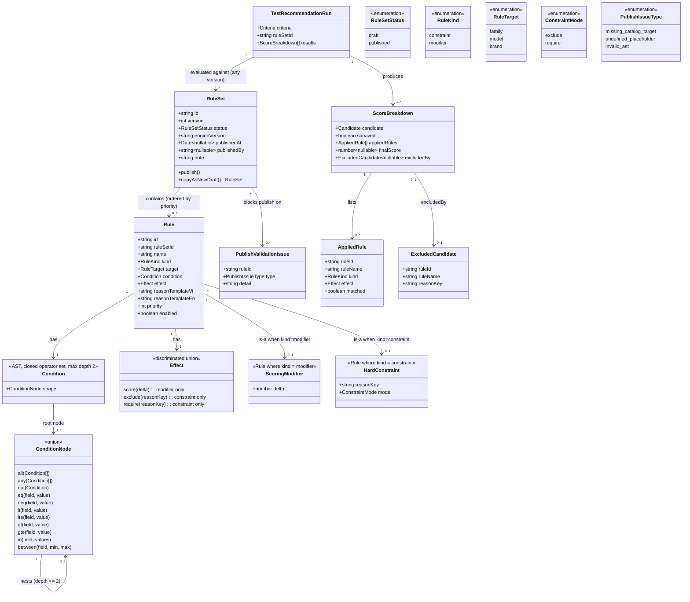

# Recommendation Rules Authoring & Testing

## Requirements

Give managers a structured, code-free way to tune how instruments get
recommended — author scoring rules as either hard constraints (exclude/require)
or soft modifiers (score adjustment) through a builder that produces a
schema-validated, closed-operator condition AST; save edits to a draft rule set
that never touches live consumer recommendations; publish a rule set as a new
immutable version to make it the single active one, with rollback to any prior
version a single publish action; and run arbitrary criteria through a Test
Recommendation tool against any rule set version (draft or published) to see the
full per-rule score breakdown for every candidate, including candidates a
constraint excluded and why — the platform's primary debugging surface for
recommendation behavior, and the mechanism that turns `@windwise/core`'s
interpreter from 005's hardcoded v0 rule array into a manager-editable,
versioned, testable system without changing the interpreter's evaluation
contract itself.

## Entities

## Approach

1. **Deterministic rule evaluation is a guarantee, not a target**: Given
   identical `(criteria, catalog snapshot, ruleSet)` inputs, `recommend()` in
   `@windwise/core` MUST return identical output every time — no randomness, no
   wall-clock dependence, no unstable sort. Ties within the same score are
   broken by a stable, explicit secondary key (e.g., `model.id`), never by
   insertion or Map iteration order. This determinism is what makes Test
   Recommendation trustworthy as a debugging tool (spec assumption) and what
   lets `constraint-veto.golden.test.ts` assert exact output instead of
   approximate behavior.

2. **Constraint-before-modifier as a structural two-pass evaluation, not a
   scoring trick**: The interpreter evaluates every `constraint` rule against a
   candidate first. Any matching `exclude` or unmatched `require` removes the
   candidate from the result set before a single `modifier` rule ever runs
   against it. `modifier` rules only ever execute against candidates that
   survived the constraint pass. This is a hard code-path separation (two
   sequential loops, not two weighted terms in one sum) — a `constraint` can
   never be outscored by a `modifier`, because modifiers never get the chance to
   run against an excluded candidate at all (research.md §2, spec FR-010).

3. **Draft/publish/exactly-one-published-at-a-time as a DB-enforced invariant**:
   `rule_sets.status` is `draft | published`. A partial unique index (e.g., on
   `status` where `status = 'published'`) is the source of truth for "exactly
   one published row at any time" (spec FR-006) — application code must not rely
   solely on a transaction-level check-then-write, since that invariant has to
   hold even under concurrent publishes. Publish is a single transaction: it
   sets the target row to `published` and, in the same transaction, flips any
   other currently `published` row to a non-published status, so the unique
   index is never violated mid-transaction (only `draft`/`published` exist per
   data-model.md — there is no separate "archived" status in this feature's
   schema). Rollback is copy-then-publish (research.md §5): reactivating a
   historical row in place is forbidden, because every `rule_sets.id` must keep
   an immutable identity forever for `recommendation_runs.rule_set_id`
   traceability (spec FR-012, feeds 011).

4. **Condition-AST validator design — schema-shaped, not parsed**:
   `ast-schema.ts` is a recursive Valibot schema over the closed `ConditionNode`
   union (`all`/`any`/`not`/`eq`/`neq`/`lt`/`lte`/`gt`/`gte`/`in`/`between`).
   Depth limiting is expressed in the schema itself (an `all`/`any`/`not` node's
   children may only be leaf conditions or exactly one further level of
   `all`/`any`/`not`, never deeper) so "reject depth > 2" is a property of the
   schema shape, not a separate post-parse depth-counter that could drift out of
   sync. No `eval`, `new Function`, or stored expression string anywhere in this
   feature (platform TR-7, non-negotiable). This same AST shape is intentionally
   generic enough (field/operator/value triples, no rule-domain concepts baked
   in) that 010's `visible_when` validator can reuse `ConditionNode` and
   `ast-schema.ts` directly rather than re-deriving an equivalent shape — do not
   add rule-specific fields (e.g., `ruleId`) onto `ConditionNode` itself; keep
   rule-specific data (`kind`, `effect`, `reasonTemplate*`) on `Rule`, one layer
   above the AST.

5. **Effect/kind pairing enforced structurally, not conventionally**: The
   Valibot schema for `Rule` rejects a `constraint`-kind rule paired with a
   `score` effect, and a `modifier`-kind rule paired with `exclude`/`require`.
   There is no default `kind` — the builder UI requires an explicit choice
   before a rule can be saved at all (spec FR-002, User Story 3 scenario 3).

6. **Test Recommendation reuses the live evaluation path, not a parallel
   implementation**: `runTestRecommendation` calls the exact same
   `interpreter.ts` functions `recommend()` uses internally (constraint pass,
   then modifier pass) — the only difference is (a) which `ruleSetId` is
   supplied (any version, not just the cached published one) and (b) the
   response shape wraps the interpreter's internal per-candidate detail into
   `ScoreBreakdown[]` instead of collapsing it into the consumer `publicView`.
   This guarantees Test Recommendation output can never diverge from what a live
   consultation (005) would actually do with the same rule set — the entire
   point of it being a trustworthy debugging tool (spec User Story 2). Two
   distinct response _types_ (internal `ScoreBreakdown` vs. consumer
   `RecommendationResult`) keep "excluded candidates never reach consumers" a
   type-level guarantee, not a runtime filter that a future call site could
   forget (research.md §4).

7. **Publish-time validation as a hard gate, named per rule**: Before a
   `draft → published` transition commits, validate (a) every catalog reference
   embedded in each rule's `condition`/`target` still resolves against the
   current catalog, (b) every `{field}` placeholder in
   `reason_template_vi`/`_en` corresponds to a field actually referenced in that
   rule's `condition`, and (c) every rule's `condition` re-passes
   `ast-schema.ts`. Any failure blocks the publish transaction outright and
   returns which rule(s) and which specific `PublishIssueType` caused it — never
   a generic failure, never a soft warning a manager can dismiss (spec FR-011,
   Edge Cases).

8. **Published-rule-set cache, invalidated only on publish**: An in-memory cache
   in `@windwise/db` (or a module `@windwise/core` is handed at request time —
   never fetched by `@windwise/core` itself, preserving its DB-purity boundary)
   holds the currently published rule set. It is populated once at server start
   and refreshed exactly once per successful publish — never on a timer, never
   per-request. `recommend()`'s signature stays
   `recommend(criteria, catalog, ruleSet)` unchanged from 005; only how
   `ruleSet` is sourced (hardcoded array → cached DB read) changes.

## Structure

### Type Relationships

1. `RuleSet` 1—0..* `Rule`, ordered by `priority` within the same `kind`.
2. `Rule.condition: Condition` is the closed-operator AST; `Rule.effect: Effect`
   is a discriminated union whose variant must match `Rule.kind`.
3. `TestRecommendationRun` references a `RuleSet` by `ruleSetId` (any version)
   and produces `ScoreBreakdown[]`, one entry per catalog candidate considered,
   never persisted.
4. `ScoreBreakdown.excludedBy: ExcludedCandidate | null` is populated only when
   `survived = false`; `finalScore` is `null` in that case.
5. Publish-time validation produces `PublishValidationIssue[]`; a non-empty
   array blocks the `draft → published` transition and is returned to the
   caller, never silently discarded.

### Dependencies

1. **Builds on 008 (catalog management)**: rules target `family | model | brand`
   catalog entities that 008 owns and populates; this feature reads catalog data
   for the builder's target picker and for publish-time reference validation,
   but never writes catalog content.
2. **Builds on 008's role/audit infrastructure** (per quickstart.md
   prerequisites) for Editor/Reviewer/Viewer permission checks on
   save/publish/test actions.
3. **Feeds 005 (guided instrument consultation)**: `@windwise/core`'s
   `recommend()` — already built by 005 against a hardcoded v0 rule set — now
   sources its `ruleSet` argument from this feature's published-rule-set cache
   instead. 005's consumer-facing flow and response shapes are unchanged; only
   what powers them changes.
4. **Feeds 006 (instrument compare/upgrade)**: consumes the same published rule
   set via the same cached `recommend()` path — no separate integration point.
5. **Feeds 011 (consultation observability & evaluation)**: every live
   recommendation's `rule_set_id` pin (spec FR-012) is the join key 011 depends
   on to reconstruct why a recommendation happened; this feature's
   copy-then-publish rollback design (research.md §5) is what keeps that pin
   unambiguous over time.
6. **Shares AST shape with 010 (consultation flow configuration)**: 010's
   `visible_when` question-branching validator is expected to reuse
   `ConditionNode`/`ast-schema.ts` from this feature's
   `packages/core/src/rules/` rather than re-deriving an equivalent AST — keep
   the AST generic (no rule-only concepts leaked into `ConditionNode` itself,
   per Approach #4).
7. No new workspace package: rule evaluation logic extends `@windwise/core`
   (where `recommend()` and the 005 v0 interpreter already live) and storage
   extends `@windwise/db`; the authoring UI extends `apps/manager-dashboard`
   (already stood up by 008, using `@windwise/ui`).

### Layered Architecture

1. **Rule builder UI layer** (`apps/manager-dashboard/src/routes/rules/*`,
   `test-recommendation.tsx`): structured condition-AST editor, rule
   list/priority ordering, draft/publish/rollback controls, Test Recommendation
   criteria form and score-breakdown display. Composes `@windwise/ui` primitives
   only (no restyled forks); calls TanStack Start server functions, never
   touches `@windwise/db` directly.
2. **Condition-AST validation layer** (`packages/core/src/rules/ast-schema.ts`):
   pure Valibot schema, no DB, no I/O — validates on save and re-validates at
   publish time. Shared with 010.
3. **Rule evaluation engine layer** (`packages/core/src/rules/interpreter.ts`,
   `score-breakdown.ts`): pure functions — constraint pass, then modifier pass,
   then `ScoreBreakdown` assembly. No DB import (TR-1 purity); receives
   `catalog` and `ruleSet` as plain arguments from callers.
4. **Publish/lifecycle layer** (`packages/db/src/queries/rule-set-write.ts`,
   `published-rule-set-cache.ts`): draft creation/edit, publish-time
   cross-reference validation, the draft→published DB transition, cache
   invalidation on publish, copy-then-publish rollback.
5. **DB layer** (`packages/db/src/schema/rule-sets.ts`, `rules.ts`): Drizzle
   table definitions, the partial unique index enforcing exactly-one-published,
   foreign key from `rules.rule_set_id` to `rule_sets.id`.

Data flows strictly downward for authoring (UI → server function → lifecycle
layer → DB) and is handed explicitly (not fetched) into the evaluation engine
layer (lifecycle/cache layer → `recommend()`/`runTestRecommendation` as
arguments) to preserve `@windwise/core`'s DB-purity boundary.

## Operations

### Create Schema - `packages/db/src/schema/rule-sets.ts`

1. Responsibility: Drizzle table definition for `rule_sets` (data-model.md
   RuleSet), the versioned lifecycle unit.
2. Columns: `id: uuid` (pk, default random), `version: integer` (not null),
   `status: pgEnum('rule_set_status', ['draft', 'published'])` (not null,
   default `'draft'`), `engine_version: text` (not null),
   `published_at: timestamp` (nullable), `published_by: uuid` (nullable, fk to
   the 008 users/staff table), `note: text` (nullable),
   `created_at`/`updated_at: timestamp` (not null, default now).
3. Constraint: a partial unique index
   `CREATE UNIQUE INDEX ... ON rule_sets (status) WHERE status = 'published'`
   (Drizzle `uniqueIndex(...).where(eq(ruleSets.status, 'published'))`) — the
   DB-level enforcement of spec FR-006, so exactly-one-published holds even
   under concurrent writes, not just application-level check-then-write.
4. Constraints: no soft delete; rows are immutable once created except for the
   `status`/`published_at`/`published_by` transition performed by the publish
   query (Operations item below) — never edit `rules` under a `published`
   `rule_set_id` (editing always targets a `draft`).

### Create Schema - `packages/db/src/schema/rules.ts`

1. Responsibility: Drizzle table definition for `rules` (data-model.md Rule).
2. Columns: `id: uuid` (pk), `rule_set_id: uuid` (not null, fk → `rule_sets.id`,
   `onDelete: 'cascade'`), `name: text` (not null),
   `kind: pgEnum('rule_kind', ['constraint', 'modifier'])` (not null, **no
   default**), `target: pgEnum('rule_target', ['family', 'model', 'brand'])`
   (not null), `condition: jsonb` (not null), `effect: jsonb` (not null),
   `reason_template_vi: text`, `reason_template_en: text`, `priority: integer`
   (not null, default 0), `enabled: boolean` (not null, default true).
3. Constraints: `condition`/`effect` are stored as validated JSON (never a code
   string); no DB-level CHECK can express the AST shape or the kind/effect
   pairing — that validation lives entirely in `ast-schema.ts` at the
   application layer (Operations item below), invoked on every write.

### Create Type/Schema - `packages/core/src/rules/ast-schema.ts`

1. Responsibility: The single source of truth for the condition AST shape and
   its validation (spec FR-003, platform TR-7). Shared with 010.
2. Exports:
   - `type ConditionNode` — the discriminated union from data-model.md
     (`all`/`any`/`not`/`eq`/`neq`/`lt`/`lte`/`gt`/`gte`/`in`/`between`).
   - `conditionSchema: v.GenericSchema<ConditionNode>` — recursive Valibot
     schema. Logic: leaf operators (`eq`/`neq`/`lt`/`lte`/`gt`/`gte`/`in`/
     `between`) validate `[field: string, value/values: unknown]` tuples
     directly. Composite operators (`all`/`any`) accept an array whose elements
     are validated by a **depth-1 schema** that only allows leaf nodes or a
     single further `all`/`any`/`not` wrapping leaves — never a third
     `all`/`any`/`not` inside that. `not` wraps exactly one node under the same
     depth-1 rule. This nesting is expressed via two distinct schema constants
     (`leafOrOnceNested`, `topLevel`), not a shared self-referential recursion,
     so "max depth 2" cannot silently become unbounded through a future edit.
   - `parseCondition(input: unknown): ConditionNode` — throws a typed
     `ConditionValidationError` with the specific violated rule (unknown
     operator, wrong tuple arity, nesting too deep) on failure; callers (rule
     save, publish validation) catch this and surface
     `{ error: 'INVALID_AST', issue }`.
   - `type Effect` and `effectSchema` — discriminated union
     (`score`/`exclude`/`require`) per data-model.md.
   - `assertEffectMatchesKind(kind: RuleKind, effect: Effect): void` — throws if
     `kind === 'constraint'` and `effect.type === 'score'`, or
     `kind === 'modifier'` and `effect.type !== 'score'`.
3. Constraints: pure module — no `eval`, no `new Function`, no dynamic
   `Function` construction anywhere in this file or anything it imports; no DB
   or network I/O. Keep `ConditionNode` free of any rule-only field (`ruleId`,
   `priority`) so 010 can import `conditionSchema`/`ConditionNode` unmodified.

### Create Test - `packages/core/src/rules/ast-schema.test.ts`

1. Responsibility: Prove the AST validator is the actual enforcement point for
   TR-7 and FR-003, not just documentation.
2. Cases: accepts each leaf operator individually; accepts one level of
   `all`/`any` nesting containing leaves; accepts exactly two levels (`all`
   containing `any` containing leaves); **rejects** three levels of nesting;
   rejects an unknown operator key (e.g., `{ script: '...' }`); rejects
   malformed tuple arity (e.g., `between` with only `[field, min]`);
   `assertEffectMatchesKind` rejects `constraint` + `score` and `modifier` +
   `exclude`, accepts `constraint` + `exclude`/`require` and `modifier` +
   `score`.
3. Constraints: `vite-plus/test`, no DB, no React.

### Create Type - `packages/core/src/rules/interpreter.ts`

1. Responsibility: Promote 005's hardcoded v0 evaluation logic into the shared,
   DB-agnostic engine both live consultations and Test Recommendation call
   (Approach #2, #6).
2. Exports:
   - `type Candidate` —
     `{ familyId: string; modelId: string; [field: string]: unknown }` (catalog
     row plus any fields conditions may reference).
   - `evaluateConstraints(candidate: Candidate, rules: Rule[]): { survived: boolean; appliedRules: AppliedRule[]; excludedBy: ExcludedCandidate | null }`
     — logic: filter `rules` to `kind === 'constraint' && enabled`, sorted by
     `priority`; for each, evaluate `condition` against `candidate` via a shared
     `matchCondition(condition, candidate): boolean` helper; on the first match
     where `effect.type === 'exclude'`, or the first `require` rule whose
     condition does _not_ match, stop and return `survived: false` with
     `excludedBy` populated from that rule; if every constraint rule is checked
     without exclusion, return `survived: true` with `appliedRules` listing
     every constraint rule and whether it matched.
   - `evaluateModifiers(candidate: Candidate, rules: Rule[]): { finalScore: number; appliedRules: AppliedRule[] }`
     — only called for candidates with `survived: true`; sums `effect.delta` for
     every `modifier`-kind, `enabled` rule whose `condition` matches, starting
     from a baseline score (the same baseline 005 already defines); records
     every matched rule in `appliedRules`.
   - `matchCondition(condition: ConditionNode, candidate: Candidate): boolean` —
     pure recursive evaluator over the closed operator set; `in`/`between` read
     `candidate[field]`; unknown/undefined `candidate[field]` evaluates to
     `false` for comparison operators (never throws) so a candidate missing an
     optional field is simply not matched, not an error.
   - `recommend(criteria: Criteria, catalog: Candidate[], ruleSet: { rules: Rule[] }): RecommendationResult`
     — unchanged signature from 005; internally calls `evaluateConstraints` then
     `evaluateModifiers` per candidate, then ranks survivors by `finalScore`
     desc with a stable secondary sort key (Approach #1), and maps to 005's
     existing consumer-facing `RecommendationResult` shape (no
     `excludedBy`/internal detail leaks through this function's return type).
3. Constraints: no DB import; no randomness; no `Date.now()`/wall-clock
   dependence in scoring; must remain byte-for-byte behavior-compatible with
   005's v0 hardcoded interpreter for the same effective rule set (this is a
   promotion, not a rewrite — do not change constraint/modifier ordering
   semantics).

### Create Type - `packages/core/src/rules/score-breakdown.ts`

1. Responsibility: Build the internal, debug-only `ScoreBreakdown[]` shape for
   Test Recommendation (spec FR-008/FR-009), reusing `interpreter.ts` rather
   than re-implementing evaluation (Approach #6).
2. Exports:
   - `type ScoreBreakdown` — per data-model.md (`candidate`, `survived`,
     `appliedRules`, `finalScore`, `excludedBy`).
   - `buildScoreBreakdown(criteria: Criteria, catalog: Candidate[], ruleSet: { id: string; rules: Rule[] }): ScoreBreakdown[]`
     — logic: for every candidate in `catalog`, call `evaluateConstraints`; if
     `survived`, also call `evaluateModifiers` and set `finalScore`; if not,
     `finalScore = null` and `excludedBy` is carried through. Returns one entry
     per candidate, **including excluded ones** — this is the one place in the
     codebase where excluded candidates appear at all.
3. Constraints: this module's output type (`ScoreBreakdown`) must never be
   imported by any consumer-facing (005/006) response mapping — enforce via
   module boundary/import convention, not a runtime role check (Approach #6).

### Create Test - `packages/core/src/__tests__/constraint-veto.golden.test.ts`

1. Responsibility: Lock in the platform's single most safety-critical
   correctness invariant — a `constraint` always outranks a `modifier` (spec
   FR-010, SC-002, plan.md's "the -50 vs +80 bug").
2. Cases: a candidate with one `constraint`/`exclude` rule matching and one
   `modifier`/`score` rule with `delta: +80` matching the same candidate —
   assert `recommend()` never returns that candidate, regardless of modifier
   size, across a small matrix of delta values (0, +1, +80, +10000). A `require`
   constraint that does not match also excludes. A candidate matching no
   constraint and one `+10` modifier is scored normally. `buildScoreBreakdown`
   for the same fixture returns `survived: false` with a populated `excludedBy`
   for the excluded candidate.
3. Constraints: golden/fixture-driven (exact expected output, not "greater than"
   assertions) — this is the invariant SC-002 requires zero tolerance on.

### Create Query - `packages/db/src/queries/rule-set-write.ts`

1. Responsibility: Draft creation/edit, publish transition, publish-time
   validation, copy-then-publish rollback (spec FR-004/005/006/011, research.md
   §5).
2. Exports:
   - `saveDraftRule(ruleSetId: string, input: RuleInput): Promise<Rule>` —
     logic: assert the target `rule_sets.status === 'draft'` (reject edits to a
     `published` row); call `ast-schema.ts`'s
     `parseCondition`/`assertEffect MatchesKind`; on validation failure return
     `{ error: 'INVALID_AST', issue }` without persisting; on success, upsert
     the `rules` row.
   - `createDraftRuleSet(fromVersion?: string): Promise<RuleSet>` — logic: if
     `fromVersion` given, copy its `rules` rows into a brand-new `rule_sets` row
     with `status: 'draft'`, `version: <next lineage number>` (used both for
     ordinary new-draft creation and rollback's copy step, research.md §5 —
     history rows are never mutated).
   - `validateForPublish(ruleSetId: string): Promise<PublishValidationIssue[]>`
     — logic: for every `enabled` rule in the set, (a) resolve `target`'s
     referenced catalog id against 008's catalog tables, push
     `missing_catalog_target` if absent; (b) extract `{field}` placeholders from
     `reason_template_vi`/`_en` via regex, diff against fields actually
     referenced inside `condition` (walk the AST collecting `field` values),
     push `undefined_placeholder` for any placeholder not in that set; (c)
     re-run `ast-schema.ts`'s `parseCondition` on the stored `condition`, push
     `invalid_ast` on failure (defense against a row that could have been
     written before a validator change). Returns `[]` when clean.
   - `publishRuleSet(ruleSetId: string, publishedBy: string): Promise<RuleSet | { error: 'VALIDATION_FAILED'; issues: PublishValidationIssue[] }>`
     — logic: call `validateForPublish`; if non-empty, return the error without
     starting a transaction. Otherwise, in a single DB transaction: set any
     currently `published` row to a non-published status, set the target row to
     `status: 'published', published_at: now(), published_by`, and invoke
     `published-rule-set-cache.ts`'s `invalidateCache()` after commit succeeds.
   - `rollbackToVersion(ruleSetId: string, publishedBy: string): Promise<RuleSet | { error: string }>`
     — logic: `createDraftRuleSet(ruleSetId)` then immediately `publishRuleSet`
     the resulting new row — a rollback is literally "copy old rules into a new
     version, publish it," never a status flip on the historical row
     (research.md §5).
3. Constraints: every write here operates inside `packages/db` only —
   `apps/manager-dashboard` server functions call these, never construct SQL
   directly. `publishRuleSet`'s status-swap-and-set MUST be one transaction (not
   two sequential writes) so the partial unique index is never observed violated
   by a concurrent reader.

### Create Cache - `packages/db/src/queries/published-rule-set-cache.ts`

1. Responsibility: In-memory cache of the currently published rule set,
   invalidated only on publish (Approach #8, plan.md Complexity Tracking).
2. Exports:
   - `getPublishedRuleSet(): Promise<{ id: string; rules: Rule[] }>` — returns
     the cached value if present; on cold start (cache empty), fetches the
     `published` row + its `rules` from DB once and populates the cache.
   - `invalidateCache(): void` — clears the in-memory value; called only from
     `publishRuleSet` after a successful commit. No timer, no TTL, no other call
     site.
3. Constraints: module-level singleton state (same pattern as any other
   process-lifetime cache in `@windwise/db`); `@windwise/core`'s `recommend()`
   never imports this module directly — the caller (a manager-dashboard/
   consumer-application server function) fetches via `getPublishedRuleSet()` and
   passes the result into `recommend()` as a plain argument, preserving
   `@windwise/core`'s DB-purity boundary (TR-1).

### Create Server Function - `apps/manager-dashboard/src/server/rules/save-draft-rule.ts`

1. Responsibility: TanStack Start server function wrapping
   `saveDraftRule`/`createDraftRuleSet` for the builder UI, with role
   enforcement.
2. Logic: require Editor-or-above role (reuse 008's role-check pattern); accept
   `RuleInput` validated via a Valibot input schema at the server-function
   boundary (separate from, and in addition to, `ast-schema.ts`'s AST-specific
   validation); call `saveDraftRule`; on `{ error: 'INVALID_AST' }`, return a
   typed error the builder UI maps to inline field errors, not a thrown
   exception surfaced as a generic 500.
3. Constraints: no direct Drizzle import in this file — delegates to
   `packages/db`.

### Create Server Function - `apps/manager-dashboard/src/server/rules/publish-rule-set.ts`

1. Responsibility: Wrap `publishRuleSet`/`rollbackToVersion` with Reviewer-role
   enforcement (publishing is a higher-privilege action than drafting, per
   quickstart.md's Editor/Reviewer distinction).
2. Logic: require Reviewer-or-above role; call `publishRuleSet`; on
   `{ error: 'VALIDATION_FAILED', issues }`, return the issues array intact
   (named rule/issue detail, per spec FR-011 — never collapse to a generic
   message).
3. Constraints: same DB-import restriction as above.

### Create Server Function - `apps/manager-dashboard/src/server/rules/run-test-recommendation.ts`

1. Responsibility: Wrap `buildScoreBreakdown` for the Test Recommendation tool
   (spec FR-007/008/009), any role Viewer-or-above.
2. Logic: accept `{ criteria: Criteria; ruleSetId: string }`; fetch the target
   `rule_sets` row (draft or published — no status restriction, unlike the live
   path) and its `rules`; fetch current catalog snapshot; call
   `buildScoreBreakdown`; return `TestRecommendationRun`
   (`{ criteria, ruleSetId, results: ScoreBreakdown[] }`) as-is, including
   excluded candidates.
   - Also export
     `compareTestRuns(runA: TestRecommendationRun, runB: TestRecommendationRun): { diff: Array<{ candidate: Candidate; before: 'included' | 'excluded'; after: 'included' | 'excluded' }> }`
     for spec User Story 2 scenario 3 / quickstart Scenario 5 — pure comparison
     over two already-computed results, no re-evaluation.
3. Constraints: this is the one server function permitted to return
   `excludedBy`/full `ScoreBreakdown` detail — never reuse this function's
   return type for any consumer-facing (005/006) route.

### Create Route - `apps/manager-dashboard/src/routes/rules/index.tsx`

1. Responsibility: Rule set list — versions, current published indicator,
   publish/rollback actions (spec User Story 1).
2. Logic: list `rule_sets` ordered by `version` desc via a query loader; show
   `status` badge (`@windwise/ui` `Badge`) per row; "Publish" action on a
   `draft` row calls the publish server function, confirmed via `@windwise/ui`
   `Dialog` (irreversible-ish action, per 004's notice-vs-dialog norm);
   "Rollback to this version" action on a non-active `published` row calls
   `rollbackToVersion`, also dialog-confirmed; success/failure surfaces via
   `Toaster`, not a dialog.
3. Constraints: composes `@windwise/ui` primitives only; no restyled forks (004
   norm).

### Create Route - `apps/manager-dashboard/src/routes/rules/builder.tsx`

1. Responsibility: Structured rule builder — condition-AST editor, kind/target/
   effect pickers, reason templates (spec FR-001/002/003).
2. Logic: form fields — `name` (text), `kind` (required select, no default
   value, per FR-002), `target` (select: family/model/brand + a catalog-scoped
   picker for the specific entity), condition editor (a nested
   field/operator/value row UI that serializes to `ConditionNode`, capped at 2
   levels in the UI itself — do not let the UI construct a 3rd level that the
   schema would then reject), `effect` editor (conditionally rendered: `score`
   delta input when `kind === 'modifier'`; `exclude`/`require` + `reasonKey`
   when `kind === 'constraint'`), `reasonTemplateVi`/`En` text inputs with
   inline placeholder hints (list of fields referenced by the current
   `condition`). On submit, calls the save-draft-rule server function;
   `INVALID_AST` errors map to inline `Field`/`FieldError` messages next to the
   offending part of the condition editor, not a toast (per 004's field-error
   pattern).
3. Constraints: never constructs or sends a raw expression string; the condition
   editor's internal state must always be representable as a valid
   `ConditionNode` (or empty) — invalid intermediate UI states are fine, but the
   submitted payload always round-trips through the same
   `conditionSchema`/`effectSchema` used server-side.

### Create Route - `apps/manager-dashboard/src/routes/test-recommendation.tsx`

1. Responsibility: Test Recommendation tool UI — criteria input, rule-set
   version selector (draft or published), ranked results with per-candidate
   score breakdown and excluded-candidate detail (spec FR-007/008/009, User
   Story 2).
2. Logic: criteria form mirrors 005's `Criteria` shape; rule-set selector lists
   all `rule_sets` (draft and published) by version; on submit, calls
   `run-test-recommendation`; renders survivors ranked by `finalScore` with an
   expandable `appliedRules` list per candidate (rule name, kind, effect,
   matched); renders excluded candidates in a visually distinct section
   (`@windwise/ui` `Badge`/`Card`, e.g., muted/struck-through styling) showing
   `excludedBy.ruleName` and reason — explicitly labeled as test-tool-only,
   never implying this view is what consumers see. Optional "compare to another
   version" control calls `compareTestRuns` and highlights `diff` entries.
3. Constraints: this route is the only UI surface in the app permitted to
   display excluded candidates; do not reuse its result-rendering component
   inside any consumer-facing (future 005 dashboard-side) view without stripping
   `excludedBy`/`appliedRules` first.

### Create Test - `packages/db/src/queries/rule-set-write.test.ts`

1. Responsibility: Prove the lifecycle invariants at the query layer (spec
   FR-004/005/006/011), against a test DB per this repo's existing DB-test
   pattern.
2. Cases: `saveDraftRule` against a `published` rule set is rejected; draft
   edits do not affect `getPublishedRuleSet()`'s cached value (FR-004);
   `publishRuleSet` with a rule targeting a deleted catalog model returns
   `VALIDATION_FAILED` naming that rule (FR-011); `publishRuleSet` with a
   `{unknownField}` placeholder in a reason template returns
   `VALIDATION_FAILED`; after a successful publish, exactly one row has
   `status = 'published'` (query the table directly, don't just trust the
   function's return value); `rollbackToVersion` creates a new row (different
   `id`) rather than mutating the historical one, and the historical row's
   `status`/`published_at` are unchanged after rollback.
3. Constraints: `vite-plus/test`, isolates/rolls back its own DB transaction per
   test (same convention as any existing `@windwise/db` test in the repo).

### Create Test - `apps/manager-dashboard/src/routes/rules/builder.test.tsx`

1. Responsibility: Prove the builder cannot submit an ambiguous or invalid rule
   (spec FR-001/002/003, User Story 3 scenario 3).
2. Cases: submit is disabled/blocked until `kind` is explicitly chosen (no
   default selection pre-fills it); selecting `constraint` hides the `score`
   delta field and shows `exclude`/`require`; selecting `modifier` hides
   `exclude`/`require` and shows `delta`; a condition editor state exceeding 2
   levels cannot be constructed via the provided "add nested group" control past
   the second level (button disabled/hidden at max depth).
3. Constraints: `happy-dom` + `@testing-library/react`, `vite-plus/test`, no
   real server calls (mock the save server function).

## Norms

1. **Imports**: apps and `@windwise/core`/`@windwise/db` follow this repo's
   existing import grouping (external → `@windwise/*` workspace packages →
   relative). `@windwise/ui` internals use `#/` aliases only within
   `packages/ui`; consuming apps import via `@windwise/ui/components/*`,
   `@windwise/ui/lib/*`. New `packages/core` internal modules may adopt the same
   `#/*` import-map pattern as `packages/ui` if one is introduced for that
   package — do not invent a different alias convention.
2. **Tests**: `vite-plus/test` exclusively
   (`import { describe, expect, it } from 'vite-plus/test'`), matching
   `packages/query/src/create-query-client.test.ts` and
   `packages/ui/src/tests/*`. Golden-file tests assert exact output, not loose
   bounds. Component tests needing DOM use
   `/** @vitest-environment happy-dom */` with `@testing-library/react`, as
   `@windwise/ui`-style devDependencies only in the package that needs them.
3. **Package boundaries**: `@windwise/core` MUST NOT import `@windwise/db` (TR-1
   purity — no DB import inside the interpreter/AST-validator layer);
   `@windwise/db` MUST NOT import React or any app; `apps/manager-dashboard`
   MUST NOT import Drizzle or raw SQL directly — always through
   `packages/db/src/queries/*`. `packages/ui` MUST NOT gain rule-authoring or
   recommendation-domain components (AGENTS.md §9) — the condition-AST editor,
   rule cards, and score-breakdown views live in `apps/manager-dashboard`, not
   `@windwise/ui`.
4. **Changesets**: add `.changeset/*.md` for any change to `@windwise/core` or
   `@windwise/db` public exports/behavior (new `recommend()` rule source is a
   `minor` at minimum, given `0.y.z` baseline — see AGENTS.md Changesets
   section) and for `apps/manager-dashboard` when new user-facing
   routes/behavior ship. Skip changesets for test-only or spec/doc changes.
   Highest-impact record wins if multiple pending changesets touch the same
   package. No `Co-authored-by` trailers anywhere (AGENTS.md §7).
5. **Error handling**: server functions return typed error result objects
   (`{ error: 'INVALID_AST', issue }`, `{ error: 'VALIDATION_FAILED', issues }`)
   for expected/validatable failure modes — never throw for these; reserve
   thrown exceptions for genuinely unexpected failures (DB connection loss,
   etc.), which TanStack Start's own error boundary handles. Do not encode
   validation failures as HTTP-status-only signals with no structured body.
6. **No stored code / no `eval`**: platform TR-7 is absolute across every file
   touched by this feature — no `eval`, `new Function`, `Function(...)`
   constructor, or persisted expression string, in application code or tests.
7. **Determinism**: no `Math.random()`, no `Date.now()`-based tie-breaking, no
   reliance on object/Map iteration order anywhere in `interpreter.ts`,
   `score-breakdown.ts`, or `ast-schema.ts`.

## Safeguards

1. **Functional — no catalog authoring here**: This feature does not create,
   edit, or delete `family`/`model`/`brand` catalog rows — that is 008's scope
   entirely. The builder's target picker only _reads_ catalog data.
2. **Functional — no consumer-app changes**: `apps/consumer-application` is not
   touched by this feature; 005 already owns the consumer-facing consultation UI
   and its response shapes are unchanged.
3. **Functional — no new package**: Do not create `packages/rules` or similar;
   rule evaluation logic extends `@windwise/core`, storage extends
   `@windwise/db`, per plan.md's explicit "no new package" structure decision.
4. **Performance**: `recommend()` (via the cached published rule set) must stay
   within 005's inherited <50ms p95 budget — this cache design (Approach #8) is
   what makes that achievable once rules are DB-backed; do not replace the cache
   with a per-request DB fetch, and do not add a TTL-based refresh that would
   reintroduce a staleness window.
5. **Security**: rule authoring must never provide a path to arbitrary code
   execution — enforced structurally via `ast-schema.ts`, never via input
   sanitization of a string expression. Publish and rollback require
   Reviewer-role or above; drafting requires Editor-role or above (008's role
   model) — do not allow an unauthenticated or Viewer-role call to reach
   `publishRuleSet`.
6. **Integration**: `@windwise/core` MUST NOT import `@windwise/db` (purity,
   TR-1); this feature depends on 008's catalog tables and role/audit
   infrastructure existing — if 008 is not yet merged, publish-time catalog
   validation and role checks are blocked, surface that as a stated dependency,
   not a workaround (e.g., do not stub catalog validation as always-pass).
7. **Business rules**: exactly one `rule_sets` row has `status = 'published'` at
   any time (DB-enforced partial unique index, not just app logic); a candidate
   matching an active `exclude`/unmatched-`require` constraint is removed from
   consumer results regardless of any modifier score (zero tolerance, SC-002 —
   verified by the golden test, not spot-checked); every `Rule.kind` is explicit
   with no default; excluded candidates are visible only through
   `run-test-recommendation`'s response type, never through any consumer-facing
   route.
8. **Technical constraints**: no `eval`/`new Function`/stored expression string
   anywhere (TR-7); `recommend()`'s external signature
   `(criteria, catalog, ruleSet)` stays unchanged from 005 — only how `ruleSet`
   is sourced changes; rollback never mutates a historical `rule_sets` row in
   place (research.md §5).
9. **Data constraints**: `condition`/`effect` are stored as `jsonb`, validated
   by `ast-schema.ts` on every write (save and publish); max AST nesting depth
   is 2, enforced by schema shape; `rules.rule_set_id` cascades on delete of its
   parent `rule_sets` row, but in practice `rule_sets` rows are never deleted by
   this feature (only created) — do not add a delete path.
10. **API constraints**: `run-test-recommendation`'s response type
    (`TestRecommendationRun`/`ScoreBreakdown`) is a distinct type from any
    005/006 consumer-facing recommendation response — never merge them into one
    shape with a role-conditional field, per Approach #6/research.md §4.
11. **Verification gate**: `vp -C packages/core test`, `vp -C packages/db test`,
    and `vp -C apps/manager-dashboard test` must pass, then `vp run ready` as
    the workspace gate, before this feature is considered done — the golden
    constraint-veto test and the exactly-one-published-row test are the two
    non-negotiable checks that must be green (SC-002, FR-006).
