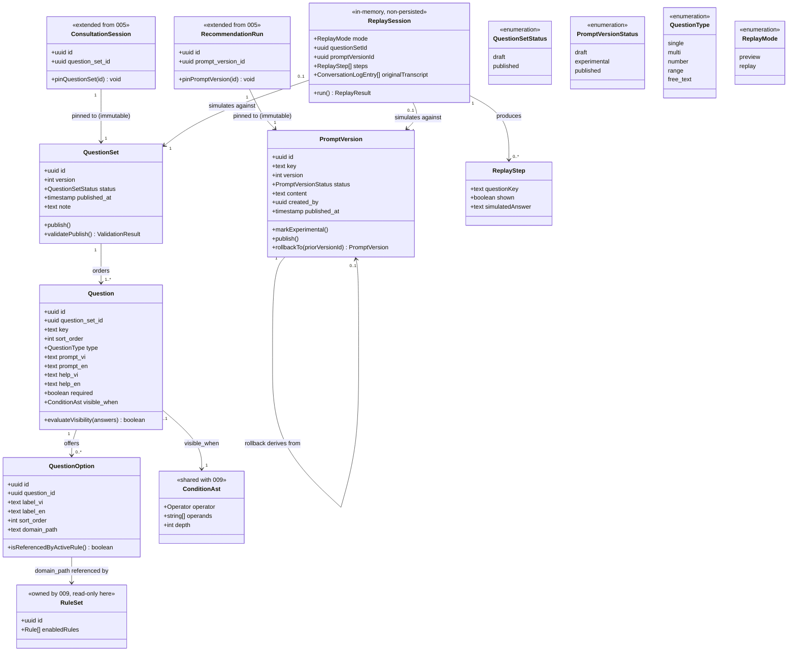

# Consultation Flow & Prompt Version Configuration

## Requirements

Let a manager add, remove, reorder, and conditionally show consultation
questions — each option mapped to a structured domain value — and separately
author, test, publish, and roll back AI system-prompt versions through
`apps/manager-dashboard`, so that both the visitor question flow and the
conversational assistant's behavior can change without an engineering code
change or deploy, while every in-flight consultation session and recommendation
run stays pinned to the exact question-set and prompt version it started with,
every publish of a question set is blocked if any `visible_when` condition
points at a question that no longer exists, and a manager can preview a draft
flow or replay a past consultation against an experimental prompt version
without creating or altering any consumer-facing record.

## Entities

Reuse note: `ConditionAst` is not a new schema — it is 009's `ast-schema.ts`
shape (closed operator set, depth-limited), reused verbatim as the type of
`Question.visible_when`. This feature does not define a second condition DSL.

## Approach

1. **Mirror 009's draft → publish → rollback skeleton onto two new entities.**
   `QuestionSet` and `PromptVersion` each get their own `status` enum, their own
   "exactly one active row" invariant, and their own publish action, built as
   the same table/query/UI shape 009 established for `rule_sets` — not a new
   authoring paradigm. `QuestionSet` has two states (`draft`/`published`);
   `PromptVersion` has three (`draft`/`experimental`/`published`), so its state
   machine is a strict superset, not a divergent design.

2. **Pin at creation, never touch again.**
   `consultation_sessions.question_set_id` is written once, at session-creation
   time, from whichever `QuestionSet` row currently has `status = 'published'`;
   `recommendation_runs.prompt_version_id` is written once, at run-creation
   time, the same way. Neither column is ever updated by a later publish. This
   is the single correctness invariant the whole feature exists to protect
   (FR-004, FR-006, SC-002) — every other design decision below is subordinate
   to not breaking it.

3. **Rollback is a forward publish, never an in-place revert.** Rolling back a
   `PromptVersion` does not mutate the currently published row or resurrect an
   old row's `published` flag in place. It creates (or reactivates via a fresh
   `publish()` call) a new row whose `content` is copied from the target prior
   version, demotes the current published row the same way any other publish
   does, and leaves every historical row untouched. "Roll back a rollback" is
   therefore not a special case — it is just another `publish()` call over
   history, so no separate rollback-of-rollback code path is needed.

4. **Publish-time validation reuses 009's AST validator, does not fork it.**
   Before a `QuestionSet` transitions `draft → published`: (a) every
   `visible_when` condition must reference a `key` that exists as another
   `Question` in the same set, and (b) every `visible_when` must pass the shared
   `ast-schema.ts` validator (same operator/depth constraints 009 already
   enforces on `rules.condition`). Both checks run server-side inside the same
   publish server function; publish is rejected atomically if either fails — no
   partial publish.

5. **Domain-value-in-use is a warning, not a block.** Removing a
   `QuestionOption` checks whether its `domain_path` is referenced by any
   `enabled` rule in the currently published `RuleSet` (009). If so, the
   dashboard surfaces an explicit confirmation step naming the referencing
   rule(s); the manager can still proceed. This is intentionally weaker than
   publish-time validation (which blocks) because the spec frames it as
   advisory, and a hard block would force an awkward "unlink the rule, then
   remove the option" two-step even when both are being retired together.

6. **Read-side caching mirrors 009's pattern but at a lighter weight.** The
   currently-published `QuestionSet` and each `PromptVersion.key`'s
   currently-published row are cached in-process, invalidated synchronously on
   every successful publish or rollback (same invalidation trigger as 009).
   Unlike 009 this is not a per-recommendation-computation hot path — it is read
   once per consultation-session start and once per chat turn — so no background
   refresh, TTL tuning, or multi-tier cache is introduced; a single `Map` keyed
   by `key`/singleton, invalidated on write, is sufficient and must not be
   over-engineered into 009's heavier machinery.

7. **Preview and replay share one non-persisting execution path.** Both are the
   same `ReplaySession` concept — walk `Question`s in `sort_order`, evaluate
   each `visible_when` against the accumulating answer set, optionally invoke
   the existing chat/tool infrastructure from 005 with a candidate
   `PromptVersion.content` — differing only in where the answers come from (a
   live manager walkthrough for `preview`, or a stored `ConversationLogEntry[]`
   /`consultation_answers` row for `replay`). Neither mode writes to
   `consultation_sessions`, `recommendation_runs`, or any table read by
   consumer-facing analytics; both return an in-memory result only.

8. **Concurrency conflict signal, not silent overwrite.** Each `QuestionSet` and
   `PromptVersion` draft carries an `updated_at`/version guard checked by the
   save server function (optimistic concurrency): a save whose client-known
   `updated_at` no longer matches the row's current `updated_at` is rejected
   with a conflict error surfaced in the dashboard UI, rather than silently
   overwritten. This is the minimal mechanism that satisfies the edge case
   without introducing a lock or merge UI, both of which are out of scope.

## Structure

### Type Relationships

- `Question.visible_when: ConditionAst` is a structural reuse, not an import
  dependency inversion: it is the identical schema shape 009 defines for
  `Rule.condition`, so the Valibot schema module itself should be shared (see
  Dependencies) rather than redefined per-feature.
- `QuestionOption.domain_path: string` must stay a value drawn from the same
  `Criteria` field vocabulary 005's schemas define and 009's rule conditions
  consume — this feature does not define a second vocabulary or a validation
  enum independent of that shared source.
- `ConsultationSession.question_set_id` and
  `RecommendationRun.prompt_version_id` are foreign keys this feature populates
  meaningfully for the first time; their columns are already named in 005's
  data-model (platform TR-6) and must not be renamed or re-typed here.

### Dependencies

1. **Depends on 005's data-model**
   (`docs/specs/005-guided-instrument-consultation/data-model.md`): this feature
   promotes 005's single-row, hardcoded `QuestionSet`/`Question` shape into the
   versioned tables above, and populates the already-named-but-unpopulated
   `consultation_sessions.question_set_id` and
   `recommendation_runs.prompt_version_id` pin columns. 005 must land its base
   schema first (or land alongside this feature in the same `@windwise/db`
   package) — this feature does not introduce those columns itself.
2. **Depends on 009's condition-AST validator and rule-set precedent**
   (`docs/specs/009-recommendation-rules-authoring/`): `ast-schema.ts` (shared
   Valibot schema + validator) is imported by this feature's publish-time
   validation, not reimplemented. 009's `rule_sets` draft/publish table pattern
   is the structural template for `question_sets` and `prompt_versions`.
3. **Depends on 008's role-guard / `can-transition.ts` pattern**
   (`docs/specs/008-catalog-management-workflow/`): question-flow and
   prompt-version authoring routes reuse 008's manager-role guard shape for
   gating who may edit/publish, rather than introducing a second permission
   check.
4. **`@windwise/db` is extended, not forked**: `question-sets.ts`,
   `questions.ts`, `question-options.ts`, `prompt-versions.ts` live alongside
   005/008/009's tables in the same package; no new `packages/*` is created (per
   AGENTS.md §14, only create packages an approved plan requires).
5. **`apps/manager-dashboard` is extended**: new routes under
   `src/routes/question-flow/` and `src/routes/prompts/` sit next to 008/009's
   existing authoring routes and reuse their list/diff/publish UI affordances
   from `@windwise/ui`.
6. **`apps/consumer-application` changes what it reads, not how it reads it**:
   the existing consultation flow and chat integration under
   `src/integrations`/`src/routes` swap from 005's hardcoded seed row to the
   cached currently-published `QuestionSet`/`PromptVersion` read path; no new
   consumer-facing route is introduced by this feature.
7. **No dependency on 011**
   (`docs/specs/011-consultation-observability-evaluation/`): this feature's
   `replay` (FR-011) is a single ad hoc simulation; batch evaluation-suite
   replay is 011's concern and out of scope here.

### Layered Architecture

1. **Dashboard authoring layer**
   (`apps/manager-dashboard/src/routes/question-flow/`, `.../prompts/`):
   question/option/visible_when editors, prompt version list and playground,
   preview and replay trigger UI. Composes `@windwise/ui` primitives and 009's
   AST condition-editor component; holds only unsaved-draft editor state
   (Zustand, matching 008/009's pattern) — never the source of truth for
   published state.
2. **Publish-validation layer**
   (`packages/db/src/queries/question-set-write.ts`, `prompt-version-write.ts`):
   server functions that run 009's `ast-schema.ts` validator, the `visible_when`
   referential-integrity check, the domain-value- in-use warning check, and
   008's role guard, before committing any `draft → published` transition. This
   is the only layer allowed to flip a `status` column.
3. **Consumer-facing read/cache layer** (`packages/db/src/queries/` read-side +
   in-process cache, consumed by `apps/consumer-application`): resolves "the
   currently published `QuestionSet`" and "the currently published
   `PromptVersion` for key X" from cache, invalidated synchronously on every
   publish/rollback in layer 2; pins the resolved id onto
   `consultation_sessions`/`recommendation_runs` at creation and never rereads
   it afterward.
4. **Replay/preview simulation layer**
   (`packages/db/src/queries/replay-consultation.ts`): sits beside, not inside,
   layer 3 — reads the same published or explicitly selected draft/experimental
   rows, evaluates `visible_when` and (for replay) invokes 005's existing
   chat/tool call, but never writes through layer 3's write paths.

## Operations

### 1. Create Schema - `packages/db/src/schema/question-sets.ts`

1. Responsibility: Define the `question_sets` table promoting 005's minimal
   single-row shape into the versioned entity (FR-004, data-model.md
   `QuestionSet`).
2. Shape: `id: uuid` PK, `version: integer`,
   `status: pgEnum('draft', 'published')`, `published_at: timestamp | null`,
   `note: text | null`. Add a partial unique index (or app-level guard, see
   Operation 8) ensuring at most one `status = 'published'` row exists at a
   time.
3. Constraints: no soft-delete column — question sets are never deleted, only
   superseded by a new version; do not add a `is_active` boolean duplicating
   `status`.

### 2. Create Schema - `packages/db/src/schema/questions.ts`

1. Responsibility: Define `questions`, including the `visible_when` AST column
   (FR-002, FR-008).
2. Shape: `id: uuid` PK, `question_set_id: uuid` FK → `question_sets.id`,
   `key: text`, `sort_order: integer`,
   `type: pgEnum('single', 'multi', 'number', 'range', 'free_text')`,
   `prompt_vi/prompt_en/help_vi/help_en: text`, `required: boolean`,
   `visible_when: jsonb | null` typed as 009's `ConditionAst` at the application
   layer (import the shared Valibot schema, do not redefine it in this file).
3. Constraints: `(question_set_id, key)` unique — `visible_when` referencing a
   question is by `key`, not `id`, so keys must be unique within a set.

### 3. Create Schema - `packages/db/src/schema/question-options.ts`

1. Responsibility: Define `question_options` carrying the domain-value mapping
   (FR-003, FR-009).
2. Shape: `id: uuid` PK, `question_id: uuid` FK → `questions.id`,
   `label_vi/label_en: text`, `sort_order: integer`, `domain_path: text`.
3. Constraints: `domain_path` is free text validated at the application layer
   against 005's `Criteria` field vocabulary (import from `@windwise/schemas`
   once it exists), not re-enumerated as a DB-level enum — the vocabulary can
   grow without a migration.

### 4. Create Schema - `packages/db/src/schema/prompt-versions.ts`

1. Responsibility: Define `prompt_versions` (new table; FR-005, FR-006, FR-007).
2. Shape: `id: uuid` PK, `key: text`, `version: integer`,
   `status: pgEnum('draft', 'experimental', 'published')`, `content: text`,
   `created_by: uuid` FK → the manager-dashboard user table,
   `published_at: timestamp | null`.
3. Constraints: at most one `(key, status = 'published')` row at a time
   (app-level guard, Operation 9); `version` increments per `key`, never reused,
   including for rollback-created rows (rollback still allocates the next
   `version` number rather than reusing the source version's number, so
   `version` remains a strictly increasing audit trail).

### 5. Update Migration - `consultation_sessions` / `recommendation_runs` FKs

1. Responsibility: Point 005's already-named `question_set_id`/
   `prompt_version_id` columns at the new tables (platform TR-6 pin; FR-004,
   FR-006).
2. Logic: add `references(() => questionSets.id)` /
   `references(() => promptVersions.id)` to the existing column definitions from
   005's schema; no column rename, no new column.
3. Constraints: do not make these columns nullable or add an `ON UPDATE CASCADE`
   — they must be write-once and immutable, so no update path should ever target
   them after insert.

### 6. Create Validator - `packages/db/src/queries/question-set-validate.ts`

1. Responsibility: Publish-time validation gate (FR-008, SC-004, data-model.md
   "Publish-Time Validation").
2. Signature:
   `validateQuestionSetForPublish(questionSetId: string): Promise<ValidationResult>`.
   Logic steps:
   - Load all `questions` for the set, keyed by `key`.
   - For each `question.visible_when` that is non-null: run it through 009's
     shared `ast-schema.ts` `validateCondition()` (import, do not reimplement);
     then walk its operand references and confirm every referenced question
     `key` exists in the loaded set.
   - Collect all failures (do not short-circuit on the first) and return
     `{ valid: boolean; errors: Array<{ questionKey: string; reason: string }> }`.
3. Constraints: pure read + validation, no writes; must be callable
   independently of the publish action itself so the dashboard can show inline
   validation before a manager attempts to publish.

### 7. Create Query - `packages/db/src/queries/question-set-write.ts`

1. Responsibility: Draft CRUD, reorder, and publish for `QuestionSet`/
   `Question`/`QuestionOption` (FR-001, FR-004; reuses 008's role-guard
   pattern).
2. Methods:
   - `createDraftQuestionSet(fromVersion?: string): Promise<QuestionSet>` —
     clones the current published set's questions/options as a starting point
     when `fromVersion` given, else creates an empty draft.
   - `upsertQuestion(input, expectedUpdatedAt: string): Promise<Question>` —
     checks `expectedUpdatedAt` against the row's current `updated_at`; throws a
     typed `ConflictError` if mismatched (Approach §8), otherwise upserts and
     bumps `updated_at`.
   - `reorderQuestions(questionSetId, orderedIds: string[]): Promise<void>` —
     writes `sort_order` in one transaction.
   - `removeQuestionOption(optionId): Promise<{ warning?: { ruleIds: string[] } }>`
     — calls `isOptionDomainPathInUse(optionId)` (Operation 10) first; returns
     the warning payload without deleting if not yet confirmed, deletes when the
     caller passes `confirmed: true`.
   - `publishQuestionSet(questionSetId, actorId): Promise<QuestionSet>` —
     requires 008's manager role guard; calls `validateQuestionSetForPublish`;
     if invalid, throws with the validation errors attached; if valid, in one
     transaction: marks the draft row `status='published', published_at=now()`,
     and sets the previously `published` row (if any) to `status='superseded'`,
     preserving it as a full history row rather than deleting or reusing it.
3. Constraints: relies on the `superseded` status value defined in Operation 8 —
   do not implement this method until that enum change lands.

### 8. Create Migration Fix - align enums to `draft | published | superseded`

1. Responsibility: Correct Operations 1 and 4's enum definitions before any
   other code depends on them, so the "exactly one published at a time, full
   history retained" invariant is representable (see Operation 7 constraint).
2. Logic: `question_sets.status` and `prompt_versions.status` both include
   `superseded`; `prompt_versions.status` remains
   `draft | experimental | published | superseded`.
3. Constraints: this must land before Operations 6, 7, 9 are implemented against
   the enum — order this task immediately after Operations 1-4.

### 9. Create Query - `packages/db/src/queries/prompt-version-write.ts`

1. Responsibility: Draft/experimental/published lifecycle and rollback for
   `PromptVersion` (FR-005, FR-006, FR-007).
2. Methods:
   - `createDraftPromptVersion(key, content, actorId): Promise<PromptVersion>` —
     always starts `status='draft'`, `version = max(version for key)+1`.
   - `markExperimental(promptVersionId): Promise<PromptVersion>` — requires
     current `status='draft'`; no live-traffic effect (FR-005).
   - `publishPromptVersion(promptVersionId, actorId): Promise<PromptVersion>` —
     requires 008's role guard and current `status='experimental'`; in one
     transaction: sets the currently `published` row for that `key` (if any) to
     `superseded`, sets this row to `published`, `published_at=now()`;
     invalidates the read-cache entry for `key` (Approach §6) synchronously
     within the same call before returning (SC-003: "takes effect immediately").
   - `rollbackPromptVersion(key, targetVersionId, actorId): Promise<PromptVersion>`
     — implements Approach §3: reads `targetVersionId`'s `content`, creates a
     brand-new row via `createDraftPromptVersion` + immediate
     `markExperimental` + `publishPromptVersion` chain (or an equivalent single
     transaction that skips the intermediate persisted states), allocating the
     next `version` number for `key`; never mutates `targetVersionId`'s row or
     the currently published row in place.
3. Constraints: `publishPromptVersion` and `rollbackPromptVersion` must both
   invalidate cache synchronously in the same call, not via a background job or
   webhook — SC-003 requires single-action, immediate effect.

### 10. Create Query - `packages/db/src/queries/rule-reference-check.ts`

1. Responsibility: Domain-value-in-use warning check (FR-009).
2. Signature:
   `isOptionDomainPathInUse(optionId: string): Promise<{ inUse: boolean; ruleIds: string[] }>`.
   Logic: load the option's `domain_path`; query 009's `rules` table filtered to
   the currently published `rule_set`'s `enabled` rules; return any rule whose
   `condition` AST references that `domain_path` as an operand.
3. Constraints: read-only; depends on 009's `rules` schema — if 009 has not
   landed yet, this function is stubbed to always return
   `{ inUse: false, ruleIds: [] }` behind a feature check, not silently skipped
   (flag as a cross-feature dependency risk in Safeguards).

### 11. Create Cache - `packages/db/src/queries/published-read-cache.ts`

1. Responsibility: Lightweight cached read of the currently published
   `QuestionSet` and `PromptVersion` per `key`, invalidated on publish/rollback
   (Approach §6).
2. Methods:
   - `getPublishedQuestionSet(): Promise<QuestionSet & { questions: Question[] }>`
     — reads from an in-process `Map` populated on first read; falls through to
     a DB read (`status='published'`) on cache miss.
   - `getPublishedPromptVersion(key: string): Promise<PromptVersion>` — same
     pattern, keyed by `key`.
   - `invalidatePublishedQuestionSet(): void` /
     `invalidatePublishedPromptVersion(key): void` — called by Operations 7 and
     9 inside their publish/rollback transactions.
3. Constraints: single-process `Map`, no Redis/external cache — do not introduce
   009's heavier caching machinery here (Approach §6); if
   `apps/manager-dashboard` and `apps/consumer-application` run as separate
   processes, document this as a known staleness window in Norms rather than
   solving cross-process invalidation in this feature.

### 12. Create Query - `packages/db/src/queries/replay-consultation.ts`

1. Responsibility: Shared, non-persisting preview/replay execution path (FR-010,
   FR-011, SC-005).
2. Signature:
   `runReplay(input: { mode: 'preview' | 'replay'; questionSetId: string; promptVersionId?: string; sourceConsultationId?: string }): Promise<ReplayResult>`.
   Logic steps:
   - Load the target `questions` (by `questionSetId`, draft or published —
     caller chooses; no cache used here, always a direct read so drafts are
     visible).
   - For `mode: 'preview'`: walk questions in `sort_order`, evaluating
     `visible_when` against answers supplied incrementally by the caller
     (manager UI), producing `ReplayStep[]` with `shown` flags.
   - For `mode: 'replay'`: load `sourceConsultationId`'s stored
     `consultation_answers`/`conversation_logs` (011's read model) as the answer
     source instead of live input; if `promptVersionId` given, invoke 005's
     existing chat/tool call with that version's `content` as system prompt and
     compare the response to the original transcript entry.
   - Assemble and return `ReplaySession`-shaped output; never call any
     `*-write.ts` function from Operations 7/9, never insert into
     `consultation_sessions`, `recommendation_runs`, or any analytics table.
3. Constraints: this is the only function permitted to read a `draft` or
   `experimental` row outside the dashboard authoring layer; it must not be
   reachable from `apps/consumer-application`'s routes.

### 13. Create Route - `apps/manager-dashboard/src/routes/question-flow/index.tsx`

1. Responsibility: Question list, drag-reorder, `visible_when` AST editor,
   domain-value mapping UI (FR-001, FR-002, FR-003; User Story 1).
2. Logic: loads the current draft via `createDraftQuestionSet`/existing draft
   lookup; renders questions ordered by `sort_order` with reorder controls
   calling `reorderQuestions`; reuses 009's AST condition-editor component for
   `visible_when`; option editor rows include a `domain_path` field validated
   against the shared `Criteria` vocabulary; a "Remove option" action surfaces
   the `isOptionDomainPathInUse` warning inline before confirming deletion; a
   "Publish" button calls `validateQuestionSetForPublish` first and disables/
   explains itself if invalid, otherwise calls `publishQuestionSet`.
3. Constraints: gated by 008's manager-role guard component; must not call
   `apps/consumer-application` routes or share client-side state with them.

### 14. Create Route - `apps/manager-dashboard/src/routes/question-flow/preview.tsx`

1. Responsibility: Simulated visitor walkthrough of a draft question set
   (FR-010, User Story 3, SC-005).
2. Logic: calls `runReplay({ mode: 'preview', questionSetId })` incrementally as
   the manager answers each shown question in the UI; renders
   conditional-visibility outcomes live; never calls any write function.
3. Constraints: must not create a `consultation_sessions` row or emit any event
   to consumer-facing analytics.

### 15. Create Route - `apps/manager-dashboard/src/routes/prompts/index.tsx`

1. Responsibility: Prompt version list and lifecycle controls (FR-005, FR-006,
   FR-007; User Story 2).
2. Logic: lists `prompt_versions` grouped by `key`, ordered by `version desc`,
   with status badges; actions: "Create draft", "Mark experimental" (only from
   `draft`), "Publish" (only from `experimental`), "Roll back to this version"
   on any prior `published`/`superseded` row (calls `rollbackPromptVersion`).
3. Constraints: gated by 008's manager-role guard; publish/rollback actions must
   show immediate confirmation once the cache-invalidating call returns
   (SC-003).

### 16. Create Route - `apps/manager-dashboard/src/routes/prompts/playground.tsx`

1. Responsibility: Controlled testing of an experimental prompt version (User
   Story 2 Acceptance Scenario 2, platform §5.4 "prompt playground").
2. Logic: lets a manager pick an `experimental` `PromptVersion` and send ad hoc
   messages through 005's existing chat/tool call using that version's
   `content`; renders responses inline; no persistence.
3. Constraints: only `experimental` (never `draft` or `published`) versions are
   selectable here, matching FR-005's "usable for controlled testing" scope; do
   not wire this into 011's evaluation-suite batch runner — that is 011's scope,
   not this feature's.

### 17. Create Route - `apps/manager-dashboard/src/routes/prompts/replay.tsx`

1. Responsibility: Replay a past consultation against an experimental prompt
   version for comparison (FR-011, User Story 3).
2. Logic: manager picks a past `sourceConsultationId` and an `experimental`
   `PromptVersion`; calls `runReplay({ mode: 'replay', ... })`; renders the
   original transcript entry beside the replayed response.
3. Constraints: must assert (in its own test, Operation 20) that the source
   consultation's stored rows are unchanged after replay.

### 18. Create Test - `packages/db/src/queries/question-set-validate.test.ts`

1. Responsibility: Cover FR-008/SC-004 — publish blocked on dangling
   `visible_when` reference, and on a condition that fails 009's AST validator.
2. Cases: valid set with no `visible_when` passes; valid set with a
   `visible_when` referencing an existing sibling key passes; a `visible_when`
   referencing a removed key fails with that key named in `errors`; a
   structurally invalid condition (depth/operator) fails via the shared
   validator, not a duplicated check.
3. Constraints: uses `vite-plus/test`
   (`import { describe, expect, it } from 'vite-plus/test'`); imports 009's
   validator rather than re-mocking its logic.

### 19. Create Test - `packages/db/src/queries/version-pin.test.ts`

1. Responsibility: Cover the core correctness invariant — FR-004/FR-006/SC-002 —
   a session/run pinned to version N is unaffected when version N+1 is published
   mid-session.
2. Cases: create a session pinned to published question set v1; publish v2;
   assert the session's `question_set_id` still resolves to v1's row and
   content; identical case for `recommendation_runs.prompt_version_id` across a
   prompt publish and rollback.
3. Constraints: integration test crossing the `db` ↔ session-lifecycle boundary,
   per plan.md's testing note; do not stub out the DB layer.

### 20. Create Test - `packages/db/src/queries/replay-consultation.test.ts`

1. Responsibility: Cover FR-010/FR-011/SC-005 — replay/preview never mutate or
   create consumer-facing records.
2. Cases: snapshot a source consultation's stored rows before
   `runReplay({ mode: 'replay', ... })`, assert byte-identical after; assert no
   new `consultation_sessions` row exists after
   `runReplay({ mode: 'preview', ... })`.
3. Constraints: matches plan.md's stated integration-test approach verbatim.

### 21. Create Changeset - `.changeset/consultation-flow-configuration.md`

1. Responsibility: Record the shipped `@windwise/db` schema additions and
   `apps/manager-dashboard` route additions per AGENTS.md changeset conventions.
2. Content: `minor` bump for `@windwise/db` (new tables, new query modules —
   additive public surface); `minor` bump for `@windwise/manager-dashboard` (new
   authoring routes); no bump for `apps/consumer-application` unless its read
   path's public shape changes.
3. Constraints: one changeset file covering all packages touched, per repo
   convention of not fragmenting a single work item across many changeset files
   unless impacts differ meaningfully.

## Norms

1. **Imports**: apps import shared logic via `@windwise/db`, `@windwise/ui`,
   `@windwise/schemas` (once it exists) — never via relative
   `apps/* → packages/*` paths. Within `packages/db`, internal modules import
   via `#/` per this repo's existing alias convention; do not introduce a
   different alias scheme for the new `question-*`/`prompt-*` files.
2. **Tests**: `vite-plus/test`
   (`import { describe, expect, it } from 'vite-plus/test'`), matching 004's
   established pattern. Colocate `*.test.ts` next to the module under test in
   `packages/db/src/queries/`. Integration tests that cross the write/cache
   boundary do not mock the DB.
3. **Changesets**: one changeset per package whose public surface or shipped
   behavior changes (AGENTS.md §7); `minor` for additive schema/query/route
   surface, per this repo's SemVer-during-0.y.z convention; no `Co-authored-by`
   trailers anywhere, including changeset files.
4. **Package boundaries**: `packages/db` owns all schema and query modules;
   `apps/manager-dashboard` never talks to Postgres directly, only through
   `packages/db` exports. `packages/ui` must not gain any
   consultation/question/prompt-specific component (AGENTS.md §9) — the AST
   condition editor and reorder list stay generic primitives composed by the app
   routes, not baked into `@windwise/ui` as domain components.
5. **Error handling**: server functions throw typed errors (`ValidationError`,
   `ConflictError`, `PermissionError`) rather than returning ad hoc
   `{ ok: false }` shapes, consistent with TanStack Start server-function
   conventions; the dashboard UI layer catches and renders these, it does not
   re-derive error meaning from string matching.
6. **Role guard reuse**: every mutating action (`publishQuestionSet`,
   `publishPromptVersion`, `rollbackPromptVersion`, `removeQuestionOption`)
   calls 008's `can-transition.ts`-style guard at the top of the function body,
   not only at the route/UI layer — the guard must be enforced server-side.

## Safeguards

1. **Functional — out of scope**: do not build AI tool-execution guards, output
   validation, or cost-control limits — the spec's Assumptions section states
   these are assumed to already exist in the conversational assistant
   infrastructure and are not re-specified here. Do not add a new permission
   system beyond reusing 008's guard pattern; "question-flow permission" maps
   onto 008's existing manager role model, not a new role this feature invents.
2. **Performance**: cache invalidation on publish/rollback must be synchronous
   within the same call that flips `status` (SC-003 — "takes effect for new
   consultations immediately"), never deferred to a background job, cron, or
   webhook. Do not introduce 009's heavier in-memory caching machinery here —
   read frequency (once per session start, once per chat turn) does not justify
   it (plan.md Performance Goals).
3. **Security**: publish, rollback, and option-removal actions must be rejected
   server-side for a caller without 008's manager role, even if the dashboard UI
   hides the action — do not rely on UI-only gating.
4. **Integration — explicit cross-feature dependency risk**: this feature
   depends on 005's base schema (`question_set_id`/`prompt_version_id` columns),
   008's role-guard pattern, and 009's `ast-schema.ts` validator and `rules`
   table, none of which exist in the repository yet as of this prompt. Do not
   fabricate stand-ins for 008/009's modules — if they are not yet landed when
   this feature is implemented, either sequence this work after them or stub
   `isOptionDomainPathInUse` (Operation 10) behind a feature check that safely
   returns `{ inUse: false, ruleIds: [] }`, flagging the stub in the PR
   description rather than silently building a parallel implementation of 009's
   rule model.
5. **Business rules**:
   - Version pin immutability: `question_set_id` and `prompt_version_id` are
     write-once columns; no code path may `UPDATE` them after row creation.
   - Exactly one `published` row per lifecycle object (`question_sets` overall;
     `prompt_versions` per `key`) — enforced by a partial unique index, not only
     application logic.
   - Publish-time referential integrity for `visible_when` is a hard block
     (FR-008); domain-value-in-use on option removal is a warning only (FR-009)
     — do not invert which one is a block and which is a warning.
   - Rollback never mutates a historical row's `content` or `status` in place;
     it always creates a new row (Approach §3).
6. **Technical constraints**: no new workspace package — extend `packages/db`
   and `apps/manager-dashboard` only, per plan.md's Structure Decision and
   AGENTS.md §14's "do not create packages only for theoretical future needs."
7. **Data constraints**: `question_sets.status` and `prompt_versions.status`
   enums must include a `superseded` value (not just `draft`/`published`) so
   that "exactly one published, full history retained" is representable without
   deleting rows — see Operations 7-8 for why the two-value form in
   data-model.md's table is insufficient as written.
8. **API constraints**: replay/preview (`runReplay`) must never be reachable
   from `apps/consumer-application` routes and must never call any function from
   `question-set-write.ts` or `prompt-version-write.ts`; it is read-only by
   construction.
9. **Verification gate**: `vp run ready` must pass for all files touched by this
   work item before merge; `vp -C packages/db test` and relevant
   `apps/manager-dashboard` tests must pass locally first. Do not treat
   pre-existing unrelated format debt outside this feature's scoped files as a
   blocking regression (matching the precedent in 004's Operations "Verify"
   entry), but do not introduce new debt either.
