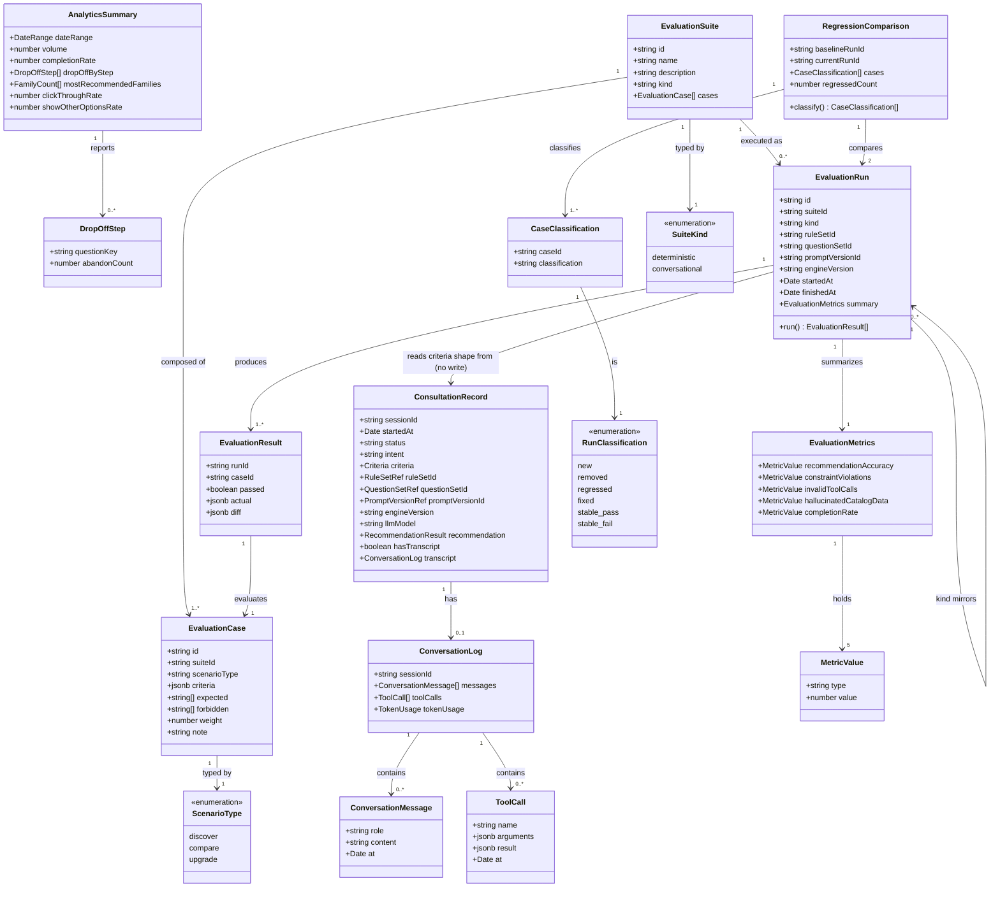

# Consultation Observability & Evaluation Suites

## Requirements

Give managers a trustworthy, read-only window into what the consultation
platform actually did and whether it is still behaving correctly: let them
search for and open any individual consultation to see its collected criteria,
the exact rule set/question set/prompt version/engine version/LLM model that
produced its recommendation, and (for chat-based consultations) the full
transcript including every tool call and result; let them replay a stored
consultation's criteria against the currently published rule set to compare old
vs. new outcomes; let them view platform-wide analytics (volume, completion
rate, drop-off by step, most-recommended families, click-through rate, "show
other options" rate) over a selectable date range; and let them author, run, and
compare evaluation suites — a deterministic engine-only suite runnable on every
pull request with zero AI-layer involvement, and a sampled conversational suite
that does invoke the AI layer — each producing per-case pass/fail results with a
regression comparison that never conflates a genuinely regressed case with one
that is merely new or removed.

## Entities

## Approach

1. **Evaluation logic lives in its own package, consumed as a library, not
   forked**:
   - `@windwise/eval` (new top-level package, per plan.md's Complexity Tracking
     and the platform's `packages/eval/` reservation) is the single
     implementation of suite running, comparison, and metrics. Both the CI job
     and `apps/manager-dashboard` server functions import the same functions
     from `@windwise/eval` — one CLI entry point (`cli.ts`) for headless CI
     invocation, one library surface for the dashboard's on-demand/nightly runs.
     Do not reimplement any part of suite execution inside the dashboard app.

2. **AI-isolation is a structural boundary, not a runtime flag**:
   - `run-deterministic-suite.ts` and everything it imports transitively may
     depend only on `@windwise/core`, `@windwise/db`, and `@windwise/schemas`.
     It must contain zero references to `@windwise/ai` anywhere in its module
     graph. This is enforced at lint/CI time (an import-boundary rule, e.g. an
     `oxlint`/dependency-cruiser-style restricted-imports rule scoped to
     `packages/eval/src/run-deterministic-suite.ts` and its co-located helpers),
     not by an `aiEnabled: boolean` parameter that could be flipped or defaulted
     wrong. `run-conversational-suite.ts` is the only module permitted to import
     `@windwise/ai`, and it lives in a separate file so the boundary is
     enforceable per-file.

3. **Per-case regression classification, never aggregate pass-rate diffing**:
   - `compare-runs.ts` classifies every case ID present in either of two runs
     into exactly one of
     `new | removed | regressed | fixed | stable-pass | stable-fail`. Only
     `regressed` cases drive the build-breaking failure signal (spec FR-009,
     SC-003). Never compute or surface a bare pass-rate-percentage delta as the
     regression signal — Edge Cases and research.md §3 explicitly reject that as
     ambiguous when the case set itself changes between runs.

4. **Correctness gates are visually and structurally separate from quality
   scores**:
   - `metrics.ts` tags each of the five platform §5.7 metrics with
     `type: 'invariant'` (Constraint Violations, Hallucinated Catalog Data —
     target exactly zero, rendered as a pass/fail gate) or `type: 'quality'`
     (Recommendation Accuracy, Invalid Tool Calls, Completion Rate — tracked as
     a number over time). The dashboard's evaluation-run view must render these
     in visually distinct sections (e.g. a "Gates" panel vs. a "Quality trend"
     panel), never as five undifferentiated percentage tiles.

5. **Direct reads over operational tables, no analytics warehouse**:
   - `search-consultations.ts` and `analytics-summary.ts` query
     `consultation_sessions`, `consultation_answers`, `recommendation_runs`,
     `recommendation_items`, and `conversation_logs` directly (tables
     005/006/009/010 already write). Do not introduce a denormalized analytics
     table, a materialized view, or a sync job in this feature — v1 scale does
     not justify it (research.md §5).

6. **This feature is read-only over everyone else's write path**:
   - It adds four new tables of its own (`eval_suites`, `eval_cases`,
     `eval_runs`, `eval_results`) and writes only to those. It must never write
     to `rule_sets`, `question_sets`, `prompt_versions`,
     `consultation_sessions`, `recommendation_runs`, or `conversation_logs`.
     "Replay" (US1.4) computes a new in-memory recommendation by calling
     `@windwise/core`'s `recommend()` against the stored criteria — it does not
     create a new `recommendation_runs` row or mutate the original.

7. **Evaluation datasets are versioned by immutable runs, not mutable
   aggregates**:
   - Editing an `EvaluationCase` (including the Edge Case path where a manager
     acknowledges a permanently unsatisfiable case and updates it) never
     rewrites history — every execution creates a new immutable
     `EvaluationRun` + `EvaluationResult` rows referencing the case IDs as they
     existed at that run's time (spec FR-012, data-model.md "State
     Transitions"). Comparisons are always between two specific run IDs, never
     "current suite state vs. some fuzzy prior average."

## Structure

### Type relationships

1. `ConsultationRecord`, `ConversationLog`, `ToolCall` are read shapes over
   005/006's `consultation_sessions`/`consultation_answers` and `@windwise/ai`'s
   existing `conversation_logs` — defined once in `@windwise/schemas`, reused by
   both `search-consultations.ts`'s list projection and the detail-view's full
   projection (no duplicate shape).
2. `EvaluationCase.criteria` reuses 005's `Criteria` schema for
   `scenario_type: 'discover'` cases and 006's `MentionInput`/ `UpgradeCriteria`
   shapes for `compare`/`upgrade` cases — do not define a parallel criteria
   shape for eval cases.
3. `EvaluationRun.summary` is the persisted `EvaluationMetrics` shape;
   `RegressionComparison` is never persisted as its own table — it is always
   computed on demand from two runs' `EvaluationResult` rows (data-model.md).
4. `AnalyticsSummary` and `ConsultationSearchResult` are in-memory
   `@windwise/schemas` shapes returned by TanStack Start server functions, not
   persisted entities.

### Dependencies

1. This feature is **strictly downstream of 005, 006, 009, and 010** — it reads
   `consultation_sessions`/`recommendation_runs`/`conversation_logs` (005/006),
   `rule_sets`/`rules` (009), and `question_sets`/`prompt_versions` (010). None
   of those features' schemas or write paths may be modified by this work item.
   If any read this feature needs is missing from those tables, that is a SPEC
   GAP against 005/006/009/010, not something to patch around here.
2. `packages/eval` depends on `@windwise/core` (for `recommend()`,
   `resolveMention()`, `compareModelsCore()`, `suggestUpgrade()` — called
   directly, never reimplemented), `@windwise/db` (schema + queries),
   `@windwise/schemas` (Valibot case/result shapes), and, for the conversational
   runner only, `@windwise/ai`.
3. `apps/manager-dashboard` depends on `@windwise/eval` as a library
   (`workspace:*`) from its server functions — it must not duplicate suite
   execution logic in route/server-function code.
4. `.github/workflows/engine-eval.yml` depends on `packages/eval`'s `cli.ts`
   only — it must not depend on `apps/manager-dashboard` being built, started,
   or deployed.
5. `packages/eval`'s deterministic module must have **zero** dependency edge to
   `@windwise/ai`, enforced by the import-boundary rule in Approach §2.

### Layered Architecture

1. **CI-invokable evaluation runner layer** (`packages/eval/src/`) — pure Node,
   no browser/React runtime, no dashboard dependency:
   `run-deterministic-suite.ts` (zero AI dependency, enforced), `metrics.ts`,
   `compare-runs.ts`, `cli.ts` (the CI entry point). This is the layer
   `.github/workflows/engine-eval.yml` invokes directly.
2. **Evaluation orchestration package layer** (`packages/eval/src/`, continued)
   — `run-conversational-suite.ts` (the only module in the package allowed to
   import `@windwise/ai`), sampled/nightly invocation logic. Same package as
   layer 1, separate module, separate dependency footprint.
3. **Persistence layer** (`packages/db/src/schema/eval-*.ts`,
   `packages/db/src/queries/search-consultations.ts`,
   `packages/db/src/queries/analytics-summary.ts`) — Drizzle schema for the four
   new eval tables, plus read-only query functions over 005/006/009/010's
   existing tables. No writes to non-eval tables from this layer.
4. **Dashboard observability/analytics UI layer**
   (`apps/manager-dashboard/src/routes/consultations/`, `.../analytics/`,
   `.../evaluation/`) — TanStack Start routes + server functions that call
   `packages/eval` and `packages/db`'s new queries as libraries; composes
   `@windwise/ui` primitives; owns no business logic of its own beyond request
   shaping and rendering.
5. **Validation layer**: `vp -C packages/eval test` and
   `vp -C packages/db test`, then `vp run ready` for the whole workspace, plus
   the new `engine-eval.yml` CI job gating PRs that touch rules/prompts/eval.

## Operations

### Create Package - `packages/eval/package.json`

1. Responsibility: Establish `@windwise/eval` as a new private workspace member
   per platform §5.1 and plan.md's Complexity Tracking.
2. Content: `"name": "@windwise/eval"`, `"version": "0.1.0"`, `"private": true`,
   `"type": "module"`; `bin: { "windwise-eval": "./src/cli.ts" }` or a
   `tsdown`-built `dist/cli.js` matching this repo's existing build convention
   for CLI-shaped packages; `dependencies` on `@windwise/core: "workspace:*"`,
   `@windwise/db: "workspace:*"`, `@windwise/schemas: "workspace:*"`,
   `@windwise/ai: "workspace:*"` (used only by the conversational module),
   `valibot: "catalog:"`; `devDependencies` pull `typescript`/`vite-plus` test
   tooling from `catalog:` matching `packages/query`'s existing pattern.
3. Constraints: no React/DOM dependency anywhere in this package. Do not add
   `@windwise/ui`.

### Create Schema - `packages/db/src/schema/eval-suites.ts`, `eval-cases.ts`, `eval-runs.ts`, `eval-results.ts`

1. Responsibility: Persist `EvalSuite`, `EvalCase`, `EvalRun`, `EvalResult` per
   data-model.md, matching this repo's Drizzle schema conventions established in
   009/010's `rule_sets`/`question_sets` tables.
2. Content:
   - `eval-suites.ts`: `id uuid pk default gen_random_uuid()`,
     `name text not null`, `description text`, `kind text not null`
     (`'deterministic' | 'conversational'` check constraint or pgEnum).
   - `eval-cases.ts`: `id uuid pk`, `suite_id uuid fk -> eval_suites.id`,
     `criteria jsonb not null`, `scenario_type text not null`
     (`'discover' | 'compare' | 'upgrade'`),
     `expected text[] not null default '{}'`,
     `forbidden text[] not null default '{}'`, `weight numeric`, `note text`.
   - `eval-runs.ts`: `id uuid pk`, `suite_id uuid fk`, `kind text not null`,
     `rule_set_id uuid fk -> rule_sets.id`,
     `question_set_id uuid fk -> question_sets.id`,
     `prompt_version_id uuid fk -> prompt_versions.id nullable`,
     `engine_version text not null`, `started_at timestamp not null`,
     `finished_at timestamp`, `summary jsonb`.
   - `eval-results.ts`: `run_id uuid fk -> eval_runs.id`,
     `case_id uuid fk -> eval_cases.id`, `passed boolean not null`,
     `actual jsonb not null`, `diff jsonb`; composite index on
     `(run_id, case_id)`.
3. Constraints: no columns duplicating `rule_sets`/`question_sets`/
   `prompt_versions` data beyond the foreign key — those tables remain the
   source of truth for version identity. No cascading delete from
   `eval_runs`/`eval_results` back onto `rule_sets` etc.

### Create Queries - `packages/db/src/queries/search-consultations.ts`, `analytics-summary.ts`

1. Responsibility: Read-only projections over 005/006's consultation and
   recommendation tables (spec FR-001, FR-005, FR-006).
2. Signatures and logic:
   - `searchConsultations(filters: { dateRange?, sessionRef?, outcome? }): Promise<ConsultationSearchResult[]>`
     — builds a Drizzle query over `consultation_sessions` joined to
     `recommendation_runs`; when no filter matches, returns `[]` (the caller
     renders the explicit empty state, this function does not encode UI
     messaging).
   - `getConsultationDetail(sessionId: string): Promise<ConsultationRecord>` —
     joins `consultation_sessions`, `consultation_answers`,
     `recommendation_runs`, `recommendation_items`, and `conversation_logs`
     (left join, since not every consultation is chat-based); throws a typed
     `NotFoundError` if `sessionId` does not exist.
   - `getAnalyticsSummary(dateRange: { from: string; to: string }): Promise<AnalyticsSummary>`
     — aggregates volume (count of sessions), completion rate (`completed`
     status / total), drop-off by step (group abandoned sessions by
     last-answered `questionKey`), most-recommended families (group
     `recommendation_items` by `family_slug`), click-through rate and "show
     other options" rate from tracked interaction events. For a
     zero-consultation range, returns all-zero values, never throws (Edge Case).
3. Constraints: pure reads — no `INSERT`/`UPDATE`/`DELETE` statements in either
   file. Do not add caching/materialization in this task; that is out of scope
   per Approach §5.

### Create Runner - `packages/eval/src/run-deterministic-suite.ts`

1. Responsibility: Execute a `deterministic` `EvalSuite` against a chosen
   `rule_set_id`/`question_set_id` calling `@windwise/core` directly, with zero
   AI-layer involvement (spec FR-008, FR-010).
2. Signature and logic:
   - `runDeterministicSuite(input: { suiteId: string; ruleSetId: string; questionSetId: string }): Promise<EvalRun>`:
     1. Load the suite's cases via `@windwise/db`.
     2. For each case, dispatch on `scenario_type`: call `recommend()` for
        `discover`, `compareModelsCore()`/`resolveMention()` for `compare`,
        `suggestUpgrade()` for `upgrade` — all from `@windwise/core`, all
        synchronous/pure per 005/006's purity guarantee.
     3. Compare the actual result's family/model identifiers against
        `case.expected` (must all appear) and `case.forbidden` (none may
        appear); record `passed`, `actual`, and (on failure) a `diff` object.
     4. Insert one `eval_runs` row (`kind: 'deterministic'`) and one
        `eval_results` row per case; compute and attach `EvaluationMetrics` via
        `metrics.ts` to `eval_runs.summary`.
     5. Return the persisted `EvalRun` with its results.
3. Constraints: **this file, and every module it imports, must not import
   `@windwise/ai` directly or transitively** — enforced by the lint boundary
   rule in Task "Create Lint Rule" below. No network I/O beyond the database
   connection `@windwise/db` provides. No `console.log`-based reporting inside
   this function — reporting is the CLI's job.

### Create Comparison - `packages/eval/src/compare-runs.ts`

1. Responsibility: Per-case regression classification between two runs of the
   same suite (spec FR-009, Edge Cases, research.md §3).
2. Signature and logic:
   - `compareRuns(baseline: EvalRun, current: EvalRun): RegressionComparison`:
     1. Build a `Map<caseId, passed>` from each run's `EvalResult` rows.
     2. For the union of case IDs across both maps, classify each as: `new` (in
        current only), `removed` (in baseline only), `regressed` (in both,
        baseline passed, current failed), `fixed` (in both, baseline failed,
        current passed), `stable-pass`/`stable-fail` (in both, unchanged).
     3. `regressedCount` is the count of `regressed` classifications only —
        never includes `new`/`removed`.
   - `findComparableBaseline(suiteId: string, currentRunId: string): Promise<EvalRun | null>`
     — looks up the most recent prior `eval_runs` row for the same `suite_id`
     and `kind`, excluding `currentRunId`; returns `null` if none exists
     (first-ever run has nothing to regress against).
3. Constraints: pure function, no I/O inside `compareRuns` itself (`EvalRun`s
   passed in fully hydrated with results). Must be covered by unit tests with
   fixture run pairs per plan.md's Constitution Check (Testing Standards).

### Create Metrics - `packages/eval/src/metrics.ts`

1. Responsibility: Compute the five platform §5.7 formulas and tag each with its
   correctness-gate vs. quality-score type (spec SC-005, research.md §4).
2. Signature and logic:
   - `computeMetrics(results: EvalResult[]): EvaluationMetrics`:
     - `recommendationAccuracy` (`type: 'quality'`): fraction of cases where all
       `expected` present and no `forbidden` present.
     - `constraintViolations` (`type: 'invariant'`): count of results whose
       `actual` includes a `forbidden` entry — target exactly 0.
     - `invalidToolCalls` (`type: 'quality'`, conversational runs only;
       `0`/`n/a` for deterministic): malformed or unrecognized tool-call count
       from the transcript.
     - `hallucinatedCatalogData` (`type: 'invariant'`): count of results
       referencing a family/model/spec identifier not present in the current
       catalog snapshot — target exactly 0.
     - `completionRate` (`type: 'quality'`): fraction of cases that produced any
       result at all (did not error/timeout).
3. Constraints: every returned field must carry its `type` tag — no field may be
   returned without one, since Approach §4 requires this distinction at the data
   level so the UI cannot accidentally collapse it.

### Create Runner - `packages/eval/src/run-conversational-suite.ts`

1. Responsibility: Execute a `conversational` `EvalSuite` against a chosen rule
   set + prompt version, invoking `@windwise/ai`'s chat/tool infrastructure on a
   sampled subset (spec FR-011).
2. Signature and logic:
   - `runConversationalSuite(input: { suiteId: string; ruleSetId: string; questionSetId: string; promptVersionId: string; sampleRate?: number }): Promise<EvalRun>`:
     1. Load cases; if `sampleRate` provided, deterministically sample a subset
        (seeded, so results are reproducible for a fixed suite+seed).
     2. For each sampled case, drive `@windwise/ai`'s existing chat/tool
        pipeline (reused from 005/006, not reimplemented) with the case's
        criteria as simulated user input; capture the transcript, tool calls,
        and final recommendation.
     3. Compare final recommendation against `expected`/`forbidden` as in the
        deterministic runner; also compute `invalidToolCalls` from malformed
        tool invocations observed.
     4. Persist `eval_runs` (`kind: 'conversational'`, `prompt_version_id` set)
        and `eval_results` exactly as the deterministic runner does.
3. Constraints: this is the only file in `packages/eval` permitted to import
   `@windwise/ai`. Must be clearly reported as a separate run `kind` in every
   list/detail view — never merged into deterministic run history.

### Create CLI - `packages/eval/src/cli.ts`

1. Responsibility: The CI-facing entry point (spec FR-010, SC-002).
2. Signature and logic:
   `npx windwise-eval run --suite=<id> --rule-set=<id> [--question-set=<id>] [--kind=deterministic|conversational]`
   — parses args, calls `runDeterministicSuite` (default) or
   `runConversationalSuite`, prints a pass/fail summary plus regression count to
   stdout, and exits non-zero if `regressedCount > 0` or any `type: 'invariant'`
   metric is non-zero.
3. Constraints: no interactive prompts (CI-safe); no dependency on
   `apps/manager-dashboard` being present or built.

### Create Lint Rule - `packages/eval/.oxlintrc.json` (or repo-root `oxlint` override scoped to `packages/eval`)

1. Responsibility: Structurally enforce the AI-isolation boundary from Approach
   §2 at lint time, not just by convention.
2. Logic: a `no-restricted-imports`-style rule scoped to
   `packages/eval/src/run-deterministic-suite.ts`, `compare-runs.ts`,
   `metrics.ts`, and `cli.ts` (when invoked with the default deterministic path)
   forbidding any import matching `@windwise/ai` or `@windwise/ai/**`. Wire this
   into `vp check` so it runs as part of the normal lint gate, not a separate
   manual step.
3. Constraints: `run-conversational-suite.ts` must be explicitly excluded from
   this rule (it is the sanctioned `@windwise/ai` import site). Do not scope the
   rule to the whole package — that would also forbid the conversational
   module's legitimate import.

### Create Test - `packages/eval/src/__tests__/no-ai-dependency.test.ts`

1. Responsibility: A meta-test proving the deterministic runner's module graph
   never resolves to `@windwise/ai`, mirroring 009's constraint-veto and 010's
   version-pin invariant tests (plan.md Testing).
2. Logic: statically walk `run-deterministic-suite.ts`'s import graph (source
   text scan or a build-graph introspection helper) and assert no path resolves
   into `packages/ai`; fails loudly if it ever does.
3. Constraints: `vite-plus/test`
   (`import { describe, expect, it } from 'vite-plus/test'`); no actual LLM call
   attempted (this is a static check, not a runtime guard test).

### Create Test - `packages/eval/src/__tests__/compare-runs.test.ts`

1. Responsibility: Verify `compareRuns` correctly distinguishes
   `new`/`removed`/`regressed`/`fixed`/`stable-pass`/`stable-fail` (plan.md
   Testing Standards; Edge Cases).
2. Logic: golden-file style fixture pairs of `EvalRun`+`EvalResult[]` covering
   each classification, including the Edge Case of a suite whose case set
   changed between runs (some cases only in baseline, some only in current).
3. Constraints: pure unit tests, no database — construct in-memory `EvalRun`/
   `EvalResult` fixtures directly.

### Create Test - `packages/eval/src/__tests__/metrics.test.ts`

1. Responsibility: Verify each of the five metric formulas and their `type` tags
   (spec SC-005).
2. Logic: fixture `EvalResult[]` sets exercising zero-violation and
   nonzero-violation cases for `constraintViolations`/
   `hallucinatedCatalogData`, asserting `type: 'invariant'`; and varying
   accuracy/completion fixtures for the `type: 'quality'` fields.
3. Constraints: `vite-plus/test`, no I/O.

### Create Route - `apps/manager-dashboard/src/routes/consultations/index.tsx`

1. Responsibility: Consultation search UI (spec FR-001, US1).
2. Logic: a TanStack Start server function wraps `searchConsultations` from
   `@windwise/db`; the route renders a filter form (date range, session
   reference, outcome) using `@windwise/ui` `Field`/ `Input`/`Select`, a results
   table (`@windwise/ui` `Table`), and an explicit "no results" state distinct
   from the loading skeleton (Edge Case).
3. Constraints: reuse 008/009/010's established list/filter route pattern in
   this app; do not introduce a new list-page convention.

### Create Route - `apps/manager-dashboard/src/routes/consultations/$sessionId.tsx`

1. Responsibility: Consultation detail view — criteria, versions,
   recommendation, transcript, replay (spec FR-002, FR-003, FR-004, US1).
2. Logic: server function wraps `getConsultationDetail`; renders criteria and
   version-pin badges (rule set/question set/prompt version/engine version/LLM
   model), the recommendation result, and — when `hasTranscript` — a transcript
   panel listing every `ConversationMessage` and `ToolCall` with
   arguments/result/timestamp. A "Replay against current published rule set"
   action calls a server function invoking `@windwise/core`'s `recommend()`
   directly (not `@windwise/eval` — replay is ad hoc, not a suite run) with the
   stored criteria, and renders the new result side-by-side with the original.
   If the original `rule_set_id` no longer resolves (Edge Case: deleted
   version), the stored snapshot still renders in full; only the "replay against
   that exact version" affordance is disabled, with a clear inline note why.
3. Constraints: transcript rendering must not attempt to re-invoke any AI call —
   it displays stored data only. No mutation of any consultation record from
   this route.

### Create Route - `apps/manager-dashboard/src/routes/analytics/index.tsx`

1. Responsibility: Platform-wide analytics view (spec FR-005, FR-006, US2).
2. Logic: server function wraps `getAnalyticsSummary`; renders a date-range
   picker, volume/completion-rate stat tiles, a drop-off-by-step chart
   (`@windwise/ui`'s `chart` primitive/Recharts), a most-recommended-families
   list, and click-through/"other options" rate tiles. For a zero-result date
   range, renders the all-zero empty state, not an error (Edge Case).
3. Constraints: no client-side aggregation of raw session data — all aggregation
   happens in `analytics-summary.ts`; the route only renders the
   already-aggregated `AnalyticsSummary` shape.

### Create Route - `apps/manager-dashboard/src/routes/evaluation/suites.tsx`

1. Responsibility: Evaluation suite/case authoring UI (spec FR-007, US3).
2. Logic: server functions for CRUD over `eval_suites`/`eval_cases` via
   `@windwise/db`; a suite list, a case editor (criteria form matching
   `scenario_type`, `expected`/`forbidden` tag inputs, `weight`, `note`), and
   the Edge Case flow: when a case is permanently unsatisfiable after a
   deliberate catalog/policy change, a manager can edit `expected`/`forbidden`
   directly here (a normal CRUD edit) rather than the case being stuck failing
   forever — this is ordinary case editing, not a special "override" flag.
3. Constraints: this route never triggers a run itself — running is a separate
   explicit action (next task) so authoring and execution stay distinguishable
   in the UI and in the audit trail.

### Create Route - `apps/manager-dashboard/src/routes/evaluation/runs/$runId.tsx`

1. Responsibility: Run results — pass/fail, metrics (gates vs. quality), and
   regression view (spec FR-008, FR-009, US3).
2. Logic: server function loads the `EvalRun` + `EvalResult[]`, calls
   `findComparableBaseline` + `compareRuns` from `@windwise/eval`, and renders:
   a per-case pass/fail table with diffs on failure; a "Gates" panel showing
   `constraintViolations`/`hallucinatedCatalogData` as pass/fail badges (green
   only at exactly 0); a "Quality" panel showing the other three metrics as
   tracked numbers; and a regression section listing only `regressed` cases
   prominently, with `new`/`removed`/`fixed` shown separately and clearly
   labeled as non-regressions. A "Run suite" action (on this page or
   `suites.tsx`) triggers `runDeterministicSuite` or `runConversationalSuite`
   from `@windwise/eval` via a server function.
3. Constraints: must not render `new`/`removed` cases inside the same visual
   group as `regressed` — Approach §3 requires this separation to be visible,
   not just computed correctly.

### Create Workflow - `.github/workflows/engine-eval.yml`

1. Responsibility: Run the deterministic suite on every pull request touching
   rules/prompts/eval (spec FR-010, SC-002, plan.md Constraints).
2. Content: triggers on `pull_request` (paths filter including
   `packages/eval/**`, `packages/db/src/schema/**`, `packages/core/**`, or run
   unconditionally if path-filtering proves unreliable given catalog seed data
   dependencies); steps: checkout, `pnpm install` (or `vp install` per this
   repo's toolchain), then
   `pnpm --filter @windwise/eval run cli -- run --suite=<default-ci-suite-id> --rule-set=<candidate-or-seeded-id>`
   (or a `vp run eval:ci` task defined in `packages/eval/package.json` wrapping
   the same command); the job fails the PR check if the CLI exits non-zero
   (regression or non-zero invariant metric).
3. Constraints: this job must not start, build, or depend on
   `apps/manager-dashboard`; it must not require network access to any LLM
   provider (deterministic path only, enforced by the lint rule above); it
   should be added alongside, not replacing, any existing `vp run ready`-style
   CI job for this repo.

### Create Changeset - `.changeset/eval-observability-suite.md`

1. Responsibility: Record the new `@windwise/eval` package and `db`/dashboard
   changes per AGENTS.md §7.
2. Content: `minor` for `@windwise/eval` (new package, initial public API);
   `minor` for `@windwise/db` (new schema + queries, additive); `minor` for
   `@windwise/manager-dashboard` (new routes).
3. Constraints: one changeset file covering all three, or split per package per
   this repo's existing changeset granularity — match whatever 009/010's
   changesets did, do not invent a new convention.

## Norms

1. **Package boundary**: `@windwise/eval` never imports from
   `apps/manager-dashboard`; the dashboard depends on `@windwise/eval`, never
   the reverse (Structure §Dependencies). The deterministic-path modules never
   import `@windwise/ai`, enforced by the scoped lint rule, not by convention or
   code review alone.
2. **Imports**: workspace packages via `workspace:*`; internal package imports
   use each package's own alias convention (`#/` inside `packages/db` and
   `packages/eval` if they adopt the same `imports` map `packages/ui` uses —
   check `packages/query`'s existing pattern before introducing a new one). Apps
   import `@windwise/eval` and `@windwise/db` exports only, never deep
   `packages/eval/src/...` relative paths.
3. **Tests**: `vite-plus/test`
   (`import { describe, expect, it } from 'vite-plus/test'`), run via
   `vp -C packages/eval test` / `vp -C packages/db test`. Regression-comparison
   and metrics tests are pure unit tests with in-memory fixtures — no live
   database in `compare-runs.test.ts`/`metrics.test.ts`. Route-level tests (if
   added) follow whatever pattern 009/010 established for
   `apps/manager-dashboard`.
4. **Changesets**: add a `.changeset/*.md` per AGENTS.md §7 for any package
   whose public exports change (`@windwise/eval` on creation, `@windwise/db` for
   new schema/queries, `@windwise/manager-dashboard` for new routes). No
   `Co-authored-by` trailers anywhere.
5. **Error handling**: server functions and query functions throw typed errors
   (e.g. `NotFoundError` for an unknown `sessionId`) that routes catch and
   render as an explicit UI state — no bare `throw new Error(string)` surfaced
   directly to the user, and no silent `catch {}` that swallows a query failure
   into a false-empty result. The CLI (`cli.ts`) exits non-zero on any
   regression or invariant violation — never exits 0 with a warning printed to
   stdout only.
6. **Naming**: `EvalSuite`/`EvalCase`/`EvalRun`/`EvalResult` in `@windwise/db`
   schema/table names (`eval_suites`, `eval_cases`, `eval_runs`, `eval_results`,
   snake_case per this repo's existing Drizzle convention); `Evaluation*` prefix
   in `@windwise/schemas` TypeScript types (`EvaluationSuite`, `EvaluationCase`,
   `EvaluationMetrics`) matching this document's Entities section — do not mix
   the two prefixes within the same layer.

## Safeguards

1. **Functional**: Do not build a UI or code path to mutate `rule_sets`,
   `question_sets`, or `prompt_versions` from this feature — 009 and 010 own
   that. Do not build "replay" as a new `recommendation_runs` write. Do not
   build a general analytics warehouse, ETL job, or materialized view in this
   work item.
2. **Performance**: The deterministic CI suite (spec SC-002) must complete fast
   enough to gate merges — target sub-second per case given no I/O beyond an
   in-memory/fixture catalog snapshot per case; if a candidate suite grows to
   hundreds of cases and threatens PR-gating latency, that is a signal to
   shrink/parallelize the CI suite, not to relax the deterministic constraint.
   The conversational suite carries no such budget (nightly/ sampled) and must
   never run inside the PR-gating job.
3. **Security**: Transcript data may include PII (visitor-entered free text,
   session identifiers). Consultation search/detail and transcript routes must
   sit behind the same manager-authenticated access control as the rest of
   `apps/manager-dashboard` (existing `better-auth` integration) — do not add a
   public or unauthenticated route for any observability or evaluation view.
4. **Integration**: This feature has a **hard, explicit dependency on
   005-guided-instrument-consultation, 006-instrument-compare-upgrade,
   009-recommendation-rules-authoring, and 010-consultation-flow-configuration
   landing first** — it reads their tables and version-pin identifiers directly.
   Do not begin `packages/eval`/dashboard route implementation against stub or
   assumed schemas; if any of those four have not landed, flag this as a
   blocking dependency rather than inventing a placeholder schema.
5. **Business rules**: Zero silent regressions (spec SC-003) — every `regressed`
   classification must be surfaced, never filtered out by default. Correctness
   gates (`constraintViolations`, `hallucinatedCatalogData`) are pass/fail at
   exactly zero, never rendered as a percentage or "improving" trend line.
   Historical fidelity survives version deletion — a consultation's stored
   criteria/recommendation/version pins must remain fully viewable even if the
   referenced `rule_set_id` row is later deleted (Edge Case); only live replay
   against that exact deleted version is disabled, not the historical view
   itself.
6. **Technical constraints**: The deterministic evaluation path must be
   **structurally incapable** of invoking the AI layer — enforced by the scoped
   lint rule plus the `no-ai-dependency.test.ts` meta-test, not by a runtime
   flag or documentation comment alone. `@windwise/eval` must run as a headless
   Node process with no React/DOM/browser dependency.
7. **Data constraints**: No new columns on `consultation_sessions`,
   `recommendation_runs`, `conversation_logs`, `rule_sets`, `question_sets`, or
   `prompt_versions` — this feature's four new tables (`eval_suites`,
   `eval_cases`, `eval_runs`, `eval_results`) are additive-only. `EvalCase.id`
   stability across suite edits is required so regression comparison remains
   valid across runs (data-model.md).
8. **API constraints**: `@windwise/eval`'s public exports
   (`runDeterministicSuite`, `runConversationalSuite`, `compareRuns`,
   `computeMetrics`, `findComparableBaseline`) are the stable surface the
   dashboard and CI both call — do not let either caller reach into
   `packages/eval/src/` internals directly; route everything through the
   package's declared `exports`.
9. **Verification gate**: `vp -C packages/eval test` and
   `vp -C packages/db test` must pass; `vp run ready` must pass workspace-wide
   for files this work item touches; the new `.github/workflows/engine-eval.yml`
   job must pass on every PR touching rules/prompts/eval as an additional,
   non-optional merge gate alongside existing CI.
